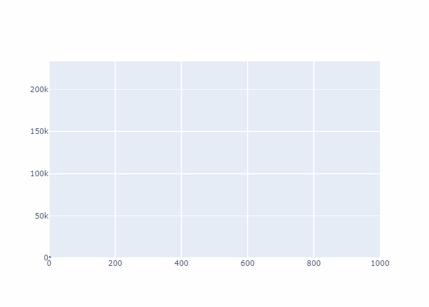

# Problem 1

## Problem Statement
The problem on project euler can be found here:

<a href="https://projecteuler.net/problem=001" target="_blank">https://projecteuler.net/problem=001</a>

Here's the problem statement, copied from the website:

!!! quote "Problem 1"

    If we list all the natural numbers below $10$ that are multiples of $3$ or $5$, we get $3, 5, 6$ and $9$. The sum of these multiples is $23$.

    Find the sum of all the multiples of $3$ or $5$ below $1000$.


## Simple solution

Let's start with the first order simplest solution:

1.  Loop through all numbers from $1$ to $999$.
2.  Get the mod of each number with $3$ and $5$.
3.  If the mod is 0, add it to total


=== ":simple-python: Python"

    ``` python title="prob_001.py"
    def simple_solution(upper_number : int)-> int:
        """This function calculates the sum of all number divisible by 3 
            or 5 below upper_number.

        Args:
            upper_number (int): The upper limit of the calculation.

        Returns:
            int: The sum of all numbers divisible by 
            3 and 5 below upper_number.
        """
        total = 0
        for n in range(upper_number):
            match (n % 3, n%5):
                case (0, _):
                    total +=n
                case (_ ,0):
                    total +=n
        return total
    

    if __name__ == '__main__':
        print("The solution is:", simple_solution(1000))
    ```

=== ":simple-rust: Rust"

    ``` rust title="lib.rs"
    pub mod prob_001 {
        pub fn simple_solution(upper_limit : u32) -> u64 {
            let mut total : u64 = 0;
            for n in (0..(upper_limit as u64)).into_iter() {
                match (n % 3, n%5) {
                    (0, _) => {
                        total += n;
                    },
                    (_, 0) => {
                        total += n
                    },
                    _ => {}
                }
            }
            total
        }
    }
    ```

The solution is 233168.

Here's the GIF:

{ width="500" }

Time taken for first solution: 60 + 10:38 minutes.

## Proposed solution
=== ":simple-python: Python"

    ``` python title="prob_001.py"
    def sum_divisible_by(n_upper: int, div : int):
        total = 0
        n = 0
        while n * div < n_upper:
            total += n*div
            n += 1
        return total

    if __name__ == "__main__":
        sum_3 = sum_divisible_by(1000, 3)
        sum_5 = sum_divisible_by(1000, 5)
        sum_15 = sum_divisible_by(1000, 15)
        print(f"The total is {sum_3 + sum_5 - sum_15} ")
        print(simple_solution(1000))
    ```

    ``` console
    PS C:\Users\Dawie Diamond\OneDrive\extreme_stem> poetry run python .\python_solution\prob_001.py
    The total is 233168 
    233168
    ```


=== ":simple-rust: Rust"

    ``` rust title="lib.rs"
    pub mod prob_001 {
        // - snip

        pub fn sum_multiples_of(upper_limit : u64, div : u64) -> u64 {
            let mut n = 0;
            let mut total = 0;
            while n*div < upper_limit {
                total += n*div;
                n += 1;
            };
            total
        }
    }
    ```

    ``` rust title='main.rs'

    use extreme_stem::prob_001::{
        simple_solution,
        sum_multiples_of
    };

    fn main() {
        let total = simple_solution(1000);
        let total2 = {
            sum_multiples_of(1000, 3) 
            + sum_multiples_of(1000, 5)
            - sum_multiples_of(1000, 15)
        };
        println!("The total is {total}");
        println!("The total 2 is {total2}");
    }
    ```

    ``` console
    PS C:\Users\Dawie Diamond\OneDrive\extreme_stem> cargo run      
    Compiling extreme_stem v0.1.0 (C:\Users\Dawie Diamond\OneDrive\extreme_stem)
        Finished dev [unoptimized + debuginfo] target(s) in 0.96s
        Running `target\debug\extreme_stem.exe`
    The total is 233168
    The total 2 is 233168
    ```

<div style='display:flex'>
    <div>
        <a target="_blank" href="https://www.bladesight.com" class="" title="Dawie Diamond" style="border-radius:100%;"> 
            
        </a>
    </div>
    <div style='margin-left:2rem'>
        <p>
            <strong>Dawie Diamond</strong>
        </p>
        <p>
            2024-04-01
        </p>
    </div>
</div>