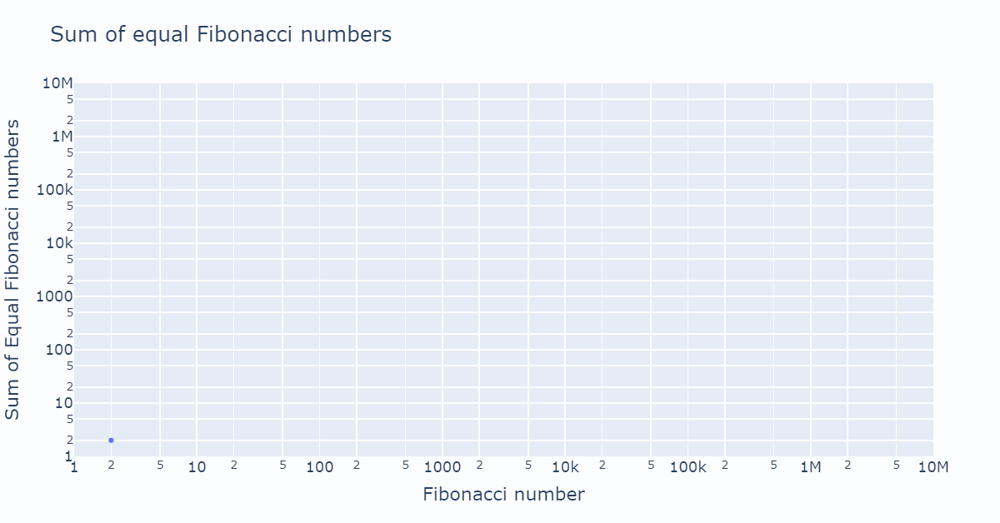

# Problem 1

## Physical exercise

Jogged 5.4 km at Pheasant Hill Estate with 4 sets of 21 push-ups inm between in 39.5 minutes.

## Problem Statement

The problem on Project Euler can be found at :

<a href="https://projecteuler.net/problem=002" target="_blank">https://projecteuler.net/problem=002</a>

Here's the problem:

Each new term in the Fibonacci sequence is generated by adding the previous two terms. By starting with $1$ and $2$, the first $10$ terms will be:

$$1, 2, 3, 5, 8, 13, 21, 34, 55, 89, \dots$$

By considering the terms in the Fibonacci sequence whose values do not exceed four million, find the sum of the even-valued terms.


## Simple Solution

Sadly, the only "smart" thing I could do is prevent dividing the next Fibonacci number by 2 to check if it is equal. The logic works by storing the two previous number' "equal" state. By definition, adding two unequal numbers gives an equal number. The only other possible number is an unequal number.

I also deduced that if the previous fibonacci number is > than upper_limit/2, then we're done.

=== ":simple-python: Python"

    ``` python title="prob_002.py"
    from plotly import graph_objects as go
    import numpy as np
    from typing import Tuple

    def fibonacci_series_equal_sum(upper_limit : int ) -> Tuple[np.ndarray, np.ndarray]:
        """Calculate the sum of equal Fibonacci numbers below <upper_limit>.

        Args:
            upper_limit (int): You may not add a number 
                larger or equal than this.

        Returns:
            Tuple[np.ndarray, np.ndarray]: The sums, the fibonacci numbers.
        """
        stop_lim = upper_limit/2
        fib_n_min2 = 1
        fib_n_min2_equal = False
        fib_n_min1 = 2
        fib_n_min1_equal = True
        n_equal = np.zeros(int(stop_lim), dtype=np.uint32)
        totals = np.zeros(int(stop_lim), dtype=np.uint32)
        i_count = 0
        n_equal[i_count] = 2
        totals[i_count] = 2
        i_count +=1
        while fib_n_min2 < stop_lim:
            next_num = fib_n_min1 + fib_n_min2
            if fib_n_min1_equal or fib_n_min2_equal:
                fib_n_min2 = fib_n_min1 * 1
                fib_n_min1 = next_num * 1
                fib_n_min2_equal = bool(fib_n_min1_equal)
                fib_n_min1_equal = False
                n_equal[i_count] = next_num
                totals[i_count] = totals[i_count-1]*1
                i_count += 1
            else:
                fib_n_min2 = fib_n_min1 * 1
                fib_n_min1 = next_num * 1
                fib_n_min2_equal = bool(fib_n_min1_equal)
                fib_n_min1_equal = True
                n_equal[i_count] = next_num
                totals[i_count] = next_num + totals[i_count-1]
                i_count += 1
        print("stop_lim:", stop_lim)
        print("fib_n_min2:", fib_n_min2)
        print("fib_n_min1:", fib_n_min1)
        return n_equal[:i_count], totals[:i_count]

    def generate_figure(
            n_numbers : np.ndarray, 
            totals : np.ndarray,
            n_frame : int
        ) -> go.Figure:
        """Generate a line figure up to n_num.

        Args:
            n_numbers (np.ndarray): n_numbers
            totals (np.ndarray): totals
            n_frame (int) : The frame number

        Returns:
            go.Figure: The Figure to generate.
        """
        fig = go.Figure()
        fig.add_trace(
            go.Scatter(
                x = n_numbers[:n_frame],
                y = totals[:n_frame],
                mode='lines+markers',
            )
        )
        fig.update_xaxes(type="log", range=[0,np.ceil(np.log10(n_numbers[-1]))])
        fig.update_yaxes(type="log", range=[0,np.ceil(np.log10(totals[-1]))])
        fig.update_layout(
        title="Sum of equal Fibonacci numbers",
        xaxis_title="Fibonacci number",
        yaxis_title="Sum of Equal Fibonacci numbers",
        font=dict(
            size=18
        )
        )
        
        return fig

    import imageio
    from tqdm import tqdm

    if __name__ == '__main__':
        fib_numbers, totals = fibonacci_series_equal_sum(4000000)
        print(fib_numbers)
        print(totals, totals.shape)
        print("The solution is ", totals[-1])
        n_max = totals.shape[0]
        print(n_max)
        images = []
        for i in tqdm(list(range(1, n_max))):
            fig = generate_figure(fib_numbers, totals, i)
            fig.write_image("python_solution/fig.png", width=1200, height=int(1200/1.91))
            images.append(imageio.imread("python_solution/fig.png"))
        imageio.mimsave('python_solution/gif.gif', images ,loop=50)
    ```

    ``` console
    stop_lim: 2000000.0
    fib_n_min2: 2178309
    fib_n_min1: 3524578
    [      2       3       5       8      13      21      34      55      89
        144     233     377     610     987    1597    2584    4181    6765
    10946   17711   28657   46368   75025  121393  196418  317811  514229
        144     233     377     610     987    1597    2584    4181    6765
    10946   17711   28657   46368   75025  121393  196418  317811  514229
    832040 1346269 2178309 3524578]
    [      2       2       2      10      10      10      44      44      44
        188     188     188     798     798     798    3382    3382    3382
    14328   14328   14328   60696   60696   60696  257114  257114  257114
    1089154 1089154 1089154 4613732] (31,)
    The solution is  4613732
    ```

=== ":simple-rust: Rust"

    ``` rust title=''
    use std::ops::Add;

    #[derive(Debug, Copy, Clone, PartialEq)]
    pub struct FibonacciNumber {
        value : i64,
        is_equal : bool
    }

    impl Add for FibonacciNumber  {
        type Output = FibonacciNumber;

        fn add(self, rhs: Self) -> Self::Output {
            match self.is_equal | rhs.is_equal {
                    true => {
                        FibonacciNumber {
                            value : self.value + rhs.value,
                            is_equal : false
                        }
                    },
                    false => {
                        FibonacciNumber {
                            value : self.value + rhs.value,
                            is_equal : true
                        }
                    }
                }
        }
    }
        

    pub mod prob_002 {
        use super::FibonacciNumber;

        pub fn fibonacci_series(upper_limit : i64) -> i64 {
            let mut fib_min1 = FibonacciNumber {
                value: 1,
                is_equal: false
            };
            let mut fib_min2 = FibonacciNumber {
                value: 2,
                is_equal: true
            };
            let mut total : i64 = 2;
            let max_value = upper_limit ;
            while fib_min2.value < max_value {
                let new_fib = fib_min1.clone() + fib_min2.clone();
                if new_fib.is_equal {
                    total += new_fib.value;
                };
                fib_min1 = fib_min2.clone();
                fib_min2 = new_fib.clone()
            }
            total
        }
    }

    ```

    ``` rust title='main.rs'
    use extreme_stem::prob_002::{
        fibonacci_series
    };

    fn main() {
        let total = fibonacci_series(4_000_000);
        println!("The total is {total}");
    }
    ```

    ``` console 
    PS C:\Users\Dawie Diamond\OneDrive\extreme_stem> cargo run
    Compiling extreme_stem v0.1.0 (C:\Users\Dawie Diamond\OneDrive\extreme_stem)
        Finished dev [unoptimized + debuginfo] target(s) in 0.72s
        Running `target\debug\extreme_stem.exe`
    The total is 4613730
    ```
The solution is 4613732.

I'm soooper chuffed with my Rust solution. I created a struct to hold the `value` and the `is_equal` values and implement the Add trait so that they can simply be added together!

Time taken for first solution: 60 + 1:26 minutes.

{width = 1200}