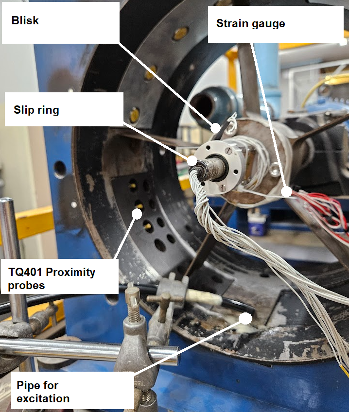
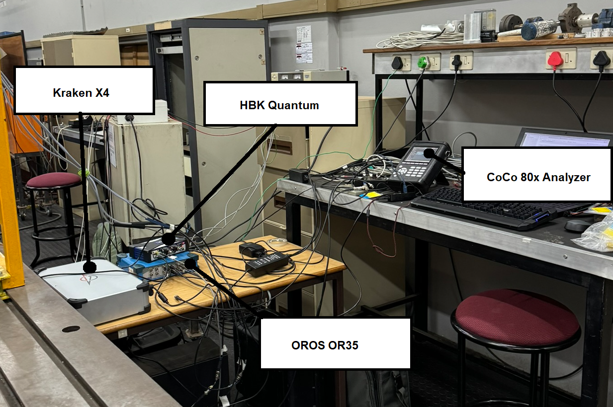
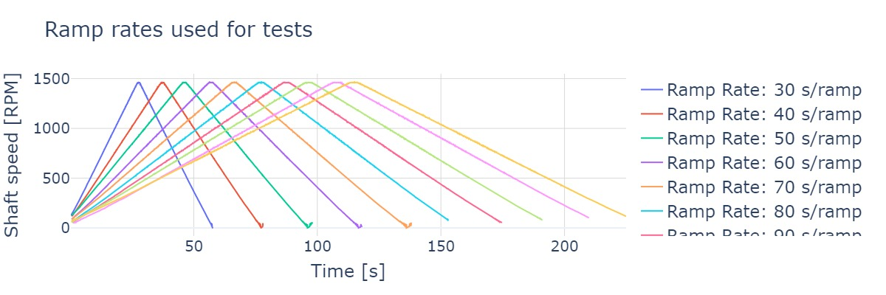
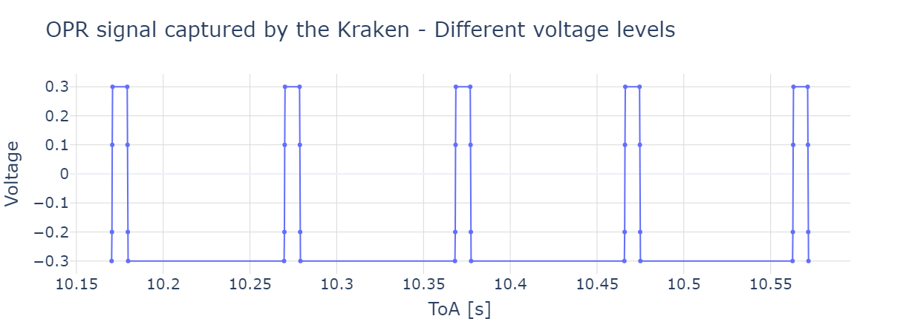
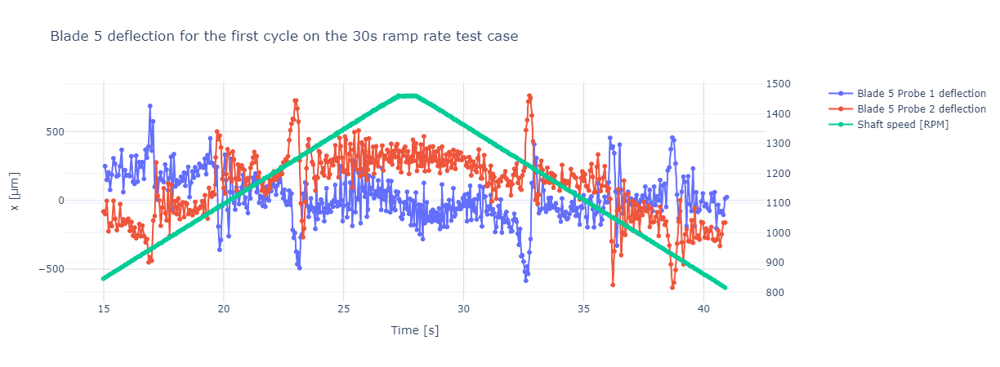
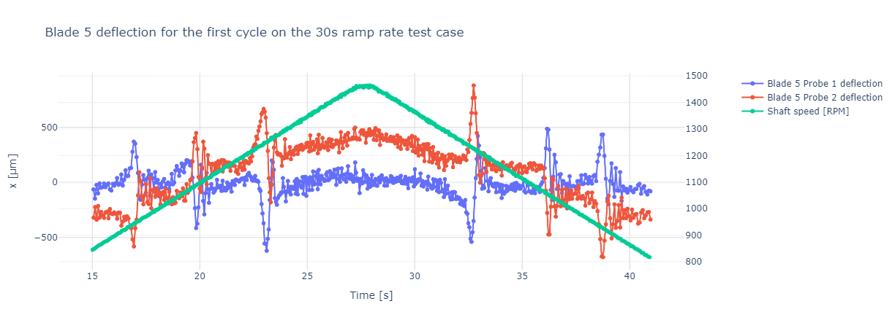

# Diamond et al 2024 ramp rates at 45 degrees

## Why did we conduct these tests?

It's always felt like there's a stone lodged under my heel when fitting curves to transient synchronous resonances. The resonant frequencies recovered by curve fitting algorithms have always struck me as imprecise. A prime example of this is when you measure the resonant frequency during a run-up vs the same frequency during a run-down. Logic dictates that such frequencies should be the same. 

I've found they are never the same.

To investigate this, we set about to conduct measurements where we varied the ramp rate of run ups and run-downs.

Unfortunately, about a fortnight prior to completing our first draft, I found a paper by [@zhi2022error] that investigated this phenomenon. It could be that most BTT practitioners know about this. But I doubt it. 

I believe most people subscribe to the classical view that synchronous resonances are integrally proportional to the shaft speed. *This is not the case*. I still want to publish on this work, but we'll need more tests. 

I've decided to publish the dataset to Bladesight under the Creative Commons license. 

I hope you find it useful. There's a lot of data here.

## Experimental setup and method

The main purpose of these tests are to investigate if the commonly held synchronous vibration relationship, given below,

\begin{equation}
f = \Omega EO
\end{equation}

holds true for different ramp rates.

The BTT test bench at the University of Pretoria's Sasol laboratory was used for this investigation.

### Rotor, motor, and blade excitation

The test bench consists of a five blade blisk. The blades of the blisk have an outer radius of 164 mm. These blades
are rectangular, thereby allowing us to study pure bending modes. The motor is controlled with an analogue signal that varies between 0 - 10 Volts, corresponding to the minimum and maximum speed, respectively. 

The maximum speed of the rotor is approximately 1450 RPM. Compressed air was used to excite the blades. The pipe, presented in [Figure 1](#figure_01), was placed at approximately a 45 &deg; angle with respect to the blades. 

!!! note

    The choice of 45 degrees was in truth accidental. Prior to positioning the pipe at a 45 &deg; angle it was placed at close to a 90 &deg; angle. I hypothesized that, because the air was directed perpendicular to the blade's chord, the largest tip deflections would be observed. 

    After an entire day of testing, we conducted a single test with the pipe at a 45 &deg; angle. The tip deflections were significantly larger than those observed at 90 &deg;. It was like finding out there's another 5 km left after running a marathon. 
    
    We repeated all the tests at 45 &deg;, yielding the present dataset.


The rotor blades’ first three natural frequencies at rest are approximately 125 Hz, 512 Hz, 723 Hz.

<figure markdown>
  { width="500" }
    <figcaption><strong><a name='figure_01'>Figure 1</a></strong>: The experimental setup at the University of Pretoria's Sasol Laboratory.
    </figcaption>
</figure>


!!! note

    We had every intent to return to the test bench in pursuit of better photos. 
    
    We never did. We apologize for this.

### Sensors

Three <a href='https://catalogue.meggittsensing.com/shop/sensors-and-signal-conditioners/proximity-probes/tq401-proximity-sensor/' target='_blank'> MEGGIT TQ401 eddy current proximity probes</a> were used. Two were used as proximity probes and one as an OPR sensor. 

Aditionally, an Optel Thevon 152G8 optical fibre sensor was installed in conjunction with a zebra-tape to serve as a Multiple Pulses per Revolution (MPR) shaft encoder.

We instrumented one blade with a strain gauge at its root. The strain gauge was attached so as to be sensitive to bending.

!!! info

    The probes are installed 20.1 &deg; apart. The strain gauge'd blade is the *last blade* to arrive at the OPR sensor.


### Data acquisition and control

In addition to understanding the effects of ramp rates and directions on blade vibration, we also included new/unproven sensors and Data Acquisition Systems (DAQs). Ultimately, four different DAQs and control systems were used.

The four DAQs and control systems are shown in [Figure 2](#figure_02) below.

<figure markdown>
  { width="800" }
    <figcaption><strong><a name='figure_02'>Figure 2</a></strong>: The four DAQs and control systems used in the tests. 
    </figcaption>
</figure>

#### Kraken X4
My under-development BTT DAQ, the <a href='https://www.bladesight.com' target='_blank'>Bladesight Kraken X4 🐙 </a>, was used to acquire the Time-of-Arrivals (ToAs) from the TQ401 eddy current sensors. 

Why did we use the Kraken? 

* Because it's mine and it makes me happy.
* It has the ability to condition a -24 V to 0 V signal to a -1 to 1 V signal, thereby enabling digitization.
* It has the ability to trigger at *__multiple thresholds__* per pulse, not just one threshold.
* It digitizes the incoming signals at 125 MHz, much faster than the other systems in our lab.

#### HBK Quantum
An HBK Quantum (MX410) was used to excite and measure the strain gauge. Excitation and communication to and from the strain gauge ocurred through a slip ring.

#### OROS OR35
An OROS OR35 DAQ was used to measure the Multiple Per Revolution (MPR), strain gauge, and three other inductive probes (TURCK BI10U-M18-AP6X). 

The OROS' sampling rate was set to 25.6 kHz.

#### CoCo-80x analyzer
The motor was controlled using the output from a CoCo-80x analyzer. We could set different ramp rates using this system.

## Experimental method

We define a ramp rate as the time taken to move from 0 RPM to 1450 RPM. The ramp rates for the tests were as follows: 30s, 40s, 50s, 60s, 70s, 80s, 90s, 100s, 110s, 120s. 

For each test, acquisition was performed for at least 4 cycles. Giving 4 run-ups and run-downs per test.

[Figure 3](#figure_03) below exhibits the first cycle of each test case.

<figure markdown>
  { width="800" }
    <figcaption><strong><a name='figure_03'>Figure 3</a></strong>: The ramp rates of each test case.
    </figcaption>
</figure>

## Multiple Triggering levels

I've always thought it nonsensical to pick only one threshold level per channel. Some blades are longer than others. It makes sense that you should use different triggering levels for different blades.

The Kraken X4 was programmed to trigger at 4 different levels on both the rising and falling slopes. The four levels were -0.3, -0.2, 0.1 and 0.3 V. These voltage levels are only approximate, because the Kraken conditions the signals prior to acquisition, and each signal can be conditioned differently to yield the best pulse.

!!! note

    The voltage levels may be approximate, but you can bank on one thing: The triggering thresholds on the rising and falling slopes are identical.

We therefore have 8 different ToA types per channel. Some channels do not have all 8 ToAs, depending on each blade's distance from each sensor. If the 8 triggering levels are displayed for each channel, it reveals something of the pulse shape, as indicated in [Figure 4](#figure_04) below.  

<figure markdown>
  { width="800" }
    <figcaption><strong><a name='figure_04'>Figure 4</a></strong>: The ramp rates of each test case.
    </figcaption>
</figure>

I believe having multiple triggering levels can be used for new kinds of analyses. This is a topic for another day.

!!! note

    We did not extract multiple triggering levels for the signals acquired with the OROS.

## Strain gauge data

The strain gauge signals are genuinely beautiful - as you will see.

We endeavored to calibrate the strain gauge after the tests. As things go, we put this off, and at some stage Murphy intervened by damaging the  strain gauge's attachment to the blade.

There is no calibration data that we can use to convert the strain gauge data to tip displacement. This is a pity. We will have to make do with the raw strain gauge data.

Fortunately, it is still a most rich dataset. The strain gauge values are in units of millivolts.

## Dataset usage

If you have not installed Bladesight, please follow the instructions in the <a href='https://docs.bladesight.com/tutorials/intro_to_btt/ch2/' target='_blank'>the BTT tutorial</a>.


### DuckDB or Pandas?

You can now use DuckDB SQL to query your datasets. Why would you want to do this? Because you can be more deliberate with which data you materialize into memory. Memory is a precious resource.

### Download the dataset

You can download the dataset using the below code. Note that the database is ~290 Mb in size, so it may take a while to download.

=== ":simple-pandas: Pandas only"

    ``` python
    from bladesight import Datasets

    ds = Datasets["data/diamond_et_al/2024_ramp_rates_45_deg"]

    print(ds)
    ```
    
    Output:
    
    ``` console

    If you use this dataset in published work, please use the below citation:

    Diamond, D.H (2024) Dataset - Diamond et al 2024 ramp rates at 45 degrees. https://docs.bladesight.com/tutorials/datasets/diamond_et_al_2024_vary_ramp_rates_45/
    Link to paper: https://docs.bladesight.com/tutorials/datasets/diamond_et_al_2024_vary_ramp_rates_45/
    DOI: None
    Dataset(C:\Users\Dawie Diamond\.bladesight\data\diamond_et_al\2024_ramp_rates_45_deg.db),

    Tables: 
    [
      'table/sg_100_s',
      'table/sg_110_s',
      'table/sg_120_s',
      'table/sg_30_s',
      'table/sg_40_s',
      'table/sg_50_s',
      'table/sg_60_s',
      'table/sg_70_s',
      'table/sg_80_s',
      'table/sg_90_s',
      'table/toas_100_s',
      'table/toas_110_s',
      'table/toas_120_s',
      'table/toas_30_s',
      'table/toas_40_s',
      'table/toas_50_s',
      'table/toas_60_s',
      'table/toas_70_s',
      'table/toas_80_s',
      'table/toas_90_s',
    ]
    ```

=== ":simple-duckdb: I like DuckDB as well"

    ``` python
    from bladesight import Datasets

    ds = Datasets["data/diamond_et_al/2024_ramp_rates_45_deg"]

    print(ds.query("DESCRIBE TABLES"))
    ```
    
    Output:
    ``` console

    If you use this dataset in published work, please use the below citation:

    Diamond, D.H (2024) Dataset - Diamond et al 2024 ramp rates at 45 degrees. https://docs.bladesight.com/tutorials/datasets/diamond_et_al_2024_vary_ramp_rates_45/
    Link to paper: https://docs.bladesight.com/tutorials/datasets/diamond_et_al_2024_vary_ramp_rates_45/
    DOI: None
    Dataset(C:\Users\Dawie Diamond\.bladesight\data\diamond_et_al\2024_ramp_rates_45_deg.db),

              name
    0     metadata
    1     sg_100_s
    2     sg_110_s
    3     sg_120_s
    4      sg_30_s
    5      sg_40_s
    6      sg_50_s
    7      sg_60_s
    8      sg_70_s
    9      sg_80_s
    10     sg_90_s
    11  toas_100_s
    12  toas_110_s
    13  toas_120_s
    14   toas_30_s
    15   toas_40_s
    16   toas_50_s
    17   toas_60_s
    18   toas_70_s
    19   toas_80_s
    20   toas_90_s

    ```

## Tables
 
As you can see above, there are many tables in the dataset. The different tables contain the ToAs and strain gauge data for the different ramp rates.

The tables containing the toas are:

* `toas_30_s`
* `toas_40_s`
* `toas_50_s`
* `toas_60_s`
* `toas_70_s`
* `toas_80_s`
* `toas_90_s`
* `toas_100_s`
* `toas_110_s`
* `toas_120_s`


Let's take a look at the first 10 rows of the `toas_30_s` table:

=== ":simple-pandas: Pandas only"

    ``` python
    df_toas_30_s = ds["toas_30_s"]
    print(df_toas_30_s.head(10))
    ```

    Output:
    
    ``` console

          channel        toa  voltage  is_rising
    0  Kraken OPR  10.170276     -0.3       True
    1  Kraken OPR  10.170459     -0.2       True
    2  Kraken OPR  10.170639      0.1       True
    3  Kraken OPR  10.170820      0.3       True
    4  Kraken OPR  10.179263      0.3      False
    5  Kraken OPR  10.179440      0.1      False
    6  Kraken OPR  10.179612     -0.2      False
    7  Kraken OPR  10.179777     -0.3      False
    8  Kraken OPR  10.269662     -0.3       True
    9  Kraken OPR  10.269845     -0.2       True
    ```

=== ":simple-duckdb: I like DuckDB as well"

    ``` python
    df_toas_30_s = ds.query("SELECT * FROM toas_30_s LIMIT 10")
    print(df_toas_30_s)
    ```

    Output:
    

The `toa`, `voltage` and `is_rising` columns are self-explanatory. The `channel` column contains the acquisition channel. The following channels exist:
 
* `Kraken OPR` : The OPR sensor as measured by the Kraken X4.
* `OROS OPR`: The OPR sensor as measured by the OROS OR35. Only one threshold level, on the rising edge at 0V was extracted.
* `OROS MPR`: The MPR sensor as measured by the OROS OR35. Only one threshold level, on the rising edge at 2.5V was extracted.
* `Kraken Probe 1`: The first proximity probe as measured by the Kraken X4.
* `Kraken Probe 2`: The second proximity probe as measured by the Kraken X4.
* `OROS IP Probe 1`: The first TURCK BI10U-M18-AP6X inductive proximity probe as measured by the OROS OR35.
* `OROS IP Probe 2`: The second inductive proximity probe as measured by the OROS OR35.
* `OROS IP Probe 3`: The third inductive proximity probe as measured by the OROS OR35.

The tables containing the strain gauge data are:

* `sg_30_s`
* `sg_40_s`
* `sg_50_s`
* `sg_60_s`
* `sg_70_s`
* `sg_80_s`
* `sg_90_s`
* `sg_100_s`
* `sg_110_s`
* `sg_120_s`

Let's consider the first 10 rows of the `sg_30_s` table:

=== ":simple-pandas: Pandas only"

    ``` python
    df_toas_30_s = ds["table/sg_30_s"]
    print(df_toas_30_s.head(10))
    ```

    Output:
    
    ``` console
      voltage
    0    -1.28
    1    -1.31
    2    -1.17
    3    -0.85
    4    -0.90
    5    -0.93
    6    -0.98
    7    -0.93
    8    -0.89
    9    -0.89
    ```

=== ":simple-duckdb: I like DuckDB as well"

    ``` python
    df_toas_30_s = ds.query("SELECT * FROM sg_30_s LIMIT 10")
    print(df_toas_30_s)
    ```

    Output:
    
    ``` console

      voltage
    0    -1.28
    1    -1.31
    2    -1.17
    3    -0.85
    4    -0.90
    5    -0.93
    6    -0.98
    7    -0.93
    8    -0.89
    9    -0.89
    ```

You will note that there is no time column in the strain gauge data. You need to create your own time column. Here's an example of how you can do this:

=== ":simple-pandas: Pandas only"

    ``` python
    df_toas_30_s = ds["table/sg_30_s"]
    df_toas_30_s["t"] = pd.Series(range(len(df_toas_30_s))) * 1/25.6e3
    print(df_toas_30_s.head(10))
    ```

    Output:
    
    ``` console
      voltage         t
    0    -1.28  0.000000
    1    -1.31  0.000039
    2    -1.17  0.000078
    3    -0.85  0.000117
    4    -0.90  0.000156
    5    -0.93  0.000195
    6    -0.98  0.000234
    7    -0.93  0.000273
    8    -0.89  0.000313
    9    -0.89  0.000352
    ```

=== ":simple-duckdb: I like DuckDB as well"

    ``` python
    df_toas_30_s = ds.query(
    """
      SELECT
        (row_number() OVER () -  1)*(1/25.6e3) as t,
        voltage,
      FROM 
        sg_30_s
      LIMIT 10
    """
    )
    print(df_toas_30_s)
    ```

    Output:
    
    ``` console

              t  voltage
    0  0.000000    -1.28
    1  0.000039    -1.31
    2  0.000078    -1.17
    3  0.000117    -0.85
    4  0.000156    -0.90
    5  0.000195    -0.93
    6  0.000234    -0.98
    7  0.000273    -0.93
    8  0.000313    -0.89
    9  0.000352    -0.89
    ```


## Full analyses 👇

### OPR encoder

Here's some code to get you started with this dataset using the OPR encoder.

=== ":simple-pandas: Pandas only"

    ``` python
    from bladesight import Datasets #(1)!
    from bladesight.btt import get_rotor_blade_AoAs
    import plotly.graph_objects as go
    from plotly.subplots import make_subplots
    import numpy as np

    TACHO_CHANNEL, TACHO_VOLTAGE, TACHO_RISING = "Kraken OPR" ,0.1, True #(2)!
    PROBE1_CHANNEL, PROBE1_VOLTAGE, PROBE1_RISING = "Kraken Probe 1", 0.1, True #(3)!
    PROBE2_CHANNEL, PROBE2_VOLTAGE, PROBE2_RISING = "Kraken Probe 2", 0.1, True #(4)!
    TEST_CASE_NAME = 'toas_30_s' #(5)!
    R, B, probe_spacing = 164_000, 5, 20.1 #(6)!

    ds = Datasets["data/diamond_et_al/2024_ramp_rates_45_deg"] #(7)!
    df_toas = ds[f'table/{TEST_CASE_NAME}'] #(8)!

    blades_AoAs = get_rotor_blade_AoAs(
        df_toas.query("(channel == @TACHO_CHANNEL) & (voltage == @TACHO_VOLTAGE) & (is_rising == @TACHO_RISING)")['toa'],
        [
            df_toas.query("(channel == @PROBE1_CHANNEL) & (voltage == @PROBE1_VOLTAGE) & (is_rising == @PROBE1_RISING)")['toa'],
            df_toas.query("(channel == @PROBE2_CHANNEL) & (voltage == @PROBE2_VOLTAGE) & (is_rising == @PROBE2_RISING)")['toa']
        ],
        probe_spacings=np.deg2rad([probe_spacing]),
        B=B,
        is_mpr=False
    )#(9)!

    df_blade_sg = blades_AoAs[-1]#(10)!
    df_blade_sg['x1'] = (df_blade_sg["AoA_p1"] - df_blade_sg["AoA_p1"].median()) * R#(11)!
    df_blade_sg['x2'] = (df_blade_sg["AoA_p2"] - df_blade_sg["AoA_p2"].median()) * R

    fig = make_subplots(specs=[[{"secondary_y": True}]]) #(12)!

    fig.add_trace(
        go.Scattergl(
            x=df_blade_sg.query("ToA_p1 > 15 and ToA_p1 < 41 ")["ToA_p1"],
            y=df_blade_sg.query("ToA_p1 > 15 and ToA_p1 < 41 ")["x1"],
            mode="lines+markers",
            name="Blade 5 Probe 1 deflection"
        ),
        secondary_y=False
    )
    fig.add_trace(
        go.Scattergl(
            x=df_blade_sg.query("ToA_p1 > 15 and ToA_p1 < 41 ")["ToA_p2"],
            y=df_blade_sg.query("ToA_p1 > 15 and ToA_p1 < 41 ")["x2"],
            mode="lines+markers",
            name="Blade 5 Probe 2 deflection"
        ),
        secondary_y=False
    )
    fig.add_trace(
        go.Scattergl(
            x=df_blade_sg.query("ToA_p1 > 15 and ToA_p1 < 41 ")["n_start_time"],
            y=df_blade_sg.query("ToA_p1 > 15 and ToA_p1 < 41 ")["Omega"]*60/(2*np.pi),
            mode="lines+markers",
            name="Shaft speed [RPM]"
        ),
        secondary_y=True
    )

    fig.update_layout(
        title="Blade 5 deflection for the first cycle on the 30s ramp rate test case",
        xaxis_title="Time [s]",
        yaxis_title="x [μm]"
    )

    ```

    1.  Import the necessary libraries.
    2.  Take the OPR from the Kraken at 0.1V on the rising edge.
    3.  Take the first Probe from the Kraken at 0.1V on the rising edge.
    4.  Take second Probe from the Kraken at 0.1V on the rising edge.
    5.  The 30s ramp test case.
    6.  The blade radius, number of blades and probe spacing.
    7.  Load the dataset.
    8.  Load the ToAs for the 30s ramp test case.
    9.  Get the rotor blade AoAs.
    10. Get the strain gauge data for the last blade.
    11. Calculate the deflection.
    12. Create the plot.

    Output:
    

    <figure markdown>
      { width="800" }
        <figcaption><strong><a name='figure_05'>Figure 5</a></strong>: The first cycle of the 30s ramp rate test case.
        </figcaption>
    </figure>

=== ":simple-duckdb: I like DuckDB as well"

    ``` python
    from bladesight import Datasets #(1)!
    from bladesight.btt import get_rotor_blade_AoAs
    import plotly.graph_objects as go
    from plotly.subplots import make_subplots
    import numpy as np

    TACHO_CHANNEL, TACHO_VOLTAGE, TACHO_RISING = "Kraken OPR" ,0.1, True #(2)!
    PROBE1_CHANNEL, PROBE1_VOLTAGE, PROBE1_RISING = "Kraken Probe 1", 0.1, True #(3)!
    PROBE2_CHANNEL, PROBE2_VOLTAGE, PROBE2_RISING = "Kraken Probe 2", 0.1, True #(4)!
    TEST_CASE_NAME = 'toas_30_s' #(5)!
    R, B, probe_spacing = 164_000, 5, 20.1 #(6)!

    ds = Datasets["data/diamond_et_al/2024_ramp_rates_45_deg"] #(7)!
    duckdb_query = """
    SELECT 
        toa
    FROM 
        {0}
    WHERE
        channel = '{1}' AND voltage = {2} AND is_rising = {3}
    """ #(8)!
    blades_AoAs = get_rotor_blade_AoAs(
        ds.query(duckdb_query.format(TEST_CASE_NAME, TACHO_CHANNEL, TACHO_VOLTAGE, TACHO_RISING)),
        [
            ds.query(duckdb_query.format(TEST_CASE_NAME, PROBE1_CHANNEL, PROBE1_VOLTAGE, PROBE1_RISING)),
            ds.query(duckdb_query.format(TEST_CASE_NAME, PROBE2_CHANNEL, PROBE2_VOLTAGE, PROBE2_RISING))
        ],
        probe_spacings=np.deg2rad([probe_spacing]),
        B=B,
        is_mpr=False
    ) #(9)!

    df_blade_sg = blades_AoAs[-1] #(10)!
    df_blade_sg['x1'] = (df_blade_sg["AoA_p1"] - df_blade_sg["AoA_p1"].median()) * R #(11)!
    df_blade_sg['x2'] = (df_blade_sg["AoA_p2"] - df_blade_sg["AoA_p2"].median()) * R

    # Start a two y axis plot
    fig = make_subplots(specs=[[{"secondary_y": True}]]) #(12)!

    fig.add_trace(
        go.Scattergl(
            x=df_blade_sg.query("ToA_p1 > 15 and ToA_p1 < 41 ")["ToA_p1"],
            y=df_blade_sg.query("ToA_p1 > 15 and ToA_p1 < 41 ")["x1"],
            mode="lines+markers",
            name="Blade 5 Probe 1 deflection"
        ),
        secondary_y=False
    )
    fig.add_trace(
        go.Scattergl(
            x=df_blade_sg.query("ToA_p1 > 15 and ToA_p1 < 41 ")["ToA_p2"],
            y=df_blade_sg.query("ToA_p1 > 15 and ToA_p1 < 41 ")["x2"],
            mode="lines+markers",
            name="Blade 5 Probe 2 deflection"
        ),
        secondary_y=False
    )
    fig.add_trace(
        go.Scattergl(
            x=df_blade_sg.query("ToA_p1 > 15 and ToA_p1 < 41 ")["n_start_time"],
            y=df_blade_sg.query("ToA_p1 > 15 and ToA_p1 < 41 ")["Omega"]*60/(2*np.pi),
            mode="lines+markers",
            name="Shaft speed [RPM]"
        ),
        secondary_y=True
    )

    fig.update_layout(
        title="Blade 5 deflection for the first cycle on the 30s ramp rate test case",
        xaxis_title="Time [s]",
        yaxis_title="x [μm]",
        template="plotly_white",
        xaxis=dict(showgrid=True, gridcolor='rgb(217, 217, 217)', gridwidth=1),
        yaxis=dict(showgrid=True, gridcolor='rgb(217, 217, 217)', gridwidth=1),
    )

    ```

    1.  Import the necessary libraries.
    2.  Take the OPR from the Kraken at 0.1V on the rising edge.
    3.  Take the first Probe from the Kraken at 0.1V on the rising edge.
    4.  Take second Probe from the Kraken at 0.1V on the rising edge.
    5.  The 30s ramp test case.
    6.  The blade radius, number of blades and probe spacing.
    7.  Load the dataset.
    8.  Define a formattable DuckDB query.
    9.  Get the rotor blade AoAs.
    10. Get the strain gauge data for the last blade.
    11. Calculate the deflection.
    12. Create the plot.

    Output:

    <figure markdown>
      { width="800" }
        <figcaption><strong><a name='figure_06'>Figure 6</a></strong>: The first cycle of the 30s ramp rate test case.
        </figcaption>
    </figure>


### MPR encoder

Only the OROS was used to capture the MPR data. The MPR data is stored in the 'OROS MPR' channel.

=== ":simple-pandas: Pandas only"

    ``` python
    from bladesight import Datasets
    from bladesight.btt import get_rotor_blade_AoAs
    import plotly.graph_objects as go
    from plotly.subplots import make_subplots
    import numpy as np
    from bladesight.ias import calculate_ias #(1)!

    TACHO_CHANNEL, TACHO_VOLTAGE, TACHO_RISING = "OROS MPR" , 2.5, True #(2)!
    PROBE1_CHANNEL, PROBE1_VOLTAGE, PROBE1_RISING = "Kraken Probe 1", 0.1, True
    PROBE2_CHANNEL, PROBE2_VOLTAGE, PROBE2_RISING = "Kraken Probe 2", 0.1, True
    TEST_CASE_NAME = 'toas_30_s'
    R, B, probe_spacing = 164_000, 5, 20.1

    ds = Datasets["data/diamond_et_al/2024_ramp_rates_45_deg"]
    df_toas = ds[f'table/{TEST_CASE_NAME}']

    blades_AoAs = get_rotor_blade_AoAs(
        calculate_ias(#(3)!
            df_toas.query("(channel == @TACHO_CHANNEL) & (voltage == @TACHO_VOLTAGE) & (is_rising == @TACHO_RISING)")['toa'],
            80
        ),
        [
            df_toas.query("(channel == @PROBE1_CHANNEL) & (voltage == @PROBE1_VOLTAGE) & (is_rising == @PROBE1_RISING)")['toa'],
            df_toas.query("(channel == @PROBE2_CHANNEL) & (voltage == @PROBE2_VOLTAGE) & (is_rising == @PROBE2_RISING)")['toa']
        ],
        probe_spacings=np.deg2rad([probe_spacing]),
        B=B,
        is_mpr=True #(4)!
    )

    df_blade_sg = blades_AoAs[3] #(5)!
    df_blade_sg['x1'] = (df_blade_sg["AoA_p1"] - df_blade_sg["AoA_p1"].median()) * R
    df_blade_sg['x2'] = (df_blade_sg["AoA_p2"] - df_blade_sg["AoA_p2"].median()) * R

    # Start a two y axis plot
    fig = make_subplots(specs=[[{"secondary_y": True}]])

    fig.add_trace(
        go.Scattergl(
            x=df_blade_sg.query("ToA_p1 > 15 and ToA_p1 < 41 ")["ToA_p1"],
            y=df_blade_sg.query("ToA_p1 > 15 and ToA_p1 < 41 ")["x1"],
            mode="lines+markers",
            name="Blade 5 Probe 1 deflection"
        ),
        secondary_y=False
    )
    fig.add_trace(
        go.Scattergl(
            x=df_blade_sg.query("ToA_p1 > 15 and ToA_p1 < 41 ")["ToA_p2"],
            y=df_blade_sg.query("ToA_p1 > 15 and ToA_p1 < 41 ")["x2"],
            mode="lines+markers",
            name="Blade 5 Probe 2 deflection"
        ),
        secondary_y=False
    )
    fig.add_trace(
        go.Scattergl(
            x=df_blade_sg.query("ToA_p1 > 15 and ToA_p1 < 41 ")["section_start_time"],
            y=df_blade_sg.query("ToA_p1 > 15 and ToA_p1 < 41 ")["Omega"]*60/(2*np.pi),
            mode="lines+markers",
            name="Shaft speed [RPM]"
        ),
        secondary_y=True
    )

    fig.update_layout(
        title="Blade 5 deflection for the first cycle on the 30s ramp rate test case",
        xaxis_title="Time [s]",
        yaxis_title="x [μm]",
        template="plotly_white",
        xaxis=dict(showgrid=True, gridcolor='rgb(217, 217, 217)', gridwidth=1),
        yaxis=dict(showgrid=True, gridcolor='rgb(217, 217, 217)', gridwidth=1),
    )


    ```

    1.  Note that we import the `calculate_ias` function.
    2.  Take the MPR from the OROS at 2.5V on the rising edge.
    3.  Calculate the IAS.
    4.  Set the `is_mpr` parameter to `True`.
    5.  The MPR `calculate_ias` function aligns the MPR so that the largest (or smallest) section is always the start of the revolution. As it happens, our strain gauge data is now the 4th element in the `blades_AoAs` list. How do I know this? I just flipped through the blades until I found the blade with the same ToAs as the OPR case.

    Output:
    

    <figure markdown>
      { width="800" }
        <figcaption><strong><a name='figure_07'>Figure 7</a></strong>: The first cycle of the 30s ramp rate test case using the MPR encoder.
        </figcaption>
    </figure>

=== ":simple-duckdb: I like DuckDB as well"

    ``` python
    from bladesight import Datasets
    from bladesight.btt import get_rotor_blade_AoAs
    import plotly.graph_objects as go
    from plotly.subplots import make_subplots
    import numpy as np
    from bladesight.ias import calculate_ias #(1)!

    TACHO_CHANNEL, TACHO_VOLTAGE, TACHO_RISING = "OROS MPR" , 2.5, True #(2)!
    PROBE1_CHANNEL, PROBE1_VOLTAGE, PROBE1_RISING = "Kraken Probe 1", 0.1, True
    PROBE2_CHANNEL, PROBE2_VOLTAGE, PROBE2_RISING = "Kraken Probe 2", 0.1, True
    TEST_CASE_NAME = 'toas_30_s'
    R, B, probe_spacing = 164_000, 5, 20.1

    ds = Datasets["data/diamond_et_al/2024_ramp_rates_45_deg"]

    duckdb_query = """
    SELECT 
        toa
    FROM 
        {0}
    WHERE
        channel = '{1}' AND voltage = {2} AND is_rising = {3}
    """
    blades_AoAs = get_rotor_blade_AoAs(
        calculate_ias( #(3)!
            ds.query(duckdb_query.format(TEST_CASE_NAME, TACHO_CHANNEL, TACHO_VOLTAGE, TACHO_RISING)),
            80
        ),
        [
            ds.query(duckdb_query.format(TEST_CASE_NAME, PROBE1_CHANNEL, PROBE1_VOLTAGE, PROBE1_RISING)),
            ds.query(duckdb_query.format(TEST_CASE_NAME, PROBE2_CHANNEL, PROBE2_VOLTAGE, PROBE2_RISING))
        ],
        probe_spacings=np.deg2rad([probe_spacing]),
        B=B,
        is_mpr=True #(4)!
    )

    df_blade_sg = blades_AoAs[3] #(5)!
    df_blade_sg['x1'] = (df_blade_sg["AoA_p1"] - df_blade_sg["AoA_p1"].median()) * R
    df_blade_sg['x2'] = (df_blade_sg["AoA_p2"] - df_blade_sg["AoA_p2"].median()) * R

    # Start a two y axis plot
    fig = make_subplots(specs=[[{"secondary_y": True}]])

    fig.add_trace(
        go.Scattergl(
            x=df_blade_sg.query("ToA_p1 > 15 and ToA_p1 < 41 ")["ToA_p1"],
            y=df_blade_sg.query("ToA_p1 > 15 and ToA_p1 < 41 ")["x1"],
            mode="lines+markers",
            name="Blade 5 Probe 1 deflection"
        ),
        secondary_y=False
    )
    fig.add_trace(
        go.Scattergl(
            x=df_blade_sg.query("ToA_p1 > 15 and ToA_p1 < 41 ")["ToA_p2"],
            y=df_blade_sg.query("ToA_p1 > 15 and ToA_p1 < 41 ")["x2"],
            mode="lines+markers",
            name="Blade 5 Probe 2 deflection"
        ),
        secondary_y=False
    )
    fig.add_trace(
        go.Scattergl(
            x=df_blade_sg.query("ToA_p1 > 15 and ToA_p1 < 41 ")["section_start_time"],
            y=df_blade_sg.query("ToA_p1 > 15 and ToA_p1 < 41 ")["Omega"]*60/(2*np.pi),
            mode="lines+markers",
            name="Shaft speed [RPM]"
        ),
        secondary_y=True
    )

    fig.update_layout(
        title="Blade 5 deflection for the first cycle on the 30s ramp rate test case",
        xaxis_title="Time [s]",
        yaxis_title="x [μm]",
        template="plotly_white",
        xaxis=dict(showgrid=True, gridcolor='rgb(217, 217, 217)', gridwidth=1),
        yaxis=dict(showgrid=True, gridcolor='rgb(217, 217, 217)', gridwidth=1),
    )


    ```

    1.  Note that we import the `calculate_ias` function.
    2.  Take the MPR from the OROS at 2.5V on the rising edge.
    3.  Calculate the IAS.
    4.  Set the `is_mpr` parameter to `True`.
    5.  The MPR `calculate_ias` function aligns the MPR so that the largest (or smallest) section is always the start of the revolution. As it happens, our strain gauge data is now the 4th element in the `blades_AoAs` list. How do I know this? I just flipped through the blades until I found the blade with the same ToAs as the OPR case.

    Output:

    <figure markdown>
      { width="800" }
        <figcaption><strong><a name='figure_08'>Figure 8</a></strong>: The first cycle of the 30s ramp rate test case using the MPR encoder.
        </figcaption>
    </figure>


!!! hint

    The `calculate_ias` function is used to calculate the IAS from the MPR data. You can save the result of this calculation for posterity like so:

    ``` python
    ds["ias_30_s"] = calculate_ias(
        ds.query(duckdb_query.format(TEST_CASE_NAME, TACHO_CHANNEL, TACHO_VOLTAGE, TACHO_RISING)),
        80
    )
    ```

    Then simply query the `ias_30_s` table to get the IAS data.


## Conclusion

I hope you have fun. I believe there are many unexplored avenues in this dataset.

If you have any questions or need help with the dataset, please feel free to reach out to me at dawie.diamond@bladesight.com . Also, if you find any bugs in the library, please reach out to me 🙏.


## Acknowledgements

A big thanks to the University of Pretoria for providing the test bench and the laboratory space to conduct these tests.

\bibliography

<div style='display:flex;flex-direction:column'>
            <span class="md-icon blog-timestamp-span" title="Created"> <svg xmlns="http://www.w3.org/2000/svg" viewBox="0 0 24 24"><path d="M14.47 15.08 11 13V7h1.5v5.25l3.08 1.83c-.41.28-.79.62-1.11 1m-1.39 4.84c-.36.05-.71.08-1.08.08-4.42 0-8-3.58-8-8s3.58-8 8-8 8 3.58 8 8c0 .37-.03.72-.08 1.08.69.1 1.33.32 1.92.64.1-.56.16-1.13.16-1.72 0-5.5-4.5-10-10-10S2 6.5 2 12s4.47 10 10 10c.59 0 1.16-.06 1.72-.16-.32-.59-.54-1.23-.64-1.92M18 15v3h-3v2h3v3h2v-3h3v-2h-3v-3z"></path></svg>2024-03-12</span>
    <div style='display:flex;flex-direction:row'>
      <div>
          <a target="_blank" href="https://www.bladesight.com" class="" title="Dawie Diamond" style="border-radius:100%;"> 
              
          </a>
      </div>
      <div style='margin-left:2rem'>
          <p>
              <strong>Dawie Diamond</strong>

          </p>
      </div>
    </div>
    
    <div style='display:flex;flex-direction:row'>
    <div>
        <a target="_blank" href="https://www.linkedin.com/in/justin-s-507338116/" class="" title="Justin Smith" style="border-radius:100%;"> 
            
        </a>
    </div>
    <div style='margin-left:2rem'>
        <p>
            <strong>Justin Smith</strong>
        </p>
    </div>
  </div>

</div>

