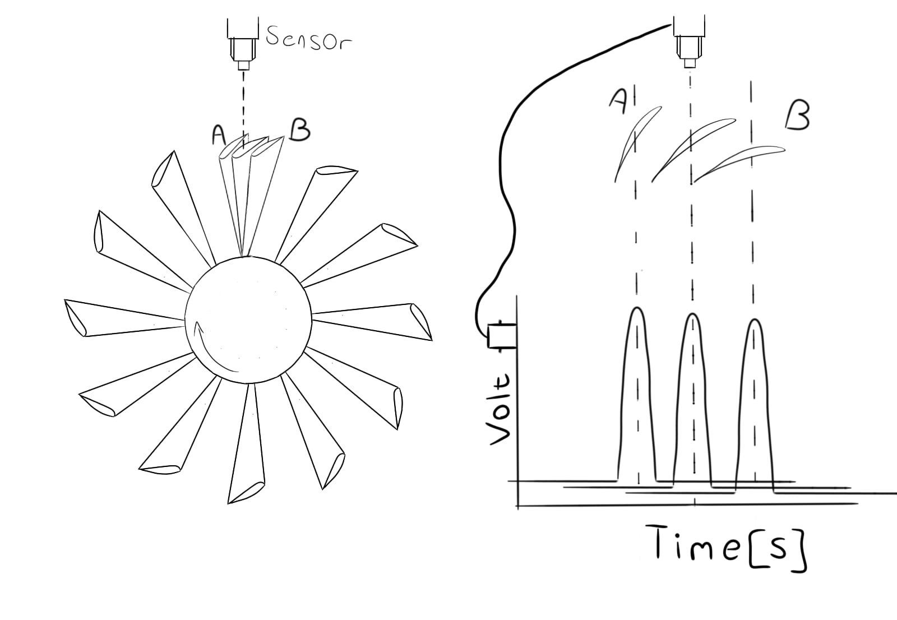
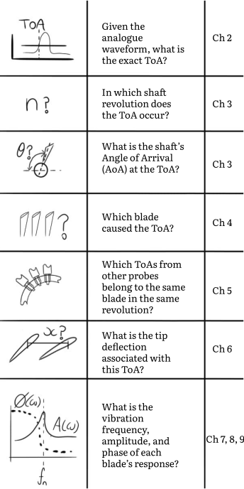

# Blade Tip Timing's fundamental principle

## Who's this tutorial for?

This tutorial is for graduate students who want to use Blade Tip Timing (BTT) to measure rotor blade vibration. The earliest BTT reference I could find is a 1967 article by Rudolph Hohenberg [@hohenberg1967detection]. BTT has therefore been around for at least 56 years. It is strange that so few getting-started resources for BTT exist. I am unaware of a single book or tutorial dedicated to BTT. 

Instead, students are expected to deep dive into old journal articles and figure it out for themselves. I have no doubt that most mechanical engineering graduate students are intellectually gifted enough to achieve this. The pressure to finish your studies on time, however, can be immense. BTT is a great discipline. You should be excited to learn it. We cannot permit submission dates to ruin the subject.

That's why I've created this tutorial. To help others learn the fundamentals as fast as possible.

I have compiled the most fundamental BTT concepts into a single resource. The core concepts are explained alongside code and example datasets. The Python :simple-python: programming language won the challenge as the language of choice. Python's popularity has surged in recent years, mostly due to its adoption in Machine Learning (ML) and Artificial Intelligence (AI). It is well poised to also take over the other engineering disciplines. Any time spent coding in Python is an excellent investment... and its value scales well beyond BTT.

The coding exercises might take more time than simply reading through the text and nodding along. However, when you grant yourself permission to spend time on the fundamentals, it leads to exponential progress later on.

By the end of this tutorial, you'll have been exposed to the fundamental theory and code that will enable you to process raw BTT data into vibration frequency, amplitude, and phase estimates.

What qualifies me to write a tutorial about BTT?

I do not claim to be the authority on BTT data processing. I have, however, wrestled with BTT for longer than 10 years. I have rewritten BTT algorithms and approaches from scratch several times. Each time, I uncovered something more fundamental. I learned how to cut away unnecessary steps and focus on the essentials. 

Hopefully, you can use what I've started with here... and take it further.

!!! question "Chapter outcomes"

	:material-checkbox-blank-outline: Understand that this tutorial is for graduate students who seek a code-first treatment of the fundamentals of BTT :simple-python:.

    :material-checkbox-blank-outline: Understand that the entire discipline of BTT is built from time stamps.

	:material-checkbox-blank-outline: Understand that each time stamp has several attributes associated with it. BTT is concerned with figuring out these attributes.
	
## Blade Tip Timing and Time Stamps
George Berkely, an 18th century philosopher, created beautiful literature while criticizing Newton's approach to calculus. Puzzled by one of the entities introduced by Newton, he wrote:

!!! quote "Quote [@berkeley1754analyst]"

    And what are these Fluxions? The velocities of evanescent increments? ... They are neither finite Quantities nor Quantities infinitely small, nor yet nothing. May we not call them the __Ghosts of departed Quantities__?

I admire the way he confers a sense of mystery onto infinitesimal entities (i.e. fluxions). This quote often comes to mind when I process BTT data. BTT measurements are not *directly proportional* to the output of the measurement device. This stands in contrast to, for example, accelerometer or strain gauge measurements. You only need to scale these raw voltages to produce the engineering quantity of interest. 

BTT measurements are the *__ghosts of departed time stamps__*.

### Time shifts and tip deflections
Rotor blades, being rigid structures, vibrate in response to dynamic loads.  They vibrate because of the aerodynamic forces experienced during operation. BTT exploits the fact that the tips move relative to the shaft's position.

The fundamental concept behind BTT is illustrated in [Figure 1](#figure_01) below. 
<figure markdown>
  { width="700" }
    <figcaption><strong><a name='figure_01'>Figure 1</a></strong>: An illustration of the fundamental principle behind BTT. </figcaption>
</figure>

On the left hand side of [Figure 1](#figure_01), a rotor is shown. Positions A and B indicate the top blade's minimum and maximum deflections due to vibration. 

A sensor is mounted in the rotor's casing. The sensor generates a voltage pulse in its output signal in response to the presence of the passing blade.

Tip deflections cause the pulse to shift *relative to* the signal produced by a "non-vibrating" blade. If the tip is deflected backward (position A), it causes the pulse to lag. If the tip is deflected forward (position B), it causes the pulse to lead.

The Time of Arrival (ToA) is extracted from each pulse. A ToA is the exact time, in seconds, that a blade is said to have *arrived* at the sensor.

### Each ToA is a puzzle to be solved

ToAs have other attributes that must be determined. Each ToA has 6 attributes associated with it. 

These attributes are best defined by a series of questions, as shown in [Figure 2](#figure_02) below.

<figure markdown>
  { width="500" }
    <figcaption><strong><a name='figure_02'>Figure 1</a></strong>: The outline of this tutorial. Each ToA  has 6 attributes associated with it. Extraction of each ToA is covered in Chapter 2. Chapters 3 - 9 determines the other attributes. </figcaption>
</figure>

I've structured this tutorial to sequentially answer these questions. Each chapter will focus on one or more of the ToA's attributes.

## Conclusion

If you grasp [Figure 1](#figure_01), you grasp the fundamental concept at the heart of BTT. However, don't underestimate the challenge that lies ahead. If tip deflections are, in fact, the ghosts of departed timestamps, they do not reveal themselves easily.    

!!! success "Chapter Outcomes"

	:material-checkbox-marked:{ .checkbox-success .heart } Understand that this tutorial is for graduate students who seek a code-first treatment of the fundamentals of BTT :simple-python:.

    :material-checkbox-marked:{ .checkbox-success .heart } Understand that the entire discipline of BTT is built from time stamps.

	:material-checkbox-marked:{ .checkbox-success .heart } Understand that each time stamp has several attributes associated with it. BTT is concerned with figuring out these attributes.

## Acknowledgements
A big thanks to <a href="https://www.linkedin.com/in/justin-s-507338116/" target="_blank">Justin Smith</a> and <a href="https://www.linkedin.com/in/alex-brocco-70218b25b/" target="_blank">Alex Brocco</a> for their feedback and suggestions regarding this chapter.

\bibliography

    

        
    

    

        

            <strong>Dawie Diamond</strong>
        

        

            2024-01-30
        

    

