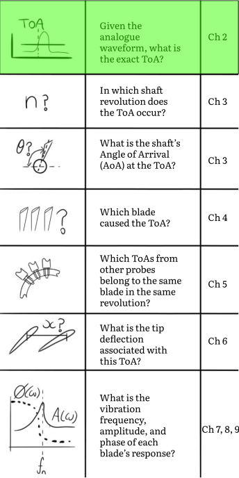
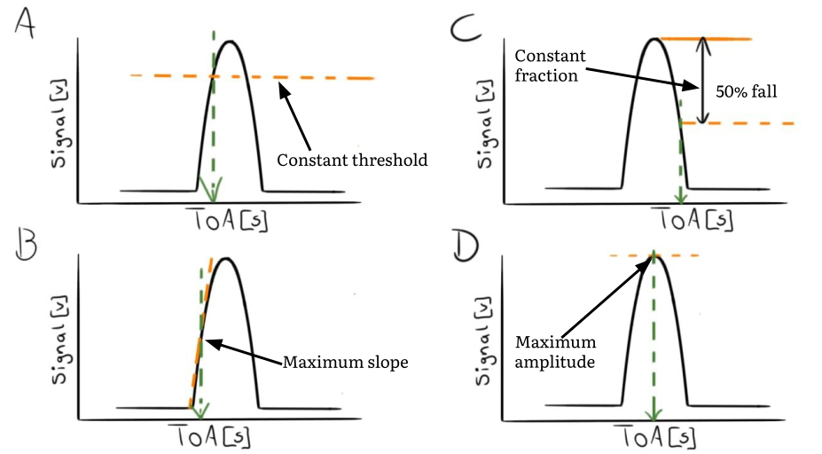
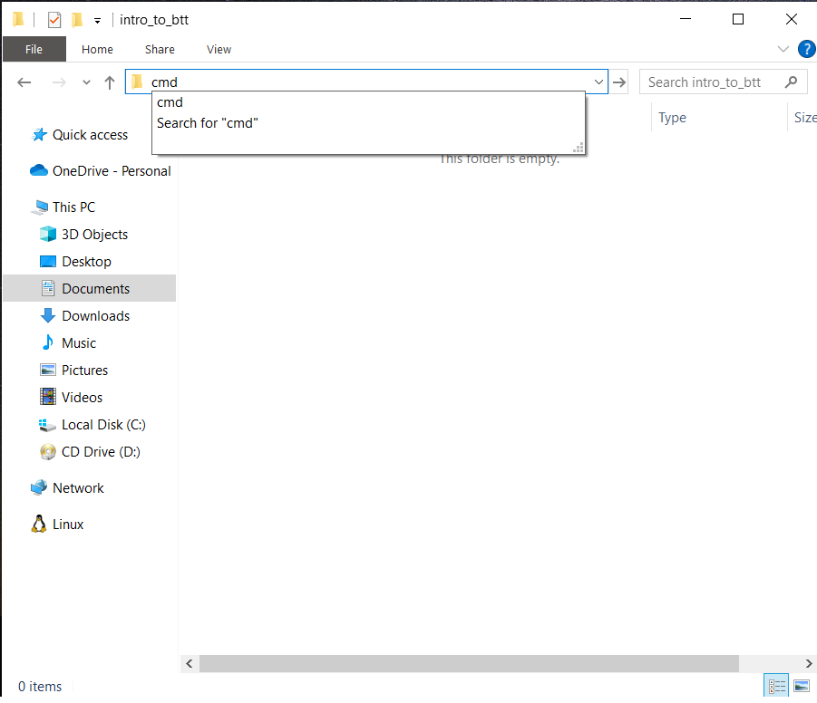
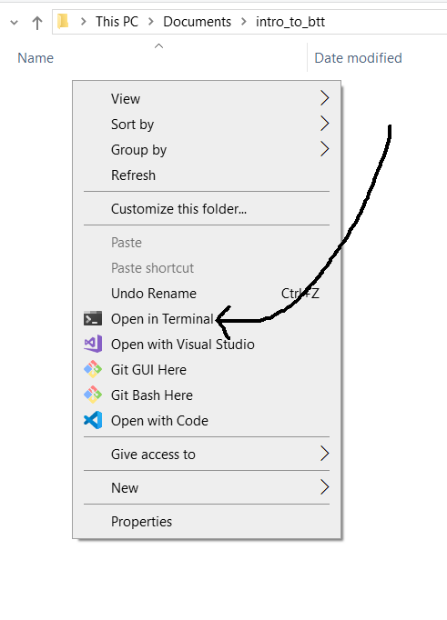
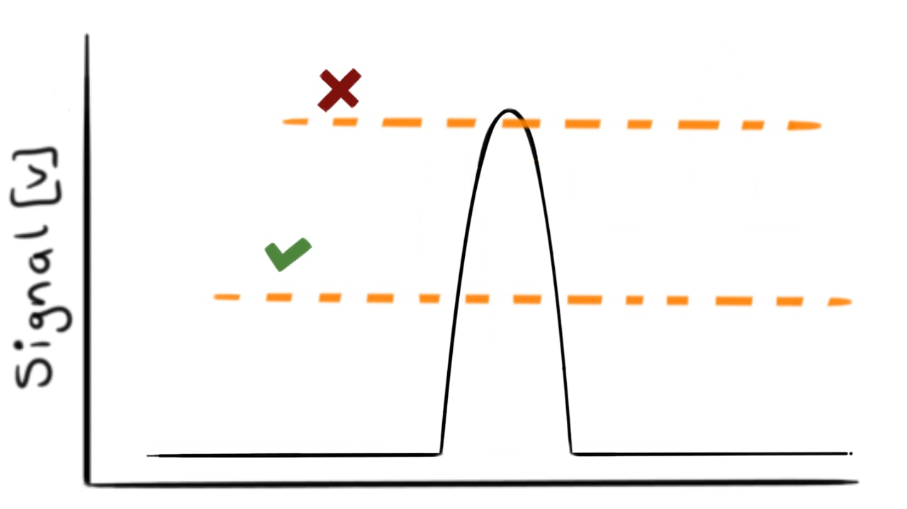
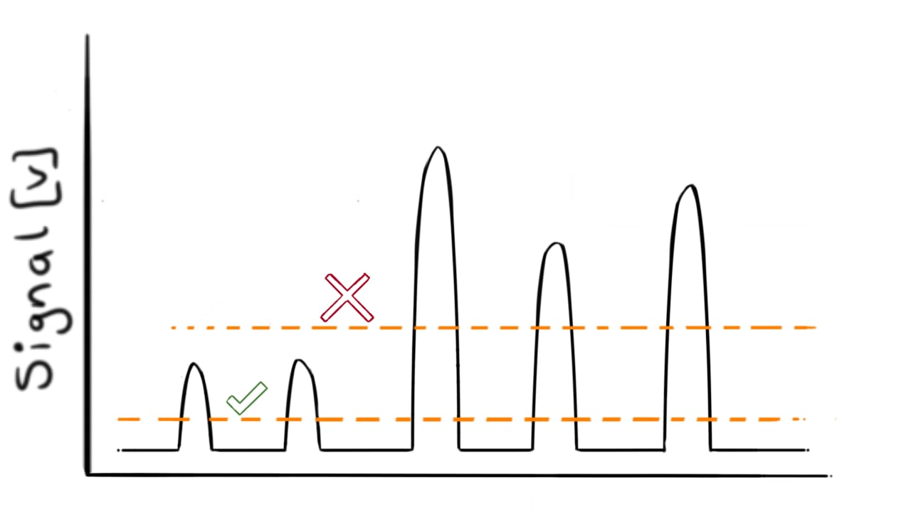
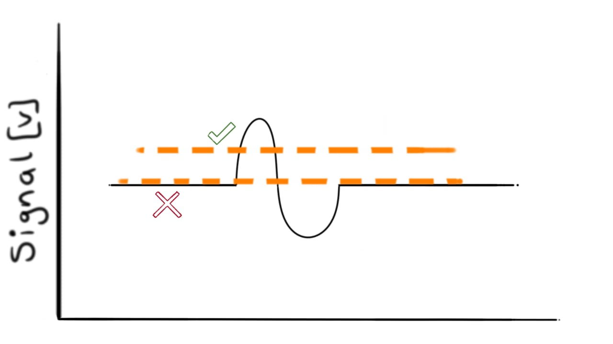
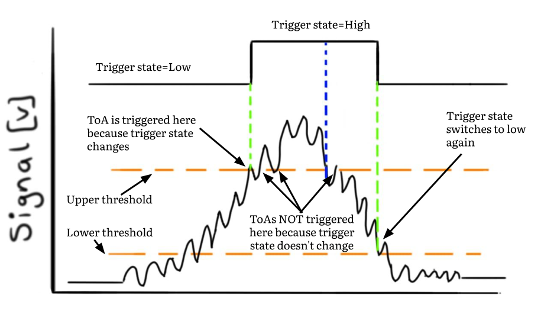

??? abstract "You are here"
	<figure markdown>
	{ width="500" }
	</figure>

# Time of Arrival (ToA)

In the previous chapter, we've established that blade vibration causes the tips to move relative to the shaft's position. A deflected tip causes a shift in the proximity probe's waveform. The size of the shift is proportional to the deflection.

So, how do we determine the size of the shift?

To determine this, we need the *exact instant* a blade moved past a probe. This instant is referred to as the __Time of Arrival__ (ToA). Each ToA is the result of applying a *trigger criterion* to each pulse. Let's consider four trigger criteria.

!!! question "Chapter outcomes"

	:material-checkbox-blank-outline: Understand that we need to implement a trigger criterion to determine the ToA of each pulse.

    :material-checkbox-blank-outline: Understand the constant-threshold trigger method's principle.

	:material-checkbox-blank-outline: Understand the detrimental effects of noise on the trigger criterion.

	:material-checkbox-blank-outline: Understand how to implement hysteresis to prevent multiple trigger events.

## Trigger criteria

Several ToA trigger criteria have been discussed in literature [@Zimmer_2008] [@diamond2021constant]. Four of the most common ones are shown in [Figure 1](#figure_01) below.

<figure markdown>
  { width="750"}
    <figcaption><strong><a name='figure_01'>Figure 1</a></strong>: Four common trigger criteria. They are A) the constant threshold trigger method, B) the maximum-slope method, C) the constant-fraction crossing method, and D) the maximum amplitude method.</figcaption>
</figure>

Here's the principle behind each criterion:
<ol type="A">
    <li>
  	    <strong>The constant threshold trigger method:</strong> A ToA is triggered when the signal crosses a predefined threshold.
    </li>
    <li>
  	    <strong>The maximum slope method:</strong> A ToA is registered when the pulse's rate of change, or slope, is at its maximum.
    </li>
    <li>
  	    <strong>The constant-fraction crossing method:</strong> Similar to method A), but the threshold level is calculated as a percentage drop from the pulse's maximum voltage level.
    </li>
    <li>
  	    <strong>The maximum voltage method:</strong> The ToA occurs when the pulse is at its maximum. 
    </li>
</ol>

We start our journey to convert raw BTT data into blade frequency, amplitude and phase starts by selecting one of these methods. Based on its simplicity, accuracy [@diamond2021constant] and widespread adoption, we choose the constant threshold method.

## Constant threshold trigger method
This method continuously compares a probe's signal to a voltage threshold. Each time the threshold is crossed, a ToA is recorded.

An idealized pulse generated by a blade as it passes a probe is shown in [Figure 2](#figure_02). A trigger threshold of 0.4 V has been set. The moment the voltage signal crosses this level, at approximately 40 $\mu s$, the ToA is registered. 
<script src="proximity_probe_data.js" > </script>
<div>
	<div>
		<canvas id="ch02_prox_probe_signal"'></canvas>
	</div>
	<script>
		async function render_chart_fig1() {

			const ctx = document.getElementById('ch02_prox_probe_signal');
			// If this is a mobile device, set the canvas height to 400
			if (window.innerWidth < 500) {
				ctx.height = 400;
			}
			while (typeof Chart == "undefined") {
				await new Promise(r => setTimeout(r, 1000));
				console.log("CHECKED FOR CHART")
			}
			Chart.defaults.font.family = "Literata, -apple-system, BlinkMacSystemFont, Helvetica, Arial, sans-serif";
			window.fig1 = new Chart(ctx, window.proximity_probe_data);
			}
		
		render_chart_fig1();
	</script>
</div>

<figure markdown>
  <figcaption><strong><a name='figure_02'>Figure 2</a></strong>: An illustration of the constant threshold method applied to an idealized pulse. A ToA is registered when the signal crosses the 0.4 V threshold level. </figcaption>
</figure>

Before we get into the code, let's get you operational with Python and this tutorial's supplementary material.

## :simple-pypi: Bladesight package
I have released a  `pip` installable package, called `bladesight`, you can use to access this tutorial's datasets and functions.

The Pypi package can be found here: <a href="https://pypi.org/project/bladesight/" target="_blank">https://pypi.org/project/bladesight/</a>. The Github repo can be found here: <a href="https://github.com/Bladesight/Bladesight" target="_blank">https://github.com/Bladesight/Bladesight</a>.

## :simple-jupyter: Follow along with the worksheet
This BTT tutorial is code-centric. 

The concepts are explained with reproducible code. I've collected the code examples for each chapter into its own Jupyter worksheet.The worksheets can be accessed at this Github repo:

<a href=https://github.com/Bladesight/bladesight-worksheets target="_blank">
	https://github.com/Bladesight/bladesight-worksheets
</a>

Please resist the urge to skip working with the sheets. The biggest stumbling block to learning BTT (and many subjects for that matter) is not the theory. It's to understand how the theory is implemented. Getting stuck into the code will pay off in the long run.

The worksheets can be executed in two environments:

1.  Use Google Colab, and 
2.  Use a local installation

### :simple-googlecolab: Google Colab
Google Colab allows you to run Jupyter notebooks in the cloud. You can open the Google Colab notebook for this chapter by clicking on the link below:

<a href="https://colab.research.google.com/github/Bladesight/bladesight-worksheets/blob/master/intro_to_btt/ch_02_worksheet.ipynb" target="_blank"></a>

You need a Google account to use Colab. If you don't have one, you can create one for free <a href="https://accounts.google.com/signup/v2/createaccount?theme=glif&flowName=GlifWebSignIn&flowEntry=SignUp" target="_blank">here</a>.

### :material-laptop: Local Python installation
At some stage you'll want to set up your local environment to do your own development. I'll guide you through the process. If you can set up a local Python environment, skip this section.

#### Python version
Here is an excellent (and entertaining) <a href="https://youtu.be/YKSpANU8jPE?feature=shared" target="_blank">:material-open-in-new: video</a> on how to install Python for Windows. *Please note:* the `bladesight` package only works on Python 3.9, 3.10 and 3.11. It does not yet work on versions 3.12 and 3.13. If you do not have a compatible version of Python installed, you can download it from <a href="https://www.python.org/downloads/release/python-3117/" target="_blank">here</a>.

#### Virtual environments
Virtual environments are an excellent way to isolate different Python projects from one another. I highly recommend setting one up. 

If you're on Windows, you can use these steps to set up a virtual environment:

1.  Go to the directory where you want to create the virtual environment. In my case it is `"C:\Users\Dawie Diamond\intro_to_btt\"`. 

2.  Open a command prompt in the directory. In Windows 11, this can be achieved in one of two ways: 
    
    1.  Type `cmd` in the address bar of the directory:
        
        { width="500" }
        
        :material-keyboard-outline: Press enter after typing `cmd`. 
        
        A command prompt should open.

    2.  You can also right click in the directory and select "Open in Terminal":
        
        { width="500" }

3. Type the following command into the command prompt to create a virtual environment called `venv`:
	``` console
	python -m venv venv
	```

4. Run the below command to activate the virtual environment:
	``` console
	venv\Scripts\activate
	```

5. Execute the below instruction to install the bladesight package:
	``` console
	pip install bladesight
	```

6. Install Jupyter:
	``` console
	pip install jupyter
	```

7. We make extensive use of `plotly` for plotting. Let's install it as well:
    ``` console
    pip install plotly
    ```

8. Now you can launch Jupyter:
    ``` console
    jupyter notebook
    ```

!!! tip
    One of the first people to test drive this tutorial told me he almost punched a hole through his screen when he was trying to set up the virtual environment.

	I understand this. Setting up a virtual environment is often the most difficult part of starting with a new project.

	Please reach out to me at <a href="mailto:dawie.diamond@bladesight.com">dawie.diamond@bladesight.com</a> and I'd be happy to help you get set up.

If you're on a different platform, here's an excellent <a href="https://youtu.be/kz4gbWNO1cw?si=uFBotRmhP1oTp8K8" target="_blank">:material-open-in-new: video</a> on how to set up virtual environments. The video covers different kinds of operating systems. I've created links for each operating system below:

* <a href="https://youtu.be/kz4gbWNO1cw?feature=shared&t=371" target="_blank">:material-microsoft-windows: Windows</a>
* <a href="https://youtu.be/kz4gbWNO1cw?feature=shared&t=45" target="_blank"> :material-apple: Mac</a>
* <a href="https://youtu.be/kz4gbWNO1cw?feature=shared&t=243" target="_blank">:fontawesome-brands-linux: Linux</a>

## Vectorized implementation of the constant threshold trigger method
An artificial signal that contains three pulses, is shown in [Figure 3](#figure_03) below. 

<script src="three_pulses.js" > </script>
<div>
	<div>
		<canvas id="ch02_three_pulses_canvas"'></canvas>
	</div>
	<script>
		async function render_chart() {

			const ctx = document.getElementById('ch02_three_pulses_canvas');
			// If this is a mobile device, set the canvas height to 400
			if (window.innerWidth < 500) {
				ctx.height = 400;
			}
			while (typeof Chart == "undefined") {
				await new Promise(r => setTimeout(r, 1000));
				console.log("CHECKED FOR CHART")
			}
			Chart.defaults.font.family = "Literata, -apple-system, BlinkMacSystemFont, Helvetica, Arial, sans-serif";
			new Chart(ctx, window.three_pulses);
		}
		render_chart();
	</script>
</div>
<figure markdown>
  <figcaption><strong><a name='figure_03'>Figure 3</a></strong>: A signal that contains three pulses. </figcaption>
</figure>

Let's extract the ToAs.

!!! note "How the code is presented"
	These are the tutorial's first code examples. I therefore __*repeatedly display*__ the complete code. Different lines are highlighted and discussed each time.


### Step 1: Load the probe signal
``` py linenums="1" hl_lines="1 3 5"
from bladesight import Datasets

ds_ch2 = Datasets["data/intro_to_btt/intro_to_btt_ch02"]

df_proximity_probe = ds_ch2["table/three_generated_pulses"] # (1)!

TRIGGER_ON_RISING_EDGE = True
THRESHOLD_LEVEL = 0.4 # Volts

if TRIGGER_ON_RISING_EDGE:
    sr_threshold_over = (
		df_proximity_probe['data'] >= THRESHOLD_LEVEL
	).astype(int)
else:
    sr_threshold_over = (
		df_proximity_probe['data'] <= THRESHOLD_LEVEL
	).astype(int)

diff_sr_threshold = sr_threshold_over.diff()

diff_sr_threshold = diff_sr_threshold.bfill()

sr_threshold_change = diff_sr_threshold > 0

sr_toas = df_proximity_probe['time'][sr_threshold_change]
```

1.	This line loads the table into memory. It returns a `Pandas DataFrame`. We will be making extensive use of Pandas DataFrames throughout this tutorial. Its documentation can be found here: <a target="_blank" href="https://pandas.pydata.org/docs/" >https://pandas.pydata.org/docs/</a>


On Line 1, we import the `bladesight` package. In addition to hosting the functions developed in this tutorial, the package makes it simple to download and open the datasets.

On lines 3 and 5, we download this chapter's dataset and read the "three_generated_pulses" table. The first ten rows of the dataset are shown below:

{{ read_csv('docs/tutorials/intro_to_btt/ch2/three_pulses_head.csv') }}

??? note "Units"
    | Column | Units |
    | --- | --- |
    | `time` | seconds |
    | `data` | Volt |

The DataFrame has 2 columns: `time` and `data`. The `time` column contains each data value's timestamp. 

### Step 2: Set the threshold direction and value

``` py linenums="1" hl_lines="7 8"
from bladesight import Datasets

ds_ch2 = Datasets["data/intro_to_btt/intro_to_btt_ch02"]

df_proximity_probe = ds_ch2["table/three_generated_pulses"]

TRIGGER_ON_RISING_EDGE = True
THRESHOLD_LEVEL = 0.4 # Volts

if TRIGGER_ON_RISING_EDGE:
    sr_threshold_over = (
		df_proximity_probe['data'] >= THRESHOLD_LEVEL
	).astype(int)
else:
    sr_threshold_over = (
		df_proximity_probe['data'] <= THRESHOLD_LEVEL
	).astype(int)

diff_sr_threshold = sr_threshold_over.diff()

diff_sr_threshold = diff_sr_threshold.bfill()

sr_threshold_change = diff_sr_threshold > 0

sr_toas = df_proximity_probe['time'][sr_threshold_change]
```

In Line 7, we specify the direction of the trigger. If `TRIGGER_ON_RISING_EDGE` is `True`, we trigger when the signal crosses the threshold on the rising edge. If `TRIGGER_ON_RISING_EDGE` is `False`, we trigger when the signal crosses the threshold on the falling edge.

In Line 8 we set the threshold level to 0.4 Volts.

### Step 3: Determine when the signal has crossed the threshold

``` py linenums="1" hl_lines="10 11 12 13 14 15 16 17"
from bladesight import Datasets

ds_ch2 = Datasets["data/intro_to_btt/intro_to_btt_ch02"]

df_proximity_probe = ds_ch2["table/three_generated_pulses"]

TRIGGER_ON_RISING_EDGE = True
THRESHOLD_LEVEL = 0.4 # Volts

if TRIGGER_ON_RISING_EDGE:
    sr_threshold_over = (
		df_proximity_probe['data'] >= THRESHOLD_LEVEL
	).astype(int) # (1)!
else:
    sr_threshold_over = (
		df_proximity_probe['data'] <= THRESHOLD_LEVEL
	).astype(int)

diff_sr_threshold = sr_threshold_over.diff()

diff_sr_threshold = diff_sr_threshold.bfill()

sr_threshold_change = diff_sr_threshold > 0

sr_toas = df_proximity_probe['time'][sr_threshold_change]
```

1.	We use the method `.astype(int)` at the end of this line because, by default, comparison operators such as `>=` and `<=` result in boolean values. We need an integer column for the steps that follow.

In lines 10 - 17, we determine when the signal is "over" the threshold level. The definition of "over" depends on the direction of the trigger. If we trigger on a rising edge, the signal is "over" when it is larger than the threshold. If we trigger on a falling edge, the signal is "over" when it is smaller than the threshold.

The variable `sr_threshold_over` contains an array of ones and zeros that indicates whether the signal is above or below the threshold. This variable is shown on top of the original signal in [Figure 4](#figure_04) below:

<script src="over_under_indicator.js" > </script>
<div>
	<div>
		<canvas id="ch03_three_pulses_canvas"'></canvas>
	</div>
	<script>
		async function render_chart() {

			const ctx = document.getElementById('ch03_three_pulses_canvas');
			// If this is a mobile device, set the canvas height to 400
			if (window.innerWidth < 500) {
				ctx.height = 400;
			}
			while (typeof Chart == "undefined") {
				await new Promise(r => setTimeout(r, 1000));
				console.log("CHECKED FOR CHART")
			}
			Chart.defaults.font.family = "Literata, -apple-system, BlinkMacSystemFont, Helvetica, Arial, sans-serif";
			new Chart(ctx, window.over_under_indicator);
		}
		render_chart();
	</script>
</div>
<figure markdown>
  <figcaption><strong><a name='figure_04'>Figure 4</a></strong>: The over/under indicator overlayed on the the original signal. The indicator goes to 1 (boolean True) when the signal is larger than the threshold and stays 0 otherwise.</figcaption>
</figure>


### Step 4: Determine when the indicator has changed

``` py linenums="1" hl_lines="19 21 23"
from bladesight import Datasets

ds_ch2 = Datasets["data/intro_to_btt/intro_to_btt_ch02"]

df_proximity_probe = ds_ch2["table/three_generated_pulses"]

TRIGGER_ON_RISING_EDGE = True
THRESHOLD_LEVEL = 0.4 # Volts

if TRIGGER_ON_RISING_EDGE:
    sr_threshold_over = (
		df_proximity_probe['data'] >= THRESHOLD_LEVEL
	).astype(int)
else:
    sr_threshold_over = (
		df_proximity_probe['data'] <= THRESHOLD_LEVEL
	).astype(int)

diff_sr_threshold = sr_threshold_over.diff()

diff_sr_threshold = diff_sr_threshold.bfill() # (1)!

sr_threshold_change = diff_sr_threshold > 0

sr_toas = df_proximity_probe['time'][sr_threshold_change]
```

1.	The `bfill` method is used to backward fill any missing values in a pandas Series. We do this because the first value of `diff_sr_threshold` is `NaN`. Why is it `NaN`? Because the first value, by definition, has no prior value to be compared with. We use `bfill` here to force the first value equal to the second value. 

Since we are interested in the *exact instant* the signal crosses the threshold, we calculate the *change* in `sr_threshold_over`. In Line 19, the `diff` method calculates the consecutive differences between adjacent measurements. In Line 23, the `>` operator is used to find where the indicator has changed from zero to one. 

The result of this operation is shown in [Figure 5](#figure_05) below:

<script src="change_in_over_under_indicator.js" > </script>
<div>
	<div>
		<canvas id="ch04_change_in_over_under_indicator"'></canvas>
	</div>
	<script>
		async function render_chart() {

			const ctx = document.getElementById('ch04_change_in_over_under_indicator');
			// If this is a mobile device, set the canvas height to 400
			if (window.innerWidth < 500) {
				ctx.height = 400;
			}
			while (typeof Chart == "undefined") {
				await new Promise(r => setTimeout(r, 1000));
				console.log("CHECKED FOR CHART")
			}
			Chart.defaults.font.family = "Literata, -apple-system, BlinkMacSystemFont, Helvetica, Arial, sans-serif";
			new Chart(ctx, window.change_in_over_under_indicator);
		}
		render_chart();
	</script>
</div>
<figure markdown>
  <figcaption><strong><a name='figure_04'>Figure 4</a></strong>: The original signal, along with the change in over/under indicator. The change indicator is 1 when the threshold is crossed, and -1 when the signal falls below the threshold again.
  </figcaption>
</figure>

### Step 5: Select the ToAs
``` py linenums="1" hl_lines="25"
from bladesight import Datasets

ds_ch2 = Datasets["data/intro_to_btt/intro_to_btt_ch02"]

df_proximity_probe = ds_ch2["table/three_generated_pulses"]

TRIGGER_ON_RISING_EDGE = True
THRESHOLD_LEVEL = 0.4 # Volts

if TRIGGER_ON_RISING_EDGE:
    sr_threshold_over = (
		df_proximity_probe['data'] >= THRESHOLD_LEVEL
	).astype(int)
else:
    sr_threshold_over = (
		df_proximity_probe['data'] <= THRESHOLD_LEVEL
	).astype(int)

diff_sr_threshold = sr_threshold_over.diff()

diff_sr_threshold = diff_sr_threshold.bfill() # (1)!

sr_threshold_change = diff_sr_threshold > 0

sr_toas = df_proximity_probe['time'][sr_threshold_change]
```

Line 25 is the culmination of our algorithm. We select only the time stamps where our over/under indicator has changed from zero to one. *These time stamps are our ToAs.* 

These are the values in `sr_toas`:

``` py
>>> print(sr_toas)
[27.44248083, 52.45081694, 77.45915305]
```

!!! tip "How can we set the *ideal* threshold level?"
    I don't have a one-size-fits-all answer. Here are some general guidelines I use:
    
    1.  The threshold level must intersect the pulse where its slope is steep. Do not set the threshold near a turning point. You can read about it in my paper [@diamond2021constant].

        { width="500" }

    2.  The blades on your rotor have different lengths. The pulse shape depends on how far the tip is from the probe. Some pulses are noticeably shorter than others. The threshold level must be set to enable the maximum number of blades can be "seen".

        { width="500" }

    3.  Many BTT probes produce a first-derivative shaped signal. In other words, each pulse:
    
        1.  starts at zero
        
        2.  increases in the positive direction
        
        3.  rapidly dips through zero again
        
        4.  extends into the negative direction

        5.  returns back to zero
        
        It is tempting to set the threshold level at zero, because you want to capture the ToA when the signal dips through zero in the middle. However, this is a bad idea. You are almost guaranteed of spurious ToAs because of noise around zero before and after the pulse settles.

        { width="500" }

        If you do want to set the threshold level at zero in the  middle of the pulse, you should implement hysteresis. We'll discuss hysteresis later in this chapter.

## Sequential implementation of the constant threshold trigger method
The vectorized implementation shown above is great... but we can do better. We now implement a *sequential version* of the constant threshold trigger method.

The sequential implementation is the preferred one for two reasons:

1. Contrary to how many people (...I'm referring to myself here) have been trained to think, it is faster than the vectorized implementation.
2. It is simpler to understand.

How can a sequential, for-loop based approach be faster than the vectorized method? Python is frequently regarded as a slow language. This is false. It is only slow if you use it like nobody ever intended for it to be used.

Many approaches exist to enhance its speed. One can often achieve performance levels comparable to compiled languages.

We use Numba. Numba is a powerful Just-In-Time (JIT) compiler for Python, compiling portions of your code into machine code at runtime. This often leads to blistering fast functions. Numba is a dependency of the bladesight package, so its already installed if you've followed the installation instructions at the start of this chapter.

To use Numba, we import the `njit` decorator from the package, and wrap our function in it.

``` py 
from numba import njit
```

### Simple example

The simplest implementation of a sequential algorithm involves a `for` loop to monitor when the signal passes a constant threshold.

``` py linenums="1"
@njit
def seq_simple_threshold_crossing(
    arr_t : np.ndarray, #(1)!
    arr_s : np.ndarray, #(2)!
    threshold : float, #(3)!
    n_est : Optional[float] = None,#(4)!
    trigger_on_rising_edge : bool = True#(5)!
) -> np.ndarray: #(6)!   
    if n_est is None:
        arr_toa = -1 * np.ones(arr_t.shape)
    else:
        arr_toa = -1 * np.ones(n_est)#(7)!

    i_toa = 0#(8)!

    prev_sample = arr_s[0]#(9)!

    for i_sample in range(1, arr_s.shape[0]):#(10)!
 
        curr_sample = arr_s[i_sample]

        if trigger_on_rising_edge:
            if (prev_sample < threshold) and (curr_sample >= threshold):#(11)!
                arr_toa[i_toa] = arr_t[i_sample]#(12)!
                i_toa += 1#(13)!
        else:
            if (prev_sample > threshold) and (curr_sample <= threshold):#(14)!
                arr_toa[i_toa] = arr_t[i_sample]
                i_toa += 1

        prev_sample = curr_sample#(15)!

    return arr_toa[:i_toa]#(16)!
```

1.	The array of time values. Must be a Numpy array.
2.	The array of voltage values. Must be a Numpy array.
3.	The threshold value. Must be a float.
4.	The estimated number of ToAs in this signal. Defaults to None. This number is used to pre-allocate the array of ToAs. If this number is not provided, the array will be pre-allocated as the same dimension as arr_t and arr_s. You should specify this value for large signals.
5.	Whether to trigger ToAs on the rising or falling edge. Defaults to True. If True, the ToA is triggered on the rising edge.
6.	This type annotation `-> np.ndarray` indicates the return value of the function is a Numpy array.
7.	We pre-allocate the array of ToAs. This is a performance optimization. If we don't pre-allocate the array, the function will have to resize the array each time a ToA is found. It's easy to estimate the expected number of ToAs in the signal, and should be done for any real signal.
8.	Initialize the number of ToAs found in this signal. `i_toa` will increase by one each time a ToA has been found.
9.	The sequential approach compares each sample to the previous sample. Here, we initialize the `prev_sample` value to the first value in the array.
10.	We loop through the entire signal and compare each sample to its previous sample.
11.	Here, we check if the threshold has been crossed. If so, we store the ToA in the `arr_toa` array. This if-clause is executed for a rising edge trigger.
12.	If the threshold has been crossed, we store the ToA in the `arr_toa` array.
13. Increment the `i_toa` value by one.
14.	The check for a falling edge trigger.
15. We're done with this sample. This command prepares use for the comparison in the next loop pass.
16.	Return the ToAs that have been registered. The rest of the array is filled with -1 values.


!!! Note "Type annotations in Python"
	Throughout this tutorial, you'll notice in many of the functions, the function arguments are accompanied by *type annotations*. In the first argument above, `arr_t : np.ndarray`, `arr_t` is the variable name and `: np.ndarray` is the type annotation . These type annotations specify the expected data types of the arguments.
    
    It's important to note Python itself does not enforce these type annotations. They are primarily utilized by type checkers and serve as a helpful guide for users of the function.

	We often need to import annotations from the `typing` library. In the example above, we need to import the `Optional` type with `from typing import Optional`.

If we pass our three pulses signal through this function, we get the same result as the vectorized implementation:

``` py
>>> toas = seq_simple_threshold_crossing(
	df_proximity_probe['time'].values, #(1)!
	df_proximity_probe['data'].values, 
	threshold=0.4
)
>>> print(toas)
[27.44248083 52.45081694 77.45915305]
```

1.	Note how we use the `.values` attribute of the Pandas object. This returns a Numpy array, which is required by the function.

### Interpolate on voltage
Our signals are *sampled* by a data acquisition system (DAQ). Suppose the DAQ's sampling rate is 100 kHz. This means one sample is acquired every 10 $\mu$s. What happens if the threshold is crossed *between two samples*? The methods derived up to this point will miss the exact ToA. The ToA will only be triggered at the first available sample *after* the threshold has been crossed.

If we have the raw analogue signal stored on disk, it's wise to capitalize on the continuous nature of the signal.

To improve the accuracy of ToA determination, we employ interpolation between the two nearest samples when the threshold is crossed.

The below is a function performs interpolation.

``` py linenums="1"
@njit
def seq_threshold_crossing_interp(
    arr_t : np.ndarray,
    arr_s : np.ndarray,
    threshold : float,
    n_est : Optional[float] = None,
    trigger_on_rising_edge : bool = True
) -> np.ndarray:
    if n_est is None:
        arr_toa = -1 * np.ones(arr_t.shape)
    else:
        arr_toa = -1 * np.ones(n_est)

    i_toa = 0

    prev_sample = arr_s[0]

    for i_sample in range(1, arr_s.shape[0]):

        curr_sample = arr_s[i_sample]

        if trigger_on_rising_edge:
            if (prev_sample < threshold) and (curr_sample >= threshold):
                # Interpolate the ToA
                arr_toa[i_toa] = (
                    arr_t[i_sample - 1] 
                    + (arr_t[i_sample] - arr_t[i_sample - 1]) 
                    * (threshold - prev_sample) 
                    / (curr_sample - prev_sample)
                ) # (1)!
                i_toa += 1
        else:
            if (prev_sample > threshold) and (curr_sample <= threshold):
                arr_toa[i_toa] = (
                    arr_t[i_sample - 1] 
                    + (arr_t[i_sample] - arr_t[i_sample - 1]) 
                    * (threshold - prev_sample) 
                    / (curr_sample - prev_sample)
                )
                i_toa += 1

        prev_sample = curr_sample

    return arr_toa[:i_toa]
```

1.	This part performs linear interpolation between the two samples either side of the threshold. It is the only difference between this function and the previous one.

??? note "Why use linear interpolation?"
    Linear interpolation is the simplest form of interpolation. It is also the fastest. In my experience, the accuracy gain from a higher order interpolation method is marginal. It's not worth the additional code complexity.

Let's use this function on the same signal:

``` py
>>> toas = seq_threshold_crossing_interp(
    df_proximity_probe['time'].values, 
    df_proximity_probe['data'].values, 
    threshold=0.4
)
>>> print(toas)
[27.42940329 52.44126697 77.45548277]
```

These values are slightly different than the previous ones ( the previous ones are `[27.44248083 52.45081694 77.45915305]` ). The new values are more accurate than the old ones.

### Hysteresis
The signals we've used so far contain minimal noise. In the absence of noise, the ToAs are easily extracted. However, in real-world scenarios, signals contain non-negligible noise components. 

Sometimes, excessive noise is consistently present throughout the signal. Other times it appears in short, sporadic bursts. 

To illustrate this point vividly, I've generated a noisy signal that contains three pulses, shown in [Figure 6](#figure_06) below: 

!!! Note "Zoom"
    If there is a "Reset zoom" button on the bottom of the figure, you can zoom and pan on the plot. Drag across the screen to __zoom__ , hold `ctrl` and drag across the screen to __pan__.

<script src="three_pulses_noisy.js" > </script>
<div>
	<div>
		<canvas id="ch02_three_pulses_noisy"'></canvas>
	</div>
	<script>
		async function render_chart_three_pulses_noisy() {
			const ctx = document.getElementById('ch02_three_pulses_noisy');
			// If this is a mobile device, set the canvas height to 400
			if (window.innerWidth < 500) {
				ctx.height = 400;
			}
			while (typeof Chart == "undefined") {
				await new Promise(r => setTimeout(r, 1000));
				console.log("CHECKED FOR CHART")
			}
			Chart.defaults.font.family = "Literata, -apple-system, BlinkMacSystemFont, Helvetica, Arial, sans-serif";
			window.fig_three_pulses_noisy = new Chart(ctx, window.three_pulses_noisy);
			window.fig_three_pulses_noisy_reset = function resetZoomFig1() {
					window.fig_three_pulses_noisy.resetZoom();
				}
			}
		render_chart_three_pulses_noisy();
	</script>
	<a onclick="window.fig_three_pulses_noisy_reset()" class='md-button'>Reset Zoom</a>
</div>
<figure markdown>
  <figcaption><strong><a name='figure_06'>Figure 6</a></strong>: A noisy signal that contains three pulses. Zoom into the areas around 0.4 V to observe the signal crosses the threshold multiple times.
  </figcaption>
</figure>

If you zoom into each pulse around 0.4 V, you'll observe the signal crosses the threshold multiple times. Let's apply our trigger algorithm to this signal. We first need to load the noisy signal dataframe:

``` py
df_proximity_probe = ds_ch2["table/three_generated_pulses_noisy"]
```

Having applied our algorithm to the noisy signal, these are the ToAs: 

``` console
[27.20280579, 27.26724046, 27.45521975, 27.54516822, 32.4110573,  32.48523812,
 32.59630977, 32.73320484, 52.10882236, 52.46204252, 52.59380688, 57.42079388,
 57.64309888, 57.69638523, 57.78086048, 57.87833845, 77.46723661, 77.66015932,
 78.09842428, 82.3623517,  82.50989437, 82.74746473]
```

Our algorithm incorrectly returns many ToAs around the 0.4 V level.

We can implement *hysteresis* to solve the issue. Hysteresis introduces a *second threshold* and a *state variable* to our algorithm. The algorithm therefore uses a *lower* and an *upper* threshold. The state can only change based on certain rules. The rules are:

1.	If the state is *low* and the current sample is *above* the upper threshold, the state becomes high. A ToA is triggered when the state moves from low to high.
2.	If the state is *high* and the current sample falls *below* the lower threshold, the state becomes low.
3.	Otherwise, the state is maintained.

[Figure 7](#figure_07) below illustrates the state variable and ToA trigger events for a (absurdly) noisy signal. 

<figure markdown>
  { width="750"}
    <figcaption><strong><a name='figure_07'>Figure 7</a></strong>: An illustration of hysteresis in our trigger criterion.</figcaption>
</figure>

The below algorithm implements hysteresis to determine the ToAs on the rising edge:

``` py linenums="1"
@njit
def seq_threshold_crossing_hysteresis_pos(
    arr_t : np.ndarray,
    arr_s : np.ndarray,
    threshold : float,
    hysteresis_height : float, #(1)!
    n_est : Optional[float] = None,
) -> np.ndarray:
    threshold_lower = threshold - hysteresis_height
    trigger_state = ( # (2)!
		True 
		if arr_s[0] > threshold_lower 
		else False
	)

    if n_est is None:
        arr_toa = -1 * np.ones(arr_t.shape)
    else:
        arr_toa = -1 * np.ones(n_est)

    i_toa = 0

    prev_sample = arr_s[0]

    for i_sample in range(1, arr_s.shape[0]):
        curr_sample = arr_s[i_sample]

        if trigger_state is True:
            if curr_sample <= threshold_lower: #(3)!
                trigger_state = False
        else:
            if curr_sample >= threshold:#(4)!
                trigger_state = True
                arr_toa[i_toa] = (
                    arr_t[i_sample - 1] 
                    + (arr_t[i_sample] - arr_t[i_sample - 1]) 
                    * (threshold - prev_sample) 
                    / (curr_sample - prev_sample)
                )
                i_toa += 1

        prev_sample = curr_sample

    return arr_toa[:i_toa]
```

1.  The height of the hysteresis. It has the same units as the signal. This value is used to calculate the lower threshold.
2.  The trigger state is a boolean value indicating whether the trigger is currently *high* or *low*. We initialize it to True if the first sample is above the lower threshold, and False otherwise.
3.  If the trigger state is True, we check if the current sample is below the lower threshold. If it is, we set the trigger state to False.
4.  If the trigger state is False, we check if the current sample is above the upper threshold. If it is, we set the trigger state to True and calculate the ToA with interpolation.

We can use this function to extract the ToAs from the noisy signal:

``` py
>>> toas = seq_threshold_crossing_hysteresis_pos(
	df_proximity_probe_noisy['time'].values, 
	df_proximity_probe_noisy['data'].values, 
	threshold=0.4, 
	hysteresis_height=0.2
)
>>> print(taos)
[27.20280579 52.10882236 77.46723661]
```
Implementation of hysteresis stops multiple trigger events. It does not, however, guarantee accurate ToAs for noisy signals. We might end up with the *correct number* of ToAs, but each ToA will be the *first* one where the signal crosses the upper threshold. This may not be the best ToA. It may therefore be beneficial to incorporate a filter into the algorithm. We don't cover filters in this chapter.

??? note "How to select `hysteresis height` and `n_est`"
    1. The hysteresis height should be at least twice as large as the noise. A sufficient estimate can usually be made by observing the largest noise spikes.
    
    2. The `n_est` value should be larger than the number of pulses in the signal. I use this calculation:

    ``` python
    n_est = (
        MAX_SHAFT_SPEED_IN_HZ 
        * NUMBER_OF_BLADES_ON_ROTOR 
        * TIME_IN_SECONDS_OF_MEASUREMENT
    ) * 2
    ```

    The `*2` at the end of the equation doubles the pre-allocated array length. We can therefore be sure there's enough space for all the ToAs.

## Performance of sequential vs vectorized implementations
We've now implemented *vectorized* and *sequential* algorithms to extract the ToAs. Which one is faster? Let's use both approaches on a real signal.

The dataset used here contains a signal acquired from an eddy current probe. It is stored in the table `table/aluminium_blisk_1200_rpm`. The signal was acquired for a five blade rotor running at 1200 RPM. The acquisition was performed at a sampling rate of 2 MHz. The signal is shown in [Figure 8](#figure_08) below:

<script src="eddy_current_probe_raw.js" > </script>
<div>
	<div>
		<canvas id="ch02_eddy_current_probe_raw"'></canvas>
	</div>
	<script>
		async function render_chart_fig_eddy_current_raw() {
			const ctx = document.getElementById('ch02_eddy_current_probe_raw');
			// If this is a mobile device, set the canvas height to 400
			if (window.innerWidth < 500) {
				ctx.height = 400;
			}
			while (typeof Chart == "undefined") {
				await new Promise(r => setTimeout(r, 1000));
				console.log("CHECKED FOR CHART")
			}
			Chart.defaults.font.family = "Literata, -apple-system, BlinkMacSystemFont, Helvetica, Arial, sans-serif";
			window.fig_eddy_current_raw = new Chart(ctx, window.eddy_current_probe_raw);
			window.fig_eddy_current_raw_reset = function resetZoomFig2() {
					window.fig_eddy_current_raw.resetZoom();
				}
			}
		render_chart_fig_eddy_current_raw();
	</script>
	<a onclick="window.fig_eddy_current_raw_reset()" class='md-button'>Reset Zoom</a>
</div>
<figure markdown>
  <figcaption><strong><a name='figure_08'>Figure 7</a></strong>: An eddy current probe signal acquired for a five blade aluminium rotor rotating at 1200 RPM. The sampling rate of the DAQ was 2 MHz. For this figure, the data points are heavily decimated.</figcaption>
</figure>

We can use the Jupyter `%%timeit` magic method to time a piece of code. Here's the result:

| Vectorized | Sequential |
|------------|------------|
| 301 ms     | 18 ms |

The sequential method is almost 20 times faster than the vectorized method. The sequential method also contains hysteresis and interpolation. The vectorized method does not.

## Real Time Hardware

This chapter assumes you can store large analogue signals on your disk. If your rotor is small and turns slowly, this method is suitable.

When your blades are large or your rotor spins fast, you'll need to determine the ToAs in real-time. This typically requires custom hardware. Here are some providers of BTT hardware:

* <a target='_blank' href="https://www.bladesight.com"> :material-open-in-new: Bladesight</a>
* <a target='_blank' href="https://emtd-measurement.com/"> :material-open-in-new: EMTD Measurement</a>
* <a target='_blank' href="https://hoodtech.com/bvm/"> :material-open-in-new: Hood Technologies</a>
* <a target='_blank' href="https://agilis.com/"> :material-open-in-new: Agilis</a>


## Conclusion

Congratulations, you've completed the second chapter of this tutorial. You're approximately 30% of the way through. You've now learned how ToA extraction works. 

In my experience, getting your Python version set up is a massive challenge. From here, we can churn out code to our heart's content.

Lets push on...

!!! question "Chapter outcomes"

	:material-checkbox-marked:{ .checkbox-success .heart } Understand that we need to implement a trigger criterion to determine the ToA of each pulse.

    :material-checkbox-marked:{ .checkbox-success .heart } Understand the constant-threshold trigger method's principle.

	:material-checkbox-marked:{ .checkbox-success .heart } Understand the detrimental effects of noise on the trigger criterion.

	:material-checkbox-marked:{ .checkbox-success .heart } Understand how to implement hysteresis to prevent multiple trigger events.

## Acknowledgements
Thanks to <a href="https://www.linkedin.com/in/justin-s-507338116/" target="_blank">Justin Smith</a> and <a href="https://www.linkedin.com/in/alex-brocco-70218b25b/" target="_blank">Alex Brocco</a> for reviewing this chapter and providing feedback.

\bibliography

<div style='display:flex'>
    <div>
        <a target="_blank" href="https://www.bladesight.com" class="" title="Dawie Diamond" style="border-radius:100%;"> 
            
        </a>
    </div>
    <div style='margin-left:2rem'>
        <p>
            <strong>Dawie Diamond</strong>
        </p>
        <p>
            2024-02-06
        </p>
    </div>
</div>


## :material-weight-lifter:{ .checkbox-success } Coding exercises

Here are two coding exercises to solidify your understanding of the material covered in this chapter. Please attempt them before you expand the solution bar.

### Problem 1: Automatic range detection :yawning_face:
So far, the threshold level has been set manually. The threshold level was chosen by eyeballing the threshold level. This is fine, but we can do better...

{==

:material-pencil-plus-outline: Write a new function, called `determine_threshold_level`, that receives the signal and the % of the range to use as the threshold level. The function should return the threshold level. 

==}

??? example "Reveal answer (Please try it yourself before peeking)"
	``` py linenums="1"
	def determine_threshold_level(
		arr_s : np.ndarray,
		threshold_percent : float = 50
	) -> float:
		""" This function determines the threshold level to use for the
		constant threshold trigger method. The threshold level is
		determined as a percentage between the maximum and minimum
		value of the signal.

		Args:
			arr_s (np.ndarray): The signal to determine the threshold
				level for.
			threshold_percent (float): The percentage of the maximum
				value to use as the threshold level. Must be a number
				between 0 and 100.

		"""
		if threshold_percent < 0 or threshold_percent > 100:
			raise ValueError("threshold_percent must be between 0 and 100")
		min_value = np.min(arr_s)
		max_value = np.max(arr_s)
		signal_range = max_value - min_value
		threshold_level = min_value + signal_range * threshold_percent/100
		return threshold_level
	```
	Example usage:
	``` py
	>>> threshold_level = determine_threshold_level(
		df_proximity_probe['data'].values, 
		threshold_percent=30
	)
	>>> print(threshold_level)
	0.3
	```


### Problem 2: Hysteresis on the falling edge :neutral_face:

We've showcased how a trigger criterion with hysteresis works on the rising edge. Implement a trigger criterion that uses hysteresis on the falling edge.

{==

:material-pencil-plus-outline: Write a new function, called `seq_threshold_crossing_hysteresis_neg`, that extracts the ToAs on the falling edge with hysteresis.

==}

??? example "Reveal answer (Please try it yourself before peeking)"
	``` py linenums="1"
	@njit
	def seq_threshold_crossing_hysteresis_neg(
		arr_t : np.ndarray,
		arr_s : np.ndarray,
		threshold : float,
		hysteresis_height : float,
		n_est : Optional[float] = None,
	) -> np.ndarray:
		""" This function implements the constant threshold trigger
		method with hysteresis on the falling edge. The hysteresis
		height is specified in voltage.

		Args:
			arr_t (np.ndarray): The time values of the signal.
			arr_s (np.ndarray): The signal to determine the threshold
				level for.
			threshold (float): The threshold level to use for the
				constant threshold trigger method.
			hysteresis_height (float): The height of the hysteresis.
				It has the same units as the signal.
			n_est (Optional[float]): The estimated number of ToAs in
				this signal. Defaults to None. This number is used to
				pre-allocate the array containing the ToAs. If this
				number is not provided, the array will be pre-allocated
				as the same dimension as arr_t and arr_s. You should
				specify this value for large signals.
		"""
		threshold_upper = threshold + hysteresis_height
		trigger_state = True if arr_s[0] < threshold_upper else False

		# Pre-allocate the array containing the ToAs
		if n_est is None:
			arr_toa = -1 * np.ones(arr_t.shape)
		else:
			arr_toa = -1 * np.ones(n_est)

		# Initialise the index of the ToA array
		i_toa = 0

		# Initialise the previous sample value
		prev_sample = arr_s[0]

		# Loop through all the samples
		for i_sample in range(1, arr_s.shape[0]):
			# Get the current sample value
			curr_sample = arr_s[i_sample]

			# Check if the threshold is crossed
			if trigger_state is True:
				if curr_sample >= threshold_upper:
					trigger_state = False
			else:
				if curr_sample <= threshold:
					trigger_state = True
					# Interpolate the ToA
					arr_toa[i_toa] = (
						arr_t[i_sample - 1] 
						+ (arr_t[i_sample] - arr_t[i_sample - 1]) 
						* (threshold - prev_sample) 
						/ (curr_sample - prev_sample)
					)
					i_toa += 1

			# Update the previous sample value
			prev_sample = curr_sample

		# Return the array containing the ToAs
		return arr_toa[:i_toa]
	```
	Example usage:
	``` py
	>>> toas = seq_threshold_crossing_hysteresis_neg(
		df_proximity_probe_noisy['time'].values, 
		df_proximity_probe_noisy['data'].values, 
		threshold=0.4, 
		hysteresis_height=0.1
	)
	```
