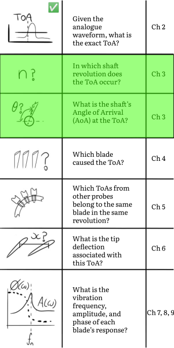
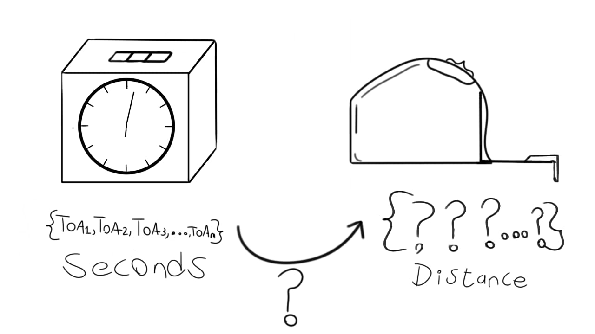
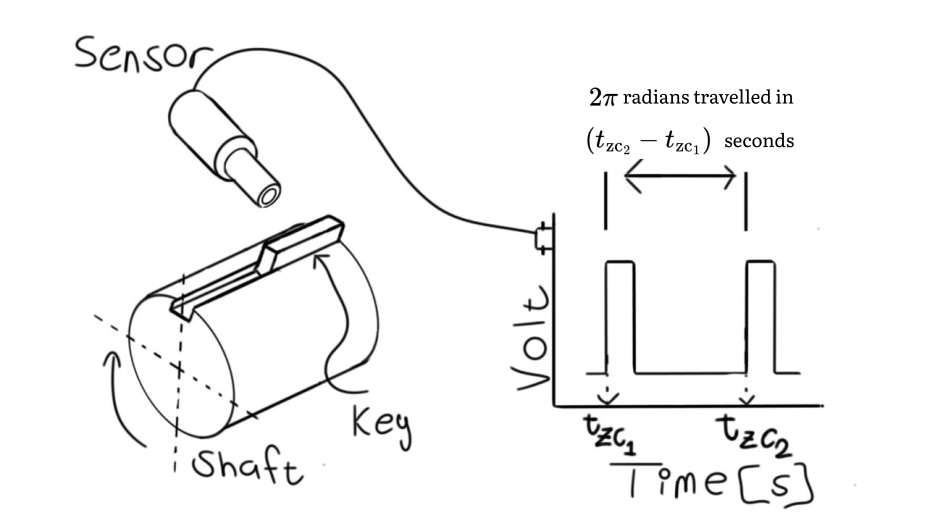

??? abstract "You are here"
	<figure markdown>
	{ width="500" }
	</figure>

<style>
:root {
  --md-tooltip-width: 600px;
}

.blog-timestamp-span {
	display : flex;	
}

.blog-timestamp-span > svg {
	margin-right: 5px;
}

</style>

# Angle of Arrival (AoA)
We are 30% through the tutorial. At this stage, we've learned how to process the raw analogue waveforms into a vector of *Time of Arrivals* (ToAs). We've said that, at the end of this tutorial, we will be able to infer vibration characteristics of each blade's *tip deflections*. This presents an interesting challenge.

Tip deflections are entities of *distance*.

ToAs represent *time*.

The two quantities are in different domains.

We therefore need to convert from *time* to *distance*. How on earth will we do this? You may as well open a file full of accelerometer measurements and attempt to infer the temperature of the instrumented structure.

<figure markdown>
  { width="700"}
    <figcaption><strong><a name='figure_01'>Figure 1</a></strong>: We need to convert our ToAs from seconds into some unit of distance. </figcaption>
</figure>

Fortunately, a fundamental mathematical property of bodies that rotate about an axis is known to us. A body that rotates an entire circle has traveled 360 degrees, or $2\pi$ radians. 

Radians may not yet be in units of mm or meters. It does, however, transport us into the distance domain.

To perform this conversion, we use a *shaft encoder*.

!!! question "Outcomes"

	:material-checkbox-blank-outline: Understand we use a shaft encoder to calculate the shaft speed, $\Omega$, and the start and end of each revolution. 

    :material-checkbox-blank-outline: Understand we need to find the shaft revolution in which each ToA occurs.

	:material-checkbox-blank-outline: Understand each ToA is used to calculate the precise shaft circumferential displacement in said revolution. This is the AoA of each ToA.
	
	:material-checkbox-blank-outline: Write a function that calculates a matrix of AoAs from the shaft encoder zero-crossing times and the ToAs.

## Shaft encoder
Most BTT systems rely on a shaft encoder installed on the rotor. A shaft encoder produces a pulse train, similar to the proximity probes discussed in the last chapter.

A typical shaft encoder is shown in [Figure 2](#figure_02) below. It consists of a rotating shaft with a key and a stationary sensor mounted next to the key.

<figure markdown>
  { width="750"}
    <figcaption><strong><a name='figure_02'>Figure 2</a></strong>: A shaft encoder consists of a rotating shaft with a key and a stationary sensor mounted next to the key. The sensor "picks up" the presence of the key as it rotates by. A voltage pulse train is produced that is processed to find the zero-crossing times. </figcaption>
</figure>

The sensor in this case produces One Pulse per Revolution (OPR). Some shaft encoders produce Multiple Pulses per Revolution (MPR). This tutorial considers the OPR case. OPR encoders are more prevalent than their MPR counterparts.

We extract the ToAs from the OPR signal with a trigger criteria, just like we used for the blade ToAs in the previous chapter. The OPR timestamps are often referred to as *zero-crossing* times. This terminology creates the impression they are registered only when the signal crosses 0 V. Though this is often the case, these timestamps can be extracted using any trigger criteria. Each timestamp therefore corresponds to the start of a new shaft revolution.

!!! note "Zero-crossing times"
	
	A zero-crossing time is the exact timestamp a revolution starts. The next timestamp is, by definition, the exact time the revolution ends and the next one starts.

	Do not confuse zero-crossing times and ToAs:

	1.	__Zero-crossing times__ refer to timestamps captured by the shaft encoder. They are the start of each revolution.

	2.	__ToAs__ refer to the timestamps captured by the proximity probes in the casing. They are the times the blades passed the probes.

After processing the shaft encoder's analogue waveform, we have a vector of zero-crossing times. The shaft speed between them can be calculated from [Equation 1](#equation_01) below.

\begin{equation}
\Omega_n = \frac{2 \pi}{zc_{n+1} - zc_{n}}
\end{equation}

<span id="equation_01"></span>

??? info "Symbols"
	| Symbol | Description |
	| :---: | :--- |
	| $\Omega_n$ | Shaft speed in the $n$th revolution |
	| $n$ | The revolution number |
	| $zc_{n}$ | The $n$th zero-crossing time |


An example of the shaft speed calculated from [Equation 1](#equation_01) is presented in [Figure 3](#figure_03) below.
<script src="shaft_run_up_and_down.js" > </script>
<div>
	<div>
		<canvas id="ch03_shaft_run_up_and_down"'></canvas>
	</div>
	<script>
		async function render_chart_shaft_run_up_and_down() {
			const ctx = document.getElementById('ch03_shaft_run_up_and_down');
			// If this is a mobile device, set the canvas height to 400
			if (window.innerWidth < 500) {
				ctx.height = 400;
			}
			while (typeof Chart == "undefined") {
				await new Promise(r => setTimeout(r, 1000));
				console.log("CHECKED FOR CHART")
			}
			Chart.defaults.font.family = "Literata, -apple-system, BlinkMacSystemFont, Helvetica, Arial, sans-serif";
			window.fig_shaft_run_up_and_down = new Chart(ctx, window.shaft_run_up_and_down);
			window.fig_shaft_run_up_and_down_reset = function resetZoomFig1() {
					window.fig_shaft_run_up_and_down.resetZoom();
				}
			}
		render_chart_shaft_run_up_and_down();
	</script>
	<a onclick="window.fig_shaft_run_up_and_down_reset()" class='md-button'>Reset Zoom</a>
</div>
<figure markdown>
  <figcaption><strong><a name='figure_03'>Figure 3</a></strong>: A shaft accelerating from 950 RPM to 1325 RPM and back again over a time of 41 seconds. </figcaption>
</figure>

The figure above presents the run-up and run-down of a shaft between 950 RPM and 1325 RPM over approximately 41 seconds.

??? info "Encoder-less techniques"

	Some publications refer to *encoder-less* BTT systems. These are advanced techniques normally used when there's no encoder. The techniques are beyond the scope of this tutorial. 

??? info "Which probes can you use for the shaft encoder?"
	
	You can use any probe capable of responding to the presence of a discontinuity on the shaft. I often use eddy current probes or optical pickups. 

??? info "At which circumferential position should the probe be installed?"
	
	It makes no difference where the probe is installed. The only requirement is the probe must be able to detect the presence of the shaft's discontinuity.

## Angle of Arrival (AoA)
The shaft's circumferential position when the ToA is registered is referred to as the Angle of Arrival (AoA). It is calculated with respect to the revolution in which it occurs. In other words, it is always a quantity between 0 and $2 \pi$ within each revolution. 

We use [Equation 2](#equation_02) below to calculate the AoA.

\begin{equation}
\textrm{AoA} (\textrm{ToA}) = \Omega_n \times (\textrm{ToA} - zc_{n})
\end{equation}

<span id="equation_02"></span>

??? info "Symbols"
	| Symbol | Description |
	| :---: | :--- |
	| $\textrm{AoA} (\textrm{ToA})$ | The AoA corresponding to the ToA |
	| $n$ | The revolution number in which the ToA occurs |
	| $\textrm{ToA}$ | The ToA. It must occur within revolution $n$  |
	| $\Omega_n$ | The shaft speed in the $n$th revolution |
	| $zc_{n}$ | The zero-crossing time at the start of the $n$th revolution |

Our algorithm must perform two cardinal tasks to calculate AoAs from ToAs:

1. Determine the revolution number in which each ToA occurs.

2. Calculate the AoA of each ToA within its revolution.

This two-step process can be performed with a single function. In this chapter, we write a function receiving a vector of ToAs and a vector of zero-crossing times as inputs. It returns a matrix of values that includes the AoAs and identified revolution numbers. We will, once again, use Numba to speed things up. Learning how to leverage Numba gives you a skill with applications in most code-centric industries.

## Following along
The worksheet for this chapter can be downloaded here <a href="https://github.com/Bladesight/bladesight-worksheets/blob/master/intro_to_btt/ch_03_worksheet.ipynb" target="_blank"></a>.

You can open a Google Colab session of the worksheet here: <a href="https://colab.research.google.com/github/Bladesight/bladesight-worksheets/blob/master/intro_to_btt/ch_03_worksheet.ipynb" target="_blank"></a>.

You need to use one of these Python versions to run the worksheet:


.

## Algorithm

To perform this conversion from time to angle, our algorithm calculates several quantities for each ToA:

1.  The revolution number, $n$, in which the ToA occurs.

2.  The zero-crossing times at the start and end of the ToA's revolution, referred to as $zc_n$ and $zc_{n+1}$ respectively.

3.  The angular velocity of the shaft in the revolution, $\Omega_n$.

4.  The shaft's angular position when the ToA was triggered. This is referred to as the AoA of the ToA. Each ToA therefore has one AoA.

Let's consider a simple example. We have measured 6 ToAs and 3 zero-crossing times:

``` python
ToAs = [0.3,0.5,0.7,1.3,1.5,1.7]
zc_times = [0.0, 1.0, 2.0]
```

We place the ToAs and the zero-crossing times on a horizontal axis. This makes it simpler to visualize.

The clickable tabs below present the calculations for each ToA.

=== "ToA no 1"

	``` console
	ToAs           = [       0.3     0.5     0.7            1.3     1.5     1.7         ]
                              |
                              | 
                              ↓ 
                     __|_______________________________|______________________________|__
	zc_times       = [0.0                             1.0                            2.0]
    revolution_no  = [0                               1                              2  ]
    Calculated values:
    
    current_revolution = 0
    zc_start           = 0.0
    zc_end             = 1.0
    Omega              = 2 π / (zc_end - zc_start) = 2 π / 1.0         = 2.0 π
    AoA                = Omega * (ToA - zc_start)  = 2 π * (0.3 - 0.0) = 0.6 π
    ```

    The allocated values after the first ToA is shown below 👇.

    | n | n_start_time | n_end_time | Omega | ToA | AoA   |
    |---|--------------|------------|-------|-----|-----  |
    | 0 | 0.0          | 1.0        | 2.0π  | 0.3 | 0.6 π |
    | ? |  ?           |  ?         |  ?    |  ?  |  ?    |
    | ? |  ?           |  ?         |  ?    |  ?  |  ?    |
    | ? |  ?           |  ?         |  ?    |  ?  |  ?    |
    | ? |  ?           |  ?         |  ?    |  ?  |  ?    |
    | ? |  ?           |  ?         |  ?    |  ?  |  ?    |

=== "ToA no 2"
	``` console
	ToAs           = [       0.3     0.5     0.7            1.3     1.5     1.7         ]
                                      |
                                      | 
                                      ↓ 
                     __|_______________________________|______________________________|__
	zc_times       = [0.0                             1.0                            2.0]
    revolution_no  = [0                               1                              2  ]
    Calculated values:
    
    current_revolution = 0
    zc_start           = 0.0
    zc_end             = 1.0
    Omega              = 2 π / (zc_end - zc_start) = 2 π / 1.0         = 2.0 π
    AoA                = Omega * (ToA - zc_start)  = 2 π * (0.5 - 0.0) = 1.0 π
    ```

    The allocated values after the second ToA is shown below 👇.
    
    | n | n_start_time | n_end_time | Omega | ToA | AoA   |
    |---|--------------|------------|-------|-----|-----  |
    | 0 | 0.0          | 1.0        | 2.0π  | 0.3 | 0.6 π |
    | 0 | 0.0          | 1.0        | 2.0π  | 0.5 | 1.0 π |
    | ? |  ?           |  ?         |  ?    |  ?  |  ?    |
    | ? |  ?           |  ?         |  ?    |  ?  |  ?    |
    | ? |  ?           |  ?         |  ?    |  ?  |  ?    |
    | ? |  ?           |  ?         |  ?    |  ?  |  ?    |

=== "ToA no 3"
	``` console
	ToAs           = [       0.3     0.5     0.7            1.3     1.5     1.7         ]
                                              |
                                              | 
                                              ↓ 
                     __|_______________________________|______________________________|__
	zc_times       = [0.0                             1.0                            2.0]
    revolution_no  = [0                               1                              2  ]
    Calculated values:
    
    current_revolution = 0
    zc_start           = 0.0
    zc_end             = 1.0
    Omega              = 2 π / (zc_end - zc_start) = 2 π / 1.0         = 2.0 π
    AoA                = Omega * (ToA - zc_start)  = 2 π * (0.7 - 0.0) = 1.4 π
    ```

    The allocated values after the third ToA is shown below 👇.
    
    | n | n_start_time | n_end_time | Omega | ToA | AoA   |
    |---|--------------|------------|-------|-----|-----  |
    | 0 | 0.0          | 1.0        | 2.0π  | 0.3 | 0.6 π |
    | 0 | 0.0          | 1.0        | 2.0π  | 0.5 | 1.0 π |
    | 0 | 0.0          | 1.0        | 2.0π  | 0.7 | 1.4 π |
    | ? |  ?           |  ?         |  ?    |  ?  |  ?    |
    | ? |  ?           |  ?         |  ?    |  ?  |  ?    |
    | ? |  ?           |  ?         |  ?    |  ?  |  ?    |

=== "ToA no 4"
	``` console
	ToAs           = [       0.3     0.5     0.7            1.3     1.5     1.7         ]
                                                             |
                                                             | 
                                                             ↓ 
                     __|_______________________________|______________________________|__
	zc_times       = [0.0                             1.0                            2.0]
    revolution_no  = [0                               1                              2  ]
    Calculated values:
    
    current_revolution = 1
    zc_start           = 1.0
    zc_end             = 2.0
    Omega              = 2 π / (zc_end - zc_start) = 2 π / 1.0         = 2.0 π
    AoA                = Omega * (ToA - zc_start)  = 2 π * (1.3 - 1.0) = 0.6 π
    ```
    
    The allocated values after the fourth ToA is shown below 👇.

    | n | n_start_time | n_end_time | Omega | ToA | AoA   |
    |---|--------------|------------|-------|-----|-----  |
    | 0 | 0.0          | 1.0        | 2.0π  | 0.3 | 0.6 π |
    | 0 | 0.0          | 1.0        | 2.0π  | 0.5 | 1.0 π |
    | 0 | 0.0          | 1.0        | 2.0π  | 0.7 | 1.4 π |
    | 1 | 1.0          | 2.0        | 2.0π  | 1.3 | 0.6 π |
    | ? |  ?           |  ?         |  ?    |  ?  |  ?    |
    | ? |  ?           |  ?         |  ?    |  ?  |  ?    |

=== "ToA no 5"
	``` console
	ToAs           = [       0.3     0.5     0.7            1.3     1.5     1.7         ]
                                                                     |
                                                                     | 
                                                                     ↓ 
                     __|_______________________________|______________________________|__
	zc_times       = [0.0                             1.0                            2.0]
    revolution_no  = [0                               1                              2  ]
    Calculated values:
    
    current_revolution = 1
    zc_start           = 1.0
    zc_end             = 2.0
    Omega              = 2 π / (zc_end - zc_start) = 2 π / 1.0         = 2.0 π
    AoA                = Omega * (ToA - zc_start)  = 2 π * (1.5 - 1.0) = 1.0 π
    ```
    
    The allocated values after the fifth ToA is shown below 👇.

    | n | n_start_time | n_end_time | Omega | ToA | AoA   |
    |---|--------------|------------|-------|-----|-----  |
    | 0 | 0.0          | 1.0        | 2.0π  | 0.3 | 0.6 π |
    | 0 | 0.0          | 1.0        | 2.0π  | 0.5 | 1.0 π |
    | 0 | 0.0          | 1.0        | 2.0π  | 0.7 | 1.4 π |
    | 1 | 1.0          | 2.0        | 2.0π  | 1.3 | 0.6 π |
    | 1 | 1.0          | 2.0        | 2.0π  | 1.5 | 1.0 π |
    | ? |  ?           |  ?         |  ?    |  ?  |  ?    |

=== "ToA no 6"

	``` console
	ToAs           = [       0.3     0.5     0.7            1.3     1.5     1.7         ]
                                                                             |
                                                                             | 
                                                                             ↓ 
                     __|_______________________________|______________________________|__
	zc_times       = [0.0                             1.0                            2.0]
    revolution_no  = [0                               1                              2  ]
    Calculated values:
    
    current_revolution = 1
    zc_start           = 1.0
    zc_end             = 2.0
    Omega              = 2 π / (zc_end - zc_start) = 2 π / 1.0         = 2.0 π
    AoA                = Omega * (ToA - zc_start)  = 2 π * (1.7 - 1.0) = 1.4 π
    ```
    
    The allocated values after the sixth ToA is shown below 👇.

    | n | n_start_time | n_end_time | Omega | ToA | AoA   |
    |---|--------------|------------|-------|-----|-----  |
    | 0 | 0.0          | 1.0        | 2.0π  | 0.3 | 0.6 π |
    | 0 | 0.0          | 1.0        | 2.0π  | 0.5 | 1.0 π |
    | 0 | 0.0          | 1.0        | 2.0π  | 0.7 | 1.4 π |
    | 1 | 1.0          | 2.0        | 2.0π  | 1.3 | 0.6 π |
    | 1 | 1.0          | 2.0        | 2.0π  | 1.5 | 1.0 π |
    | 1 | 1.0          | 2.0        | 2.0π  | 1.7 | 1.4 π |

Each calculation is performed sequentially. The results of each calculation are appended to the output matrix.

!!! tip "The blade count is unknown"
    
    You'll notice I have not stated how many blades are on the rotor for this simple example. This was by choice. At this stage of analysis, we do not need to incorporate the number of blades. We simply need to determine the revolution in which a ToA occurs and the corresponding AoA.

    You may be able to guess there are 3 blades. You should, however, not adapt your algorithm to *expect* a specific number of them. The reason for this is there can be missing or double ToAs and zero-crossing times. If you expect a certain number of time stamps but the measurement does not contain exactly what you require, your analysis will be corrupted.

	The algorithm presented in this chapter may be more complex than slicing the ToAs equally into bins, but it will save you from a lot of headaches in the future.

Based on the above example, we can write the code to calculate the AoA of each ToA. I have included comments that can be opened by clicking on the :material-plus-circle: symbols. 

If these symbols are not visible, refresh the page. If they're still not visible, download Google Chrome and try again 😁.


``` py linenums="1"
from numba import njit #(1)!
import numpy as np

@njit
def calculate_aoa(#(2)!
    arr_opr_zero_crossing : np.ndarray, 
    arr_probe_toas : np.ndarray
):
    """
    This function calculates the angle of arrival of 
    each ToA value relative to the revolution in 
    which it occurs.

    Args:
        arr_opr_zero_crossing (np.array): An array of 
            OPR zero-crossing times. 
        arr_probe_toas (np.array): An array of 
            ToA values.

    Returns:
        np.array: A matrix of AoA values. Each row in the 
            matrix corresponds to a ToA value. The columns 
            are:
            0: The revolution number
            1: The zero-crossing time at the start of the revolution
            2: The zero-crossing time at the end of the revolution
            3: The angular velocity of the revolution
			4: The ToA
            5: The AoA of the ToA value
    """
    num_toas = len(arr_probe_toas)
    AoA_matrix = np.zeros( (num_toas, 6))
	#(3)!
    AoA_matrix[:, 0] = -1

    current_revolution_start_time = arr_opr_zero_crossing[0]
    current_revolution_end_time = arr_opr_zero_crossing[1]
    current_n = 0
	#(4)!
    for i, toa in enumerate(arr_probe_toas):
		#(5)!
        while toa > current_revolution_end_time:
            current_n += 1
            if current_n >= (len(arr_opr_zero_crossing) - 1):
                break
            current_revolution_start_time = arr_opr_zero_crossing[current_n]
            current_revolution_end_time = arr_opr_zero_crossing[current_n + 1]

        if current_n >= (len(arr_opr_zero_crossing) - 1):
            break
		#(6)!
        if toa > current_revolution_start_time:
            AoA_matrix[i, 0] = current_n
            AoA_matrix[i, 1] = current_revolution_start_time
            AoA_matrix[i, 2] = current_revolution_end_time
            Omega = 2 * np.pi / (
                current_revolution_end_time 
                - current_revolution_start_time
            )
            AoA_matrix[i, 3] = Omega
            AoA_matrix[i, 4] = toa
            AoA_matrix[i, 5] = Omega * (
                toa 
                - current_revolution_start_time
            )
	#(7)!
    return AoA_matrix
```

1.	<h3> Imports </h3>
	
	``` py linenums="1"
	from numba import njit
	import numpy as np
	```

	There are two imports:

	1.  `njit` from the `numba` library. `njit` instructs `numba` to compile the function to machine code.
	
	2.  `numpy`. We rename as `np`. This means we can access the Numpy library through `np`. This is a common convention. Numpy is a numerical computation library. 

2.	<h3> Function definition </h3>

	``` py linenums="4"
	@njit
	def calculate_aoa(
		arr_opr_zero_crossing : np.ndarray, 
		arr_probe_toas : np.ndarray
	):
	```

	In Python, you define a function with the `def` keyword. We define a function called `calculate_aoa` in Line 5. This function has two arguments (an argument is a fancy word for an input):

	1.	`arr_opr_zero_crossing` : the array of OPR zero-crossing times.
	
	2.	`arr_probe_toas`: the array of ToAs from a single probe.

3.	<h3> Initialize the AoA matrix and other variables </h3> 
	``` py linenums="31"
	num_toas = len(arr_probe_toas)
	AoA_matrix = np.zeros( (num_toas, 6) )

	AoA_matrix[:, 0] = -1

	current_revolution_start_time = arr_opr_zero_crossing[0]
	current_revolution_end_time = arr_opr_zero_crossing[1]
	current_n = 0
	```

	Here we initialize constants and variables required in the rest of the function: 

	*	In Line 31, we calculate the number of ToAs in `arr_probe_toas`. We need this length to initialize the output matrix. 
	
	*	In Line 32 we instantiate the output matrix. The output matrix will contain the algorithm's results. This matrix is called `AoA_matrix`. The AoA matrix is a (`num_toas` $\times$ 6) matrix. Its columns represent:

		* __column 1__: The revolution number within which each ToA falls
		* __column 2__: The start time of the revolution
		* __column 3__: The end time of the revolution
		* __column 4__: The angular velocity of the shaft within the revolution
		* __column 5__: The ToA
		* __column 6__: The AoA of the ToA

	
	*	In Line 34 we set the entire revolution number column to -1. We use -1 to flag the ToAs that could not be converted to AoAs.
	
	*	In Line 36-38 we introduce the concept of the *current revolution*. Since this is a sequential function, we process each shaft revolution in turn. `current_n` is the revolution number the ToAs are currently in, `current_revolution_start_time` and `current_revolution_end_time`  is the start and end zero-crossing times of the current revolution. 
	
	These "current" values are updated as we iterate through the ToAs.

4.	<h3> Master loop </h3>
	
	``` python linenums="40"
	for i, toa in enumerate(arr_probe_toas):
	```

	This `for` loop iterates through each ToA in `arr_probe_toas`. The counter, `i`, starts at `0`- corresponding to the first ToA value - and increments after each iteration. The variable `toa` is the current ToA value being considered.

5.	<h3> Search for the correct shaft revolution </h3>
	
	``` python linenums="42"
	while toa > current_revolution_end_time:
		current_n += 1
		if current_n >= (len(arr_opr_zero_crossing) - 1):
			break
		current_revolution_start_time = arr_opr_zero_crossing[current_n]
		current_revolution_end_time = arr_opr_zero_crossing[current_n + 1]

	if current_n >= (len(arr_opr_zero_crossing) - 1):
		break
	```
	
	Here we find the shaft revolution within which the current ToA occurs. It repeatedly checks, in Line 42, if the current ToA is larger than the current revolution's end time. If it is, the shaft has completed a revolution since the previous ToA. We therefore increment the current revolution (`current_n`) variable. We also update the current revolution's start and end times in lines 46 and 47.

	The statements in Lines 44 and 49 checks whether we have iterated over all the zero-crossing times. If this happens, our algorithm cannot perform any more comparisons. We therefore break out of the loop.

6.	<h3> Calculate the AoA matrix values for each ToA </h3>
	
	``` py linenums="52"
	if toa > current_revolution_start_time:
		AoA_matrix[i, 0] = current_n
		AoA_matrix[i, 1] = current_revolution_start_time
		AoA_matrix[i, 2] = current_revolution_end_time
		Omega = 2 * np.pi / (
			current_revolution_end_time 
			- current_revolution_start_time
		)
		AoA_matrix[i, 3] = Omega
		AoA_matrix[i, 4] = toa
		AoA_matrix[i, 5] = Omega * (
			toa 
			- current_revolution_start_time
		)

	return AoA_matrix
	```
	
	This is where we calculate the AoAs. In Line 52 we check whether the current ToA is larger than the current revolution's start time. If this test is passed, it means this ToA falls within the `current_n`th revolution. We assign the current revolution's start and end time to the AoA matrix in lines 53 - 55.

	In lines 56 - 65 the shaft speed and AoA as defined in [Equation 1](#equation_01) and [Equation 2](#equation_02) are calculated.

7.	When we reach Line 67, it means we have either iterated over all ToAs, or we have reached the end of the encoder's timestamps. 
	
	The output matrix is returned.


## Example usage

We'll use some real experimental data to test this function. We use a shaft run-up and run-down from Du Toit et al. [@du2019stochastic]. In the experiment, a five blade rotor was run-up and run-down, as already indicated in [Figure 3](#figure_03). Four eddy current probes were used to measure the ToAs. 

The ToAs have already been extracted in this dataset. 

We use only one probe's data for this example:

``` py linenums="1"
dataset = Datasets["data/intro_to_btt/intro_to_btt_ch03"] #(1)!
df_opr_zero_crossings = (
	dataset['table/du_toit_2017_test_1_opr_zero_crossings'] #(2)!
)

df_probe_toas = dataset['table/du_toit_2017_test_1_prox_1_toas'] #(3)!
AoA_matrix = calculate_aoa(#(4)!
    df_opr_zero_crossings["time"].to_numpy(),
    df_probe_toas["time"].to_numpy()
)
df_AoA = pd.DataFrame(#(5)!
    AoA_matrix, 
    columns=[
        "n",
        "n_start_time",
        "n_end_time",
        "Omega",
        "ToA",
        "AoA"
    ]
)
```

1.  Download the data from Bladesight's repository. The dataset comprises 6 measurements. Each test has one set of OPR zero-crossing times and four sets of ToAs. There is also a set of MPR values not used in this chapter.
2.  Load the OPR zero-crossing times from Test 1 as a Pandas DataFrame.
3.  Load the first proximity probe's ToAs from Test 1 as a Pandas DataFrame.
4.  Call the `calculate_aoa` function with the OPR zero-crossing times and the ToAs as inputs. Note we convert the Pandas columns to Numpy arrays with `.to_numpy()`
5.  The algorithm returns a matrix. Numpy matrices and arrays do not have column names. Here we convert the matrix into a DataFrame. DataFrames are much simpler to work with.

The first 10 rows of the AoA DataFrame are presented in [Table 1](#table_01) below.

<figure markdown>
  <figcaption><strong><a name='table_01'>Table 1</a></strong>: The first 10 rows of the AoA DataFrame. </figcaption>
</figure>
{{ read_csv('docs/tutorials/intro_to_btt/ch3/AoA_top_10.csv') }}

We note two observations:

*  The first two rows have `n` values of -1. This means the first two ToAs were recorded *before* the first zero-crossing time. We can therefore not calculate the AoAs for these ToAs. You'll find a couple of these values at the end of the DataFrame as well.
*  The `AoA` values repeat themselves every 5 rows. This is because the rotor has 5 blades.

We drop the ToAs we could not convert to AoAs. These values are identified where `n` equals -1.

``` py linenums="1"
df_AoA = df_AoA[df_AoA["n"] != -1]
df_AoA.reset_index(inplace=True, drop=True) #(1)!
```

1.	Because we dropped the first two rows of data, the DataFrame's index starts at 2. It's always best to reset the index after dropping rows, unless the index contains important information.


In [Figure 4](#figure_04) below, we present a plot of the AoAs for the first blade over all revolutions. We also plot the angular velocity on a secondary y-axis.

<script src="blade_1_aoas.js" > </script>
<div>
	<div>
		<canvas id="ch03_blade_1_aoas"'></canvas>
	</div>
	<script>
		async function render_chart_blade_1_aoas() {
			const ctx = document.getElementById('ch03_blade_1_aoas');
			// If this is a mobile device, set the canvas height to 400
			if (window.innerWidth < 500) {
				ctx.height = 400;
			}
			while (typeof Chart == "undefined") {
				await new Promise(r => setTimeout(r, 1000));
			}
			Chart.defaults.font.family = "Literata, -apple-system, BlinkMacSystemFont, Helvetica, Arial, sans-serif";
			window.fig_blade_1_aoas = new Chart(ctx, window.blade_1_aoas);
			window.fig_blade_1_aoas_reset = function resetZoomFig2() {
					window.fig_blade_1_aoas.resetZoom();
				}
			}
		render_chart_blade_1_aoas();
	</script>
	<a onclick="window.fig_blade_1_aoas_reset()" class='md-button'>Reset Zoom</a>
</div>
<figure markdown>
  <figcaption><strong><a name='figure_04'>Figure 4</a></strong>: The AoAs of the first blade at the first proximity probe. </figcaption>
</figure>

In [Figure 4](#figure_04) above, the AoAs are not constant. Why not? In a sense, the entire discipline of BTT is about understanding what causes the AoAs to change.

We briefly discuss six topics that may be responsible for the AoAs to change:

## Discussion

### Sensor limited bandwidth noise
The drift in [Figure 4](#figure_04) appears to be correlated to the rotor's angular velocity. In other words, as the shaft speeds up, the AoAs increase proportionally to the rotational speed. The moment the rotor starts to run down, the AoAs decrease. 

This is *not* related to blade vibration. This is related to the bandwidth of the sensor you are using. Any sensor has a limited frequency response. As the tips move faster, their presence inside your sensor's field of view become shorter. This causes the input function experienced by the sensor to contain more energy at higher frequencies.

If your sensor's bandwidth is limited, it cuts out these high frequency components. This results in lower amplitude pulses. A lower amplitude pulse will manifest itself as delayed ToA triggering, and hence a larger AoA value.

This is not a problem, though, because our resonance events occur at higher frequencies than this phenomenon. In later chapters, we remove this noise with a detrending algorithm.

### Blade vibration
There are four clear resonance events in this signal. They occur at 7.5, 17.83, 24.3, and 34.5 seconds respectively. We delve into the theory of resonance in Chapter 7. For now, we highlight there are just *two unique* resonances. The two resonances occur at 1087 RPM and 1275 RPM on both the run-up and the run-down.

### High frequency noise
The signal also contains high-frequency random noise. It has many possible causes such as electrical noise, shaft torsional vibration, casing vibration, or higher frequency blade vibration. This noise may be filtered out. You can also construct your inference algorithms to handle them. 

### Non-Constant shaft speed
In [Equation 1](#equation_01) we assumed the rotor's speed was constant within a revolution. This assumption, though not strictly correct, simplifies our processing and often incurs acceptably small errors. If you're interested in the effect of non-constant shaft speed on the AoAs, you can read about it here [@diamond2019improved].

### Untwist and centrifugal stiffening
As the rotor speeds up, the blades are subjected to increased centrifugal force. Most blade designs react to the centrifugal force by twisting. The twisting of the blade causes the AoA to change, because the blade's tip is now in a different static position.

You need to understand your blade's design to understand how it reacts to centrifugal forces.

### Increased pressure on blades
Increased rotor speed will cause increased fluid pressure on the blades. This will result in a static deflection of the blade. This deflection will cause the AoA to change. How much the AoA changes depends on the blade's stiffness and the fluid pressure.

## Conclusion
In this chapter, we have converted ToAs to AoAs. We are now firmly positioned in the distance domain, where we can reason about deflection, not time. At this stage we have not used any information about the rotor's characteristics. In the next chapter, we start to make the analysis specific to our rotor. We use the blade count to allocate the AoAs to the correct blades. 

!!! success "Outcomes"

	:material-checkbox-marked:{ .checkbox-success .heart } Understand we use a shaft encoder to calculate the shaft speed, $\Omega$, and the start and end of each revolution. 

    :material-checkbox-marked:{ .checkbox-success .heart } Understand we need to find the revolution in which each ToA occurs.

	:material-checkbox-marked:{ .checkbox-success .heart } Understand each ToA is used to calculate the precise shaft circumferential displacement in said revolution. This is the AoA of each ToA.
	
	:material-checkbox-marked:{ .checkbox-success .heart } Write a function that calculates a matrix of AoAs from the shaft encoder zero-crossing times and the ToAs.

{==

I present coding exercises 👇 to solidify your the concepts covered in this chapter. 

==}

## Acknowledgements
Thanks to <a href="https://www.linkedin.com/in/justin-s-507338116/" target="_blank">Justin Smith</a> and <a href="https://www.linkedin.com/in/alex-brocco-70218b25b/" target="_blank">Alex Brocco</a> for reviewing this chapter and providing feedback.

\bibliography

<div style='display:flex'>
    <div>
        <a target="_blank" href="https://www.bladesight.com" class="" title="Dawie Diamond" style="border-radius:100%;"> 
            
        </a>
    </div>
    <div style='margin-left:2rem'>
        <p>
            <strong>Dawie Diamond</strong>
        </p>
        <p>
		<span class="md-icon blog-timestamp-span" title="Created"> <svg xmlns="http://www.w3.org/2000/svg" viewBox="0 0 24 24"><path d="M14.47 15.08 11 13V7h1.5v5.25l3.08 1.83c-.41.28-.79.62-1.11 1m-1.39 4.84c-.36.05-.71.08-1.08.08-4.42 0-8-3.58-8-8s3.58-8 8-8 8 3.58 8 8c0 .37-.03.72-.08 1.08.69.1 1.33.32 1.92.64.1-.56.16-1.13.16-1.72 0-5.5-4.5-10-10-10S2 6.5 2 12s4.47 10 10 10c.59 0 1.16-.06 1.72-.16-.32-.59-.54-1.23-.64-1.92M18 15v3h-3v2h3v3h2v-3h3v-2h-3v-3z"></path></svg>2024-02-13</span>

		<span class="md-icon blog-timestamp-span" title="Last update"> <svg xmlns="http://www.w3.org/2000/svg" viewBox="0 0 24 24"><path d="M21 13.1c-.1 0-.3.1-.4.2l-1 1 2.1 2.1 1-1c.2-.2.2-.6 0-.8l-1.3-1.3c-.1-.1-.2-.2-.4-.2m-1.9 1.8-6.1 6V23h2.1l6.1-6.1zM12.5 7v5.2l4 2.4-1 1L11 13V7zM11 21.9c-5.1-.5-9-4.8-9-9.9C2 6.5 6.5 2 12 2c5.3 0 9.6 4.1 10 9.3-.3-.1-.6-.2-1-.2s-.7.1-1 .2C19.6 7.2 16.2 4 12 4c-4.4 0-8 3.6-8 8 0 4.1 3.1 7.5 7.1 7.9l-.1.2z"></path></svg>2024-08-25
		</span>
        </p>
    </div>
</div>

## :material-weight-lifter:{ .checkbox-success } Coding Exercises

Here are some coding exercises to solidify the concepts we've covered in this chapter.

### Problem 1 :yawning_face:
In this chapter, we've written the `calculate_aoa` function. This function receives and returns Numpy arrays, though we work with Pandas DataFrames natively. We therefore needed to use the `.to_numpy()` method to convert the Pandas objects to numpy arrays. We also needed to cast the resulting matrix into a Pandas DataFrame, and drop the ToAs we could not convert to AoAs. 

In future, we do not want to do this every time we call the function.

{==

:material-pencil-plus-outline: Write a new function, called `transform_ToAs_to_AoAs`, accepting Pandas DataFrames as inputs and returning a Pandas DataFrame as output. The function should call the `calculate_aoa` function to do the actual work.

==}

??? example "Reveal answer (Please try it yourself before revealing the solution)"
	``` py linenums="1"
	def transform_ToAs_to_AoAs(
		df_opr_zero_crossings : pd.DataFrame,
		df_probe_toas : pd.DataFrame,
	) -> pd.DataFrame:
		""" This function transforms the ToA values to AoA values for a 
		single probe, given the OPR zero-crossing times and the proximity
		probe's ToA values.

		The timestamps are assumed to reside in the first column of
		each DataFrame.

		Args:
			df_opr_zero_crossings (pd.DataFrame): A DataFrame with the 
				OPR zero-crossing times.
			df_probe_toas (pd.DataFrame): A DataFrame with the probe's 
				ToA values.

		Returns:
			pd.DataFrame: A DataFrame with the AoA values.
		"""
		AoA_matrix = calculate_aoa(
			df_opr_zero_crossings.iloc[:, 0].to_numpy(), #(1)!
			df_probe_toas.iloc[:, 0].to_numpy()
		)
		df_AoA = pd.DataFrame(
			AoA_matrix, 
			columns=[
				"n",
				"n_start_time",
				"n_end_time",
				"Omega",
				"ToA",
				"AoA"
			]
		)
		df_AoA = df_AoA[df_AoA["n"] != -1]
		df_AoA.reset_index(inplace=True, drop=True)
		return df_AoA
	```

	1.	We may want to pass in DataFrames with different column names than the ones we used in the example. We therefore use the `.iloc` method to get the first column of each DataFrame, regardless of what it is called.


	Example usage:
	``` py linenums="1"
	>>> dataset = Datasets["data/intro_to_btt/intro_to_btt_ch03"]
	>>> df_opr_zero_crossings = dataset['table/du_toit_2017_test_1_opr_zero_crossings']
	>>> df_probe_toas = dataset['table/du_toit_2017_test_1_prox_1_toas']

	>>> df_AoA = transform_ToAs_to_AoAs(
		df_opr_zero_crossings,
		df_probe_toas
	)
	```

### Problem 2 :neutral_face:
Because our Python functions are converted to C, one is tempted to treat code inefficiencies with a wink and a wry smile, as one does with a child that does something naughty you are secretly proud of.

We must, however, resist this temptation. We must always strive to write efficient code. 

{==

:material-pencil-plus-outline: There are unnecessary calculations in the `calculate_aoa` function. Can you spot where? Rewrite the function to remove this inefficiency.

==}

??? example "Reveal answer (Please try it yourself before revealing the solution)"
	``` py linenums="1" hl_lines="35 36 37 38 49 50 51 52"	
	@njit
	def calculate_aoa(
		arr_opr_zero_crossing : np.ndarray, 
		arr_probe_toas : np.ndarray
	):
		"""
		This function calculates the angle of arrival of 
		each ToA value relative to the revolution in 
		which it occurs.

		Args:
			arr_opr_zero_crossing (np.array): An array of 
				OPR zero-crossing times. 
			arr_probe_toas (np.array): An array of 
				ToA values.

		Returns:
			np.array: A matrix of AoA values. Each row in the 
				matrix corresponds to a ToA value. The columns 
				are:
				0: The revolution number
				1: The zero-crossing time at the start of the revolution
				2: The zero-crossing time at the end of the revolution
				3: The angular velocity of the revolution
				4: The ToA
				5: The AoA of the ToA value
		"""
		num_toas = len(arr_probe_toas)
		AoA_matrix = np.zeros( (num_toas, 6))

		AoA_matrix[:, 0] = -1

		current_revolution_start_time = arr_opr_zero_crossing[0]
		current_revolution_end_time = arr_opr_zero_crossing[1]
		Omega = 2 * np.pi / (
			current_revolution_end_time 
			- current_revolution_start_time
		)
		current_n = 0

		for i, toa in enumerate(arr_probe_toas):

			while toa > current_revolution_end_time:
				current_n += 1
				if current_n >= (len(arr_opr_zero_crossing) - 1):
					break
				current_revolution_start_time = arr_opr_zero_crossing[current_n]
				current_revolution_end_time = arr_opr_zero_crossing[current_n + 1]
				Omega = 2 * np.pi / (
					current_revolution_end_time 
					- current_revolution_start_time
				)
			if current_n >= (len(arr_opr_zero_crossing) - 1):
				break
			#
			if toa > current_revolution_start_time:
				AoA_matrix[i, 0] = current_n
				AoA_matrix[i, 1] = current_revolution_start_time
				AoA_matrix[i, 2] = current_revolution_end_time
				AoA_matrix[i, 3] = Omega
				AoA_matrix[i, 4] = toa
				AoA_matrix[i, 5] = Omega * (
					toa 
					- current_revolution_start_time
				)

		return AoA_matrix
	```
	We have moved the calculation of $\Omega$ to the while loop from the if statement at the bottom. Now, every time we update the zero-crossing times, we calculate the rotor's speed only once. The previous method calculated the shaft speed once for every ToA.

### Problem 3 :thinking:
The dataset we used in this chapter also has MPR zero-crossing times we did not use. These values can be loaded with this command:

``` py
df_mpr_zero_crossings = dataset['table/du_toit_2017_test_1_mpr_zero_crossings']
```

The MPR encoder used for this measurement has 79 sections. You can therefore assume each encoder section represents $\frac{1}{79}$th of a rotation.

{==

:material-pencil-plus-outline: Write a new function, `calculate_aoa_from_mpr`, accepting the MPR timestamps, the number of sections in the MPR, and the ToAs as inputs. The function should return a DataFrame with the AoAs. The resulting AoA matrix should also include the MPR section number within which each ToA occurs.

==}

<script src="blade_5_aoas_using_mpr.js" > </script>
<div>
	<script>
		async function render_chart_blade_5_aoas_using_mpr() {
			const ctx = document.getElementById('ch03_blade_5_aoas_using_mpr');
			// If this is a mobile device, set the canvas height to 400
			if (window.innerWidth <500) {
				ctx.height = 400;
			}
			while (typeof Chart == "undefined") {
				await new Promise(r => setTimeout(r, 1000));
			}
			Chart.defaults.font.family = "Literata, -apple-system, BlinkMacSystemFont, Helvetica, Arial, sans-serif";
			window.fig_blade_5_aoas_using_mpr = new Chart(ctx, window.blade_5_aoas_using_mpr);
			window.fig_blade_5_aoas_using_mpr_reset = function resetZoomFig3() {
					window.fig_blade_5_aoas_using_mpr.resetZoom();
				}
			}
	</script>
</div>

??? example "Reveal answer (Please try it yourself before revealing the solution)"
	``` py linenums="1"
	def calculate_aoa_from_mpr(
		arr_mpr_zero_crossing : np.ndarray,
		arr_probe_toas : np.ndarray,
		mpr_sections : int = 1,
	) -> np.ndarray:
		""" This function calculates the angle of arrival of
		each ToA value relative to the section and revolution in
		which it occurs when using an MPR encoder.

		Args:
			arr_mpr_zero_crossing (np.ndarray): An array of MPR
				zero-crossing times.
			arr_probe_toas (np.ndarray): An array of ToA values.
			mpr_sections (int, optional): The number of sections
				in the MPR encoder. Defaults to 1, in this case,
				this function will be treated as an OPR encoder.

		Returns:
			np.ndarray: A matrix of AoA values. Each row in the
				matrix corresponds to a ToA value. The columns
				are:
				0: The revolution number
				1: The section number
				2: The zero-crossing time at the start of the revolution
				3: The zero-crossing time at the end of the revolution
				4: The angular velocity of the revolution
				5: The ToA
				6: The AoA of the ToA value
		"""
		num_toas = len(arr_probe_toas)
		AoA_matrix = np.zeros((num_toas, 7))
		rad_per_section = 2 * np.pi / mpr_sections
		AoA_matrix[:, 0] = -1

		current_revolution_start_time = arr_mpr_zero_crossing[0]
		current_revolution_end_time = arr_mpr_zero_crossing[1]
		Omega = rad_per_section / (
			current_revolution_end_time 
			- current_revolution_start_time
		)
		current_n = 0
		current_revo = 0
		current_section = 0

		for i, toa in enumerate(arr_probe_toas):

			while toa > current_revolution_end_time:
				current_n += 1
				if current_n >= (len(arr_mpr_zero_crossing) - 1):
					break
				current_revolution_start_time = arr_mpr_zero_crossing[current_n]
				current_revolution_end_time = arr_mpr_zero_crossing[current_n + 1]
				Omega = rad_per_section / (
					current_revolution_end_time 
					- current_revolution_start_time
				)
				current_section += 1
				if current_section == mpr_sections:
					current_section = 0
					current_revo += 1

					
			if current_n >= (len(arr_mpr_zero_crossing) - 1):
				break

			if toa > current_revolution_start_time:
				AoA_matrix[i, 0] = current_revo
				AoA_matrix[i, 1] = current_section
				AoA_matrix[i, 2] = current_revolution_start_time
				AoA_matrix[i, 3] = current_revolution_end_time
				AoA_matrix[i, 4] = Omega
				AoA_matrix[i, 5] = toa
				AoA_matrix[i, 6] = Omega * (
					toa
					- current_revolution_start_time
				) + current_section * rad_per_section

		return AoA_matrix
		
	def transform_ToAs_to_AoAs_mpr(
		df_mpr_zero_crossings : pd.DataFrame,
		df_probe_toas : pd.DataFrame,
		mpr_sections : int = 1,
	) -> pd.DataFrame:
		""" This function transforms the ToA values to AoA values for a 
		single probe, given the MPR zero-crossing times and the proximity
		probe's ToA values.

		The timestamps are assumed to reside in the first column of
		each DataFrame.

		Args:
			df_opr_zero_crossings (pd.DataFrame): A DataFrame with the 
				OPR zero-crossing times.
			df_probe_toas (pd.DataFrame): A DataFrame with the probe's 
				ToA values.
			mpr_sections (int, optional): The number of sections
				in the MPR encoder. Defaults to 1, in this case,
				this function will be treated as an OPR encoder.

		Returns:
			pd.DataFrame: A DataFrame with the AoA values.
		"""
		AoA_matrix = calculate_aoa_from_mpr(
			df_mpr_zero_crossings.iloc[:, 0].to_numpy(),
			df_probe_toas.iloc[:, 0].to_numpy(),
			mpr_sections
		)
		df_AoA = pd.DataFrame(
			AoA_matrix, 
			columns=[
				"n",
				"mpr_section",
				"section_start_time",
				"section_end_time",
				"Omega",
				"ToA",
				"AoA"
			]
		)
		df_AoA = df_AoA[df_AoA["n"] != -1]
		df_AoA.reset_index(inplace=True, drop=True)
		return df_AoA
	```
	<!-- Add note stating that this is not the best way to do MPR analysis-->
	!!! warning "Note"
		MPR encoder signal processing is, however, nontrivial. For instance, we have assumed here all encoder sections have the same circumferential width. This is almost never the case. I have recently added a correct MPR approach to Bladesight. I'll write a short tutorial on how to use it soon.

	The function `calculate_aoa_from_mpr` increments each section, instead of each revolution. The function can, however, transform the ToAs with an OPR encoder if you set `mpr_sections` to 1.

	In [Figure 5](#figure_05) below, we show the AoAs calculated from the MPR encoder vs the same values calculated from the OPR encoder. The AoAs from the MPR algorithm appear less noisy than the AoAs from the OPR algorithm. 
	<div>
		<div>
			<canvas id="ch03_blade_5_aoas_using_mpr"'></canvas>
		</div>
		<a onclick="window.fig_blade_5_aoas_using_mpr_reset()" class='md-button'>Reset Zoom</a>
	</div>
	<script> render_chart_blade_5_aoas_using_mpr(); </script>
	<figure markdown>
	  <figcaption><strong><a name='figure_05'>Figure 5</a></strong>: The AoAs of the fifth blade at the first proximity probe. The AoAs were calculated with both the MPR encoder and the OPR encoder. </figcaption>
	</figure>

	MPR encoders will always produce more accurate BTT results than OPR encoders. One reason for this is because MPR encoders capture high frequency shaft torsional vibration. This allows us to remove it from the AoAs. An OPR encoder cannot capture this torsional vibration. High frequency shaft torsional vibration therefore *appears* as high-frequency content in our AoAs when we use OPR encoders.

