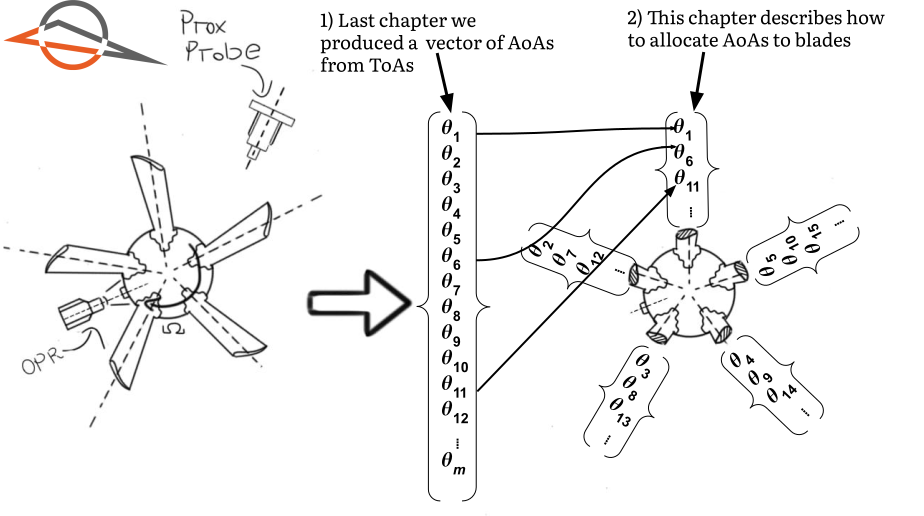

??? abstract "You are here"
	<figure markdown>
	{ width="500" }
	</figure>

<style>
:root {
  --md-tooltip-width: 600px;
}
</style>

# Allocating AoAs to blades
Taxonomy is the science of classifying entities. It is usually associated with the biological sciences. It is, however, a useful concept in many fields.

This chapter deals with the taxonomy of AoA values. What exactly needs to be classified? We need to classify the AoAs into bins, such that each bin contains the AoAs of a single blade.

Here's an illustration of what we've covered so far, and what we're about to cover:

<figure markdown>
  { width=700}
    <figcaption><strong><a name='figure_01'>Figure 1</a></strong>: 
		An illustration of this chapter's theme. We have one proximity probe and one One Pulse per Revolution (OPR) sensor. In Chapter 3, we converted the ToAs into an array of AoAs. This chapter takes the next logical step: allocating the AoAs to specific blades.
	</figcaption>
</figure>

[Figure 1](#figure_01) illustrated we converted ToAs into AoAs using the OPR sensor in the previous chapter. We still only have a large, unstructured array of AoAs. In this chapter, for the first time, we use information specific to the rotor.

Am I not overly pedantic to dedicate chapter to identify which AoAs belong to which blades. It may seem redundant. Is it not obvious that the second blade arrives after the first? That may be so, but it is too simplistic an approach. It's the solution a Large Language Model(LLM) like ChatGPT would give. Real engineering problems do not bend to the whims of LLMs.

The AoAs should not be allocated in the order in which they arrive. This chapter develops a robust methodology to assign AoAs to specific blades. Once again, giving yourself permission to immerse yourself in the fundamentals will pay dividends in the future.

## First stab
Let's generate example data to help us reason about how allocation should work. I've generated some AoAs of a 5 blade rotor using the code below. Do not get bogged down in the details of this code. The important thing is that we have 5 blades and one sensor. This produces a vector of AoAs. 

``` py
import numpy as np
import pandas as pd

delta = -20
blade_means = np.deg2rad([72, 144+delta, 216+delta, 288+delta, 360+delta])#(1)!
aoa_values = []
BLADE_COUNT = 5
# Set random seed for reproducibility
np.random.seed(0)#(2)!
for n in range(50):#(3)!
    r = 0.5 + 0.5/50 * n#(4)!
    for b in range(BLADE_COUNT):
        aoa_current = blade_means[b] + np.random.uniform(-np.pi*0.07, np.pi*0.07)#(5)!
        # Reject values with probability < 0.05
        if np.random.rand() > 0.05:#(6)!
            aoa_values.append({
                "n" : n,
                "aoa" : aoa_current,
                "plot_r" : r,#(7)!
            })
df_aoas = pd.DataFrame(aoa_values)
```

1.  We specify the mean AoAs for each blade. We also specify a `delta` value that we use to shift the mean AoA for each blade. This is to simulate the effect of blades that are not perfectly equidistant from one another. Our example shifts all except the first blade by 20 degrees. This is an extreme amount to shift. In practice, the blades will more-or-less be equidistant from one another. We'll use this `delta` value to illustrate the effect of non-equidistant blades on our allocation algorithm.
2.  We set the random seed to ensure reproducibility. It ensures that our random values are the same every time we run the code.
3.  We generate data for 50 shaft revolutions. Why 50 shaft revolutions? It's an arbitrary number. It's enough to make our point.
4.  This `radius` value has _no physical meaning__. It is simply a value that enables us to plot the AoAs on a polar plot. It is __not__ related to the radius of the rotor.
5.  We generate a random AoA value for each blade, as if the it passed the proximity sensor. We add a random value between $-\pi \times 0.07$ and $\pi \times 0.07$ to the mean AoA value. This is to simulate the effect of noise and vibration in our AoAs. Why $-\pi \times 0.07$ and $\pi \times 0.07$? Once again, I found these values helped my illustrate the point.
6.  We reject 5% of the AoAs. This is to simulate the effect of 'missing pulses' in our data. Our BTT DAQ should, in theory, be able to capture all the pulses. In practice, however, this is often not the case. We need to develop an algorithm that can handle missing ToAs.
7.  We once again reiterate that the `radius` value has no physical meaning. It is simply a value that enables us to plot the AoAs on a polar plot.

The AoAs are shown in [Figure 2](#figure_02) below.

<figure markdown>
  { width="700"}
    <figcaption><strong><a name='figure_02'>Figure 2</a></strong>: The raw AoAs are shown on a polar plot. The radial dimension is not related to the blade's radius. We've spread our AoAs radially because it's simpler to visualize.  
    </figcaption>
</figure>

In [Figure 2](#figure_02) above, there are five distinct "groups" of AoAs. Intuitively, we expect each group to correspond to one blade. Now we need to develop an algorithm to assign these AoAs.

### Sequential allocation
To help us reason through the first approach, the first 10 AoAs are presented in [Table 1](#table_01) below:
<figure markdown>
  <figcaption><strong><a name='table_01'>Table 1</a></strong>: The first 10 AoAs. </figcaption>
</figure>
{{ read_csv('docs/tutorials/intro_to_btt/ch4/preamble_aoa_values_head.csv') }}

Humans are excellent at patterns recognition. From [Table 1](#table_01) above, it's clear the AoAs arrive in a sequence. Each AoA in the table seems to increase by $\frac{2 \pi}{5}$ radians until the sixth value, where we start over with this pattern. It seems obvious that we should be able to allocate the AoAs sequentially. In other words, blade 1 arrives first, then blade 2, and so on.

A reasonable strategy would be to assign every 5th AoA to the same blade:

``` py
df_aoa_sequential = df_aoas.copy(deep=True)
df_aoa_sequential['blade'] = None
df_aoa_sequential.loc[::5, 'blade'] = 1 #(1)!
df_aoa_sequential.loc[1::5, 'blade'] = 2
df_aoa_sequential.loc[2::5, 'blade'] = 3
df_aoa_sequential.loc[3::5, 'blade'] = 4
df_aoa_sequential.loc[4::5, 'blade'] = 5
```

1.  `[::5]` is Python notation for "select every 5th value".

Every AoA is now assigned. We can therefore use a different style marker to discern between the assigned groups. The result is shown in [Figure 3](#figure_03) below.

<figure markdown>
  { width="700"}
    <figcaption><strong><a name='figure_03'>Figure 3</a></strong>: This plot indicates how the results of a sequential AoA allocation. In other words, we've grouped every 5th AoA value together. 
    </figcaption>
</figure>

:scream:

[Figure 3](#figure_03) above is a disaster. We would expect the AoAs from the same blade neatly grouped together close to one circumferential position in the polar plot. We rather have AoAs grouped together over the entire circumferential range from 0 to 360 degrees.

Why did this happen? Because we introduced "missing pulses" when we generated the AoAs. If only one pulse is missing, all of our AoAs will be incorrectly grouped. This is a common problem in BTT data. We must therefore develop a sequence-independent algorithm.

### Binned allocation
Let's rather group AoAs into angular bins. We create five equally spaced bins and determine slice the AoAs accordingly. within which each AoA value falls. The first edge starts at 0. Each bin is $\frac{360}{5}$ degrees wide. 

``` console
bin_left_edges  ->  [0,  72,  144, 216, 288]
bin_right_edges -> [72, 144, 216, 288, 360]
```
The allocation is performed below:

``` python
df_aoa_binned = df_aoas.copy(deep=True)
df_aoa_binned['blade'] = None
bin_edges = [0, 72, 144, 216, 288] #(1)!
bin_edges_rad = np.deg2rad(bin_edges) #(2)!
for b, bin_left_edge in enumerate(bin_edges_rad): #(3)!
    bin_right_edge = bin_left_edge + 2*np.pi/5 #(4)!
    ix_in_bin = (
        (df_aoa_binned['aoa'] >= bin_left_edge) 
        & (df_aoa_binned['aoa'] < bin_right_edge)
    ) #(5)!
    df_aoa_binned.loc[ix_in_bin, 'blade'] = b + 1 #(6)!
```

1.  We specify the left edges of the bins. They are all equally wide.
2.  We convert from degrees to radians to get them to the same unit as the AoAs.
3.  The `enumerate` function returns the index and left edge of the bin we are currently considering.
4.  We calculate the position of the right edge. It's always $\frac{2 \pi}{5}$ radians larger than the left edge.
5.  We create a boolean mask for all AoAs that falls within the bin we are currently considering.
6.  We use the mask to allocate the appropriate AoAs to its corresponding blade.

The groups are plotted in [Figure 4](#figure_04) below. The group edges have been added to the plot.

<figure markdown>
  { width="700"}
    <figcaption><strong><a name='figure_04'>Figure 4</a></strong>: The AoA groups as a consequence of binning. The AoA allocation is better, but not perfect. The AoAs from blades 1 and 2 are mixed.
    </figcaption>
</figure>

[Figure 4](#figure_04) above is a significant improvement over [Figure 3](#figure_03). The groups seem more sensible.

However, some of blade 1's AoAs are grouped with blade 2. This is because the AoAs from blade 1 fall close to the first bin's edge. We cannot control where the AoAs fall. It is a function of the rotor's blade count and the location of our OPR sensor. Our algorithm should be able to adapt to this.

### Rotated bin allocation

Instead of start at 0 degrees, we can subtract an offset to each edge. Let's subtract an offset. We call the offset `d_theta`. Let's set `d_theta` equal to half the current bin width, 72°/2 = 36°, for this example. 

``` console
bin_left_edges  ->  [-36,  36,  108, 180, 252]
bin_right_edges -> [36, 108, 180, 252, 324]
```

The code to perform the allocation is similar to the previous example. We need, however, to include a second mask to check for the AoAs close to the 0°/360° boundary. We'll get into this more later on. 

``` python linenums="1" hl_lines="13 14"
df_aoa_rotated_binned = df_aoas.copy(deep=True)
df_aoa_rotated_binned['blade'] = None
bin_edges_new = [-36, 36, 108, 180, 252]
bin_edges_new_rad = np.deg2rad(bin_edges_new)
for b, bin_left_edge in enumerate(bin_edges_new_rad):
    bin_right_edge = bin_left_edge + 2*np.pi/5
    ix_in_bin = (
        (
                (df_aoa_rotated_binned['aoa'] >= bin_left_edge) 
                & (df_aoa_rotated_binned['aoa'] < bin_right_edge)
        )
        | (
                ((df_aoa_rotated_binned['aoa'] - 2*np.pi) >= bin_left_edge) 
                & ((df_aoa_rotated_binned['aoa'] - 2*np.pi) < bin_right_edge)
        )
    )
    df_aoa_rotated_binned.loc[ix_in_bin, 'blade'] = b + 1
```

We plot the result in [Figure 5](#figure_05) below.

<figure markdown>
  { width="700"}
    <figcaption><strong><a name='figure_05'>Figure 5</a></strong>: The grouping as a consequence of a *rotated* bin approach. Our groups are correct.
    </figcaption>
</figure>

Finally our allocation is perfect. The AoAs from each blade are grouped together. This is the allocation we always want to achieve. 

In this example, we've eyeballed the offset to use. We would rather use an algorithm to automate the process. 

How can we determine the quality of the allocation? Intuitively, we expect the AoAs from each blade to occur in the middle of its bin. The closer it is to an edge, the higher the likelihood of misclassification.

This chapter therefore develops an algorithm to identify the optimal offset, `d_theta`. The optimal offset is the one the AoAs to be allocated in the middle of each bin.

!!! question "Outcomes"

	:material-checkbox-blank-outline: Calculate the optimal bin edges to group the AoAs into blade bins.

    :material-checkbox-blank-outline: Calculate the optimal bin edges by minimizing a quality factor, $Q$.

	:material-checkbox-blank-outline: Understand that the first blade may arrive close to the OPR zero-crossing time. This can make the blade appear at the start *or* end of the revolution. We need to cater for this scenario.
	
	:material-checkbox-blank-outline: Write a function that determines the optimal blade bins for a set of AoAs, and split the proximity probe AoA DataFrames into several individual blade DataFrames.

## Follow along
The worksheet for this chapter can be downloaded here <a href="https://github.com/Bladesight/bladesight-worksheets/blob/master/intro_to_btt/ch_04_worksheet.ipynb" target="_blank"></a>.

You can open a Google Colab session of the worksheet here: <a href="https://colab.research.google.com/github/Bladesight/bladesight-worksheets/blob/master/intro_to_btt/ch_04_worksheet.ipynb" target="_blank"></a>.

You need to use one of the these Python versions to run the worksheet:


## Load the data

We load the dataset from Chapter 3. We only get the AoAs from the first probe and store it in `df_prox_1`. 

``` py linenums="1"
from bladesight import Datasets
from bladesight.btt.aoa import transform_ToAs_to_AoAs

dataset = Datasets['data/intro_to_btt/intro_to_btt_ch03']
df_opr_zero_crossings = dataset[f"table/du_toit_2017_test_1_opr_zero_crossings"]
df_prox_1_toas = dataset[f"table/du_toit_2017_test_1_prox_1_toas"]

df_prox_1 = transform_ToAs_to_AoAs(
    df_opr_zero_crossings,
    df_prox_1_toas
)
```

## Algorithm to determine alignment bins
We've discussed that a "good" allocation is one where the AoAs from each blade occur close to the center of its bin. To quantify this intuitive approach, we create a quality factor, $Q$.

$Q$ is the sum of squared errors between the center of each bin and the AoAs within it.

\begin{equation}
Q = \sum_{b=1}^{B} \sum_{n=1}^{N_b} \left (\hat{AoA}_{b} - AoA_{b, n}\right)^2
\end{equation}


??? info "Symbols"
	| Symbol | Description |
	| :---: | :--- |
	| $Q$ | The blade bin quality factor|
	| $b$ | The blade index|
	| $B$ | The total number of blades|
	| $n$ | The index of the AoA inside bin $b$ |
	| $N$ | The total number of AoAs inside bin $b$ |
	| $\hat{AoA}_{b}$ | The center AoA of bin $b$ |
	| $AoA_{b, n}$ | The $n$th AoA inside bin $b$ |

	Below, we show the domains of the variables for this example:
	
	$$
	\begin{align}
		Q &\in [0, \infty] \\
		b &\in [0,1,2,3,4] \\
		B &= 5 \\
		n &\in [0, ..., N] \\
		N &\rightarrow \textrm{computed for each bin} \\
		\hat{AoA}_{b} &\in [0, 2 \pi] \\
		AoA_{b, n} &\in [0, 2 \pi] \\
	\end{align}
	$$

The below function calculates Q for a given blade number and offset.

``` py linenums="1"
def calculate_Q( #(1)!
    arr_aoas : np.ndarray,
    d_theta : float,
    N : int
) -> Tuple[float, np.ndarray]:
    bin_edges = np.linspace(0 + d_theta, 2*np.pi + d_theta, N + 1)
    Q = 0
    for b in range(N):#(2)!
        left_edge = bin_edges[b]
        right_edge = bin_edges[b + 1]
        bin_mask = (arr_aoas > left_edge) & (arr_aoas <= right_edge)
        
		bin_centre = (left_edge + right_edge)/2 #(3)!
		Q += np.sum(
            (
                arr_aoas[bin_mask] 
                - bin_centre
            )**2 
        )
    if np.sum(arr_aoas < bin_edges[0]) > 0:#(4)!
        return np.nan, bin_edges
    if np.sum(arr_aoas > bin_edges[-1]) > 0:
        return np.nan, bin_edges
    return Q, bin_edges
```

1.  <h2> Initialization </h2>

    ```py linenums="1"
    def calculate_Q(
        arr_aoas : np.ndarray,
        d_theta : float,
        N : int
    ) -> Tuple[float, np.ndarray]:
        bin_edges = np.linspace(0 + d_theta, 2*np.pi + d_theta, N + 1)
        Q = 0
    ```
    In lines 1 - 4, the function name and input arguments are defined. `arr_aoas` is a numpy array of AoAs, in *radians*, `d_theta` is our guess for the shift to apply to the "standard" edges, and `N` is the number of blades. 

    In Line 5, we specify the function's return type. It's a tuple - a fancy word for an immutable list - with two values: `Q` and `bin_edges`. `Q` is the quality factor, and `bin_edges` are the edges caused by this choice of `d_theta`.

    !!! note "Note"
        You need to import the `Tuple` type from the `typing` library.

        ``` py
        from typing import Tuple
        ```

    In Line 6, we calculate the `bin_edges` based on the choice of `d_theta`.

    In Line 7, we initialize the quality factor to zero.

2.  <h2> Identify the AoAs inside each bin </h2>
    
    ```py linenums="7"
    for b in range(N):
        left_edge = bin_edges[b]
        right_edge = bin_edges[b + 1]
        bin_mask = (arr_aoas > left_edge) & (arr_aoas <= right_edge)
    ```

    In Line 8, we enter our main loop, whereby we will consider each bin in turn.

    In lines 9 and 10, we select the left and right edges of the current bin.

    In Line 11, we determine which AoAs fall within the current edges. `bin_mask` is a boolean array, with the same length as `arr_aoas`. If the mask has a value of `True` at a given index, it means the corresponding AoA value falls within the current bin.

3.  <h2> Determine each bin's Q factor contribution</h2>

    ```py linenums="12"
    bin_centre = (left_edge + right_edge)/2
    Q += np.sum(
        (
            arr_aoas[bin_mask] 
            - bin_centre
        )**2 
    )
    ```

    In Line 13, the center of the bin is calculated. This is $\hat{AoA}_{b}$ in [Equation 1](#equation_01).

    In lines 14 - 19, we calculate the squared difference between each AoA and the its corresponding bin centre. We sum these squared differences and add it to $Q$. If the centre is close to the AoAs, $Q$ will not increase much. If the centre is far from the AoAs, $Q$ will increase significantly.

4.  <h2>Sanity checks and return</h2>

    ```py linenums="19"
    if np.sum(arr_aoas < bin_edges[0]) > 0:
        return np.nan, bin_edges
    if np.sum(arr_aoas > bin_edges[-1]) > 0:
        return np.nan, bin_edges
    return Q, bin_edges
    ```

    We've added sanity checks to the function. Why is it necessary to add sanity checks? Our logic in lines 8 to 19 only considers AoAs between the left and right edges of one of the bin. It is possible for the offset guess `d_theta` to shift the edges so far that some AoAs do not fall within any bin. These AoAs will therefore not contribute to $Q$, and our optimal `d_theta` will be a fraud!

    We therefore check, in lines 20 and 22, if `d_theta` is valid. `d_theta` is invalid if any AoAs occur before the far left or right edge. We return `np.nan` for `Q` to indicate `dtheta` is invalid.

    Finally, in Line 24, we return `Q` and `bin_edges`.

## Implementation example

$Q$ is now calculated for a range of possible `d_theta`s. We perform the calculation for `d_theta`s between $-\frac{\pi}{5}$ and $\frac{\pi}{5}$. This shifts the "standard" bins left and right by a maximum of 72°. 

The $Q$ factor for each `d_theta` is calculated below.

``` py linenums="1"
B = 5#(1)!
d_thetas = np.linspace(-np.pi/B, np.pi/B, 200) #(2)!
arr_aoas = df_prox_1["AoA"].to_numpy()#(3)!
Qs = [] #(4)!
optimal_Q, optimal_bin_edges, optimal_d_theta = np.inf, None, None#(5)!
for d_theta in d_thetas:#(6)!
    Q, bin_edges = calculate_Q(arr_aoas, d_theta, B)
    if Q < optimal_Q:#(7)!
        optimal_Q = Q*1
        optimal_bin_edges = bin_edges
        optimal_d_theta = d_theta*1
    Qs.append(Q)#(8)!
```

1.	We specify the number of blades. This is used to calculate the bin edges.
2.	We specify the range of offsets to consider. We'll consider 200 offsets between $-\frac{\pi}{5}$ and $\frac{\pi}{5}$.
3.	We convert the AoA DataFrame into a numpy array. Our function requires a Numpy array.
4.	We initialize an empty list to store the quality factors.
5.	We initialize the optimal Q value to infinity. This is a trick to ensure the first value we calculate is always the optimal value. It can be unseated by a better value later.
6.	We iterate over the range of offsets to consider.
7.	If the quality factor we just calculated is less than the optimal quality value, we update the optimal values.
8.	We append the quality factor to a list. This will be used to plot the quality factor as a function of the offset.

The `Q` factor for each `d_theta` is plotted in [Figure 6](#figure_06) below.

<script src="q_factor_plot.js" > </script>
<div>
	<div>
		<canvas id="ch03_q_factor_plot"'></canvas>
	</div>
	<script>
		async function render_chart_q_factor_plot() {
			const ctx = document.getElementById('ch03_q_factor_plot');
			// If this is a mobile device, set the canvas height to 400
			if (window.innerWidth < 500) {
				ctx.height = 400;
			}
			while (typeof Chart == "undefined") {
				await new Promise(r => setTimeout(r, 1000));
			}
			Chart.defaults.font.family = "Literata, -apple-system, BlinkMacSystemFont, Helvetica, Arial, sans-serif";
			window.fig_q_factor_plot = new Chart(ctx, window.q_factor_plot);
			window.fig_q_factor_plot_reset = function resetZoomFig2() {
					window.fig_q_factor_plot.resetZoom();
				}
			}
		render_chart_q_factor_plot();
	</script>
	<a onclick="window.fig_q_factor_plot_reset()" class='md-button'>Reset Zoom</a>
</div>
<figure markdown>
  <figcaption><strong><a name='figure_06'>Figure 6</a></strong>: 
	The quality factor, Q, as a function of the offset, d_theta. The optimal offset is -20.08°.
  </figcaption>
</figure>

And voila! The optimal offset is -20.08 degrees.

??? note "How to choose the offset count"
	
    I've selected 200 values between $-\frac{\pi}{5}$ and $\frac{\pi}{5}$ to search through. The choice of 200 is arbitrary, you can choose your own value. You need to ensure, however, your grid is fine enough to capture the optimal offset. If you choose too few values, you may miss the optimal offset. If you choose too many values, you may waste time.

??? note "The effects of non-equidistant probe spacing"

    At this stage it may be unclear how probe spacing affects our analysis. Especially, how non-equidistant probe spacing affects our analysis.

    I cannot stress this enough: The algorithm we've developed here is only applied to AoAs from one probe. Multiple probes are combined using a different approach, which we discuss in next chapter.

??? note "Why not use an optimization algorithm"

    To find the optimum `d_theta`, we've resorted to a simple one dimensional grid-search algorithm. This is because the problem is simple. 
    
    We could use a more sophisticated optimization algorithm, but it would be overkill for this problem.

## One DataFrame per blade
Now that we have the optimal bin edges, we cut the proximity probe AoA DataFrame into separate DataFrames for each blade:

``` py linenums="1"
blade_dfs = []#(1)!
for b in range(B):#(2)!
    ix_bin = (#(3)!
        (df_prox_1["AoA"] > optimal_bin_edges[b])
        & (df_prox_1["AoA"] <= optimal_bin_edges[b + 1])
    )
    blade_dfs.append(
        df_prox_1.loc[ix_bin] #(4)!
    )
```

1.  We initialize an empty list to store the DataFrames for each blade.
2.  The for loop allows us to consider each blade in turn.
3.  `ix_bin` is our boolean mask which indicates if the AoAs fall inside bin number `b`.
4.  We use the `.loc` method to only select the values inside bin `b`.

``` py linenums="1"
for b in range(B):
    print(f"Blade {b} mean: {blade_dfs[b]['AoA'].mean()}, std: {blade_dfs[b]['AoA'].std()}")
```

``` console
Blade 0 mean: 0.280844143512115, std: 0.0014568064245125216
Blade 1 mean: 1.5390655934492143, std: 0.001784799129959647
Blade 2 mean: 2.788312464321002, std: 0.0015687549238434136
Blade 3 mean: 4.045575640802255, std: 0.0017088093157144036
Blade 4 mean: 5.305095908129366, std: 0.0014525709531342695
```

Finally, we have 5 DataFrames, one for each blade. 

??? note "What does the mean and standard deviation mean?"

    I use the mean and standard deviation as a check for the quality of the allocation. The mean of each blade's dataframe should correspond to the bin center. The standard deviation should be small, because all AoAs should be close to the center.

    If, for some reason, your alignment is off, the standard deviations will shoot through the roof.

## Blade wrap-around
Let's shift the AoAs from their original position to illustrate an extreme case. This shift is artificial, but it is equivalent to the a shift of the proximity probe or the OPR sensor circumferential location. In short, a constant shift of the AoAs don't objectively change anything about them. We should be able to find the same $Q$ value as we did in the previous section.

``` py linenums="1" hl_lines="3"
df_prox_1_shifted = df_prox_1.copy(deep=True) #(1)!
df_prox_1_shifted['AoA'] = df_prox_1_shifted['AoA'] - 0.280844143512115
df_prox_1_shifted['AoA'] = df_prox_1_shifted['AoA'] % (2*np.pi) #(2)!

B = 5
d_thetas = np.linspace(-np.pi/B, np.pi/B, 200)
arr_aoas = df_prox_1_shifted["AoA"].to_numpy()
Qs = []
optimal_Q, optimal_bin_edges, optimal_d_theta = np.inf, None, None
for d_theta in d_thetas: #(3)!
    Q, bin_edges = calculate_Q(arr_aoas, d_theta, B)
    if Q < optimal_Q:
        optimal_Q = Q*1
        optimal_bin_edges = bin_edges
        optimal_d_theta = d_theta*1
    Qs.append(Q)
```

1.  We create a copy of our original DataFrame. In Line 2, we shift the AoAs by blade 0's mean AoA value as calculated in the previous section. 
2.  We've highlighted Line 3 because it is so important. Our artificially constructed `df_prox_1_shifted` DataFrame from Line 2 will contain some `AoA` values are negative. The code that transforms ToAs to AoAs, `transform_ToAs_to_AoAs`, will always produce positive AoAs. These values will therefore appear *at the end of the next revolution*. To simulate this effect, we wrap the AoAs to the range $[0, 2 \pi]$ in Line 3.
3.  From Line 5 onward, we repeat the same process as before to find the optimal bin edges. The only difference is we use the `df_prox_1_shifted` DataFrame instead of the `df_prox_1` DataFrame.

We print the optimal $Q$ value below.

``` py linenums="1"
>>> print(optimal_Q)
>>> print(optimal_bin_edges)
inf
None
```

The optimal $Q$ is infinity and the optimal edges equals `None` :scream: !

We plot a histogram of the AoAs in [Figure 7](#figure_07) below to investigate what went wrong.

<script src="wrapped_aoa_histogram.js" > </script>
<div>
	<div>
		<canvas id="ch03_wrapped_aoa_histogram"'></canvas>
	</div>
	<script>
		async function render_wrapped_aoa_histogram() {
			const ctx = document.getElementById('ch03_wrapped_aoa_histogram');
			// If this is a mobile device, set the canvas height to 400
			if (window.innerWidth < 500) {
				ctx.height = 400;
			}
			while (typeof Chart == "undefined") {
				await new Promise(r => setTimeout(r, 1000));
			}
			Chart.defaults.font.family = "Literata, -apple-system, BlinkMacSystemFont, Helvetica, Arial, sans-serif";
			window.fig_wrapped_aoa_histogram = new Chart(ctx, window.wrapped_aoa_histogram);
			window.fig_wrapped_aoa_histogram_reset = function resetZoomFigWrappedAoAs() {
					window.fig_wrapped_aoa_histogram.resetZoom();
				}
			}
		render_wrapped_aoa_histogram();
	</script>
	<a onclick="window.fig_wrapped_aoa_histogram_reset()" class='md-button'>Reset Zoom</a>
</div>
<figure markdown>
  <figcaption><strong><a name='figure_07'>Figure 7</a></strong>: 
	The quality factor, Q, as a function of the offset, d_theta. The optimal offset is -20.08°.
  </figcaption>
</figure>

This is what happens when a blade arrives at the proximity probe when the OPR triggers. Some of the AoAs will appear at the end of the previous revolution, and some will appear at the beginning of the current revolution.

The algorithm we've developed will fail for such cases, because some values fall before or after the far left and right edges.

We should change `calculate_Q` to handle blade wrap-around.

I'll leave it to you to make this change as an exercise 👇.

{==

:material-pencil-plus-outline: Currently, `calculate_Q` returns `nan` when some blades are outside the furthest bin edges. Blade wrap-around will always trigger this response.  Write an updated `calculate_Q` function that handles AoAs outside of the bin edges.

==}

??? example "Reveal answer (Please try it yourself before revealing the solution)"
	``` py linenums="1" hl_lines="20 21 22 23 24 25 26 27 28 29 31 32 33 34 35 36 37 38 39 40"  
	def calculate_Q(
		arr_aoas : np.ndarray,
		d_theta : float,
		N : int
	) -> Tuple[float, np.ndarray]:
		bin_edges = np.linspace(0 + d_theta, 2*np.pi + d_theta, N + 1)
		Q = 0
		for b in range(N):
			left_edge = bin_edges[b]
			right_edge = bin_edges[b + 1]
			bin_centre = (left_edge + right_edge)/2
			bin_mask = (arr_aoas > left_edge) & (arr_aoas <= right_edge)
			Q += np.sum(
				(
					arr_aoas[bin_mask] 
					- bin_centre
				)**2 
			)
		if np.sum(arr_aoas < bin_edges[0]) > 0:
			left_edge_last = bin_edges[N-1]
			right_edge_last = bin_edges[N]
			bin_centre_last = (left_edge_last + right_edge_last)/2
			bin_mask = arr_aoas <= bin_edges[0]
			Q += np.sum(
				(
					(2*np.pi - arr_aoas[bin_mask]) 
					- bin_centre_last
				)**2 
			)
		if np.sum(arr_aoas > bin_edges[-1]) > 0:
			left_edge_first = bin_edges[0]
			right_edge_first = bin_edges[1]
			bin_centre_first = (left_edge_first + right_edge_first)/2
			bin_mask = arr_aoas > bin_edges[-1]
			Q += np.sum(
				(
					(arr_aoas[bin_mask] - 2*np.pi) 
					- bin_centre_first
				)**2 
			)
		return Q, bin_edges
	```

	In the `calculate_Q` above, we've added lines of code in the 'sanity check' sections to handle AoAs outside the bin edges.

	In lines 20 - 29, we check for AoAs occurring before the left most bin edge. These values are therefore treated as if they occur in the last bin.

	In lines 31 - 40, we check for AoAs occurring after the right most bin edge. These values are therefore treated as if they occur in the first bin.

{==

:material-pencil-plus-outline: After you've finished the above, create a function called `transform_prox_AoAs_to_blade_AoAs`. This function should receive the proximity probe AoA DataFrame and the number of blades on the rotor, and returns a list of DataFrames. Each returned DataFrame should contain the AoAs for a single blade. This function should therefore perform both the determination of the optimal bin edges and slice the AoAs into separate DataFrames.

==}


??? example "Reveal answer (Please try it yourself before revealing the solution)"
	
    ``` py linenums="1" 
    def transform_prox_AoAs_to_blade_AoAs(
        df_prox: pd.DataFrame,
        B: int,
        d_theta_increments: int = 200,
    ) -> List[pd.DataFrame]:
        """This function takes a DataFrame containing the AoAs of a proximity probe,
        and returns a list of DataFrame, each containing the AoAs of a single blade.

        Args:
            df_prox (pd.DataFrame): The dataframe containing the AoAs
                of the proximity probe.
            B (int): The number of blades.
            d_theta_increments (int, optional): The number of increments

        Returns:
            List[pd.DataFrame]: A list of dataframes, each containing the AoA
            values of a single blade.
        """
        d_thetas = np.linspace(-0.5 * np.pi / B, 1.5 * np.pi / B, d_theta_increments)
        arr_aoas = df_prox["AoA"].to_numpy()
        Qs = []
        optimal_Q, optimal_bin_edges, optimal_d_theta = np.inf, None, None
        for d_theta in d_thetas:
            Q, bin_edges = calculate_Q(arr_aoas, d_theta, B)
            if Q < optimal_Q:
                optimal_Q = Q * 1
                optimal_bin_edges = bin_edges
                optimal_d_theta = d_theta * 1
            Qs.append(Q)

        blade_dfs = []
        blade_median_AoAs = []
        for b in range(B):
            ix_bin = (df_prox["AoA"] > optimal_bin_edges[b]) & (
                df_prox["AoA"] <= optimal_bin_edges[b + 1]
            )
            if b == 0:
                ix_bin = ix_bin | (df_prox["AoA"] > optimal_bin_edges[-1])
                df_bin = (
                    df_prox.loc[ix_bin].copy().reset_index(drop=True).sort_values("ToA")
                )

                ix_wrap = df_bin["AoA"] > optimal_bin_edges[-1]
                df_bin.loc[ix_wrap, "AoA"] = df_bin.loc[ix_wrap, "AoA"] - 2 * np.pi
            elif b == B - 1:
                ix_bin = ix_bin | (df_prox["AoA"] <= optimal_bin_edges[0])
                df_bin = (
                    df_prox.loc[ix_bin].copy().reset_index(drop=True).sort_values("ToA")
                )

                ix_wrap = df_bin["AoA"] > optimal_bin_edges[-1]
                df_bin.loc[ix_wrap, "AoA"] = 2 * np.pi - df_bin.loc[ix_wrap, "AoA"]
            else:
                df_bin = (
                    df_prox.loc[ix_bin].copy().reset_index(drop=True).sort_values("ToA")
                )
            blade_dfs.append(df_bin)
            blade_median_AoAs.append( df_bin["AoA"].median()  )
        blade_order = np.argsort(blade_median_AoAs)
        return [blade_dfs[i] for i in blade_order]
	```

	We've decided to only shift the `d_theta` value between $-\frac{2\pi}{B}$ and 0. This is simply a matter of preference, because I want the first blade to occur as close as possible to 0 degrees. If you allow `d_theta` to be positive, it may result in the first blade being classified as the last blade. This is not a problem, but it is a matter of preference.

## Conclusion
Blade alignment is like parallel parking - it seems so simple, but you can make a proper mess of it if you're not careful.

I've promised that, by the end of this tutorial, you'll be able to infer parameters for vibration frequency, amplitude and phase for every blade. In this chapter we've enabled the "for every blade" part. Before this chapter, we just had a massive array of AoAs with no structure to it. We now have one AoA DataFrame for every blade. 

This chapter involves *only a single proximity probe*. BTT systems normally use multiple proximity probes. 

In the next chapter, we'll combine information from multiple probes together. We'll also investigate a nice visual way to check if we've done our alignment properly: *the stack plot*.

!!! question "Outcomes"

	:material-checkbox-marked:{ .checkbox-success .heart } Calculate the optimal bin edges to group the AoAs into blade bins.

    :material-checkbox-marked:{ .checkbox-success .heart } Calculate the optimal bin edges by minimizing a quality factor, $Q$.

	:material-checkbox-marked:{ .checkbox-success .heart } Understand that the first blade may arrive close to the OPR zero-crossing time. This can make the blade appear at the start *or* end of the revolution. We need to cater for this scenario.
	
	:material-checkbox-marked:{ .checkbox-success .heart } Write a function that determines the optimal blade bins for a set of AoAs, and split the proximity probe AoA DataFrames into several individual blade DataFrames.


## Acknowledgements
Thanks to <a href="https://www.linkedin.com/in/justin-s-507338116/" target="_blank">Justin Smith</a> and <a href="https://www.linkedin.com/in/alex-brocco-70218b25b/" target="_blank">Alex Brocco</a> for reviewing this chapter and providing feedback.

<div style='display:flex'>
    <div>
        <a target="_blank" href="https://www.bladesight.com" class="" title="Dawie Diamond" style="border-radius:100%;"> 
            
        </a>
    </div>
    <div style='margin-left:2rem'>
        <p>
            <strong>Dawie Diamond</strong>
        </p>
        <p>
            2024-02-20
        </p>
    </div>
</div>

\bibliography