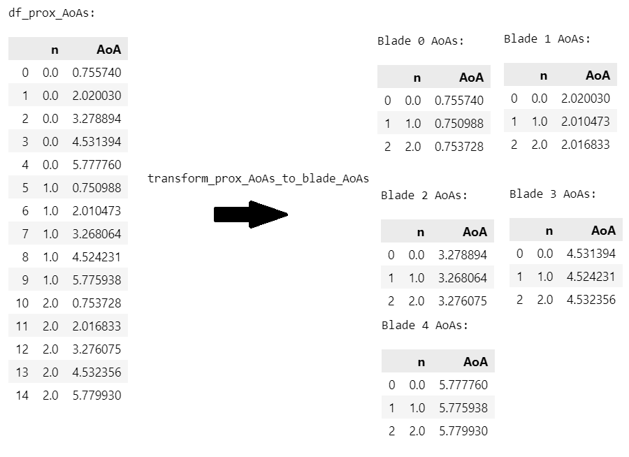
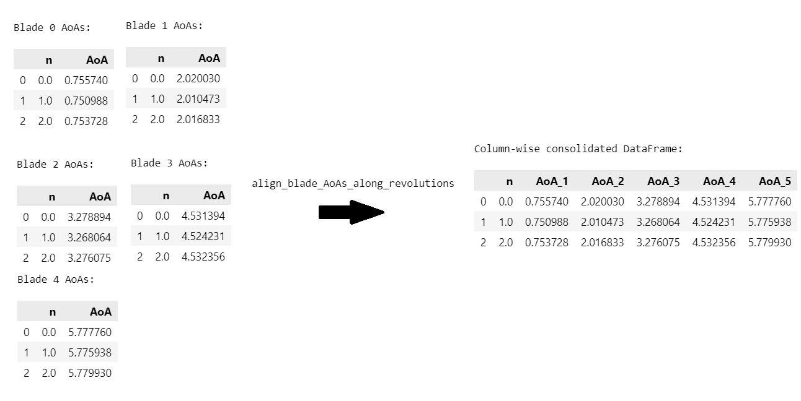
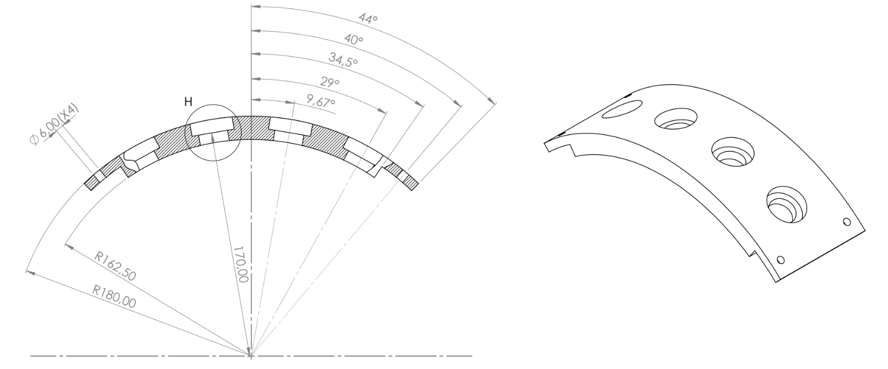

# Working with multiple probes
In the previous chapter, we focused on the identification and grouping of individual blades arriving at a *single* proximity probe. Building upon this foundational knowledge, we are now going to delve into the process of combining data from several proximity probes together. 

This chapter will culminate in the ability to create a consolidated DataFrame for each blade.

!!! question "Outcomes"

	:material-checkbox-blank-outline: Understand that we can combine the AoAs and ToAs from the blades in a single proximity probe in a column-wise manner, thereby yielding a DataFrame with one row for every shaft revolution, and several columns for the respective blades arriving at the proximity probe.

    :material-checkbox-blank-outline: Understand what the stack plot is, and how it can be used to confirm that our blades are properly aligned.

	:material-checkbox-blank-outline: Understand that the order in which the blades arrive at each proximity probe is important, and that we need to align the blades from each proximity probe to the blades from the first proximity probe.
	
	:material-checkbox-blank-outline: Write functions to convert the AoAs associated with individual proximity probes into consolidated rotor blade DataFrames which contain all the ToAs and AoAs for each blade over all the probes.

## Following along
The worksheet for this chapter can be downloaded here <a href="https://github.com/Bladesight/bladesight-worksheets/blob/master/intro_to_btt/ch_05_worksheet.ipynb" target="_blank"></a>.


You can open a Google Colab session of the worksheet by clicking here: <a href="https://colab.research.google.com/github/Bladesight/bladesight-worksheets/blob/master/intro_to_btt/ch_05_worksheet.ipynb" target="_blank"></a>.

You need to use one of the following Python versions to run the worksheet:


## Assembling probe level merged DataFrames

At the end of the previous chapter, we built an algorithm that receives the AoAs from a single proximity probe, and grouped the AoAs into individual blades. We therefore ended up with a list of DataFrames, each containing the AoAs for a single blade. 

In other words, we performed the transformation illustrated in [Figure 1](#figure_01) below:

<figure markdown>
  
  <figcaption><a id='figure_01'><strong>Figure 1:</strong></a> Illustration of the algorithm developed in Chapter 3. We took the AoAs from a single proximity probe, and cut it up into 5 DataFrames. Each DataFrame corresponds to the AoAs for a single blade.</figcaption>
</figure>

Now, we recombine those DataFrames in a column-wise manner. In other words, each row of our resulting DataFrame is going to contain all the AoAs for each blade. We are performing the transformation as illustrated below:

<figure markdown>
  
  <figcaption><a id='figure_02'><strong>Figure 2:</strong></a> Illustration of the column-wise consolidation of the DataFrames. Each row of the resulting DataFrame contains the AoAs for each blade in a different column. </figcaption>
  </figcaption>
</figure>
In [Figure 2](#figure_02) above 👆, we see that a function called `align_blade_AoAs_along_revolutions` transforms the list of DataFrames into one DataFrame. Each row contains the AoAs for each blade. We have not changed the information inside the DataFrame, merely rearranged it. 

Why do we do this? Simply because its easier to work with a single DataFrame than with a list of DataFrames. There are other ways of performing the work discussed in this chapter, but we believe this is the most intuitive method.

The function to perform this transformation this is given below.

``` py linenums="1"
def align_blade_AoAs_along_revolutions(
    prox_AoA_dfs : List[pd.DataFrame] #(1)!
) -> pd.DataFrame:
    df_blades_aligned = prox_AoA_dfs[0]#(2)!
    df_blades_aligned = df_blades_aligned.rename(#(3)!
        columns={
            "ToA":"ToA_1", 
            "AoA":"AoA_1"
        }
    )
    for i, df_blade in enumerate(prox_AoA_dfs[1:]):#(4)!
        df_blades_aligned = df_blades_aligned.merge(#(5)!
            df_blade[["n", "ToA", "AoA"]].rename(
                columns={
                    "ToA":"ToA_"+str(i+2), 
                    "AoA":"AoA_"+str(i+2)}
            ),
            how="outer",#(6)!
            on="n"#(7)!
        )
    return df_blades_aligned
```

1.  The `prox_AoA_dfs` is a list of DataFrames from a single proximity probe where each element in the list represents the AoA values from a single blade. This list is the output of the `transform_prox_AoAs_to_blade_AoAs` from the previous chapter.
2.  We take the first blade as our reference. We will align the other blades to the first blade's DataFrame.
3.  We rename the `ToA` and `AoA` columns to `ToA_1` and `AoA_1` respectively. The `1` indicates that these values belong to the first blade.
4.  We loop over the remaining blades. We are going to merge each successive blade's DataFrame into the reference DataFrame.
5.  The Pandas `.merge` method joins two DataFrames on a common key. Here, we merge the reference DataFrame with the current blade's DataFrame. 
    We rename the `ToA` and `AoA` columns to `ToA_{i+2}` and `AoA_{i+2}` respectively. The `i+2` is used because the `i` counter starts at zero. The first DataFrame we merge into the reference must, however, be 2. Therefore, we add 2 to the `i` counter.
6.  We perform an `outer` join. This means that we retain all rows from both DataFrames, even if there is no matching value for the `n` key in one of them. If, for instance, the `n` for revolution 50 is missing from the current blade's DataFrame, the `ToA_2` and `AoA_2` columns will be filled with `NaN` values.
7.  We join the DataFrames on the `n` key, which is the revolution number.

From the above code block, we see that the first blade's DataFrame is used as the reference DataFrame. Each subsequent blade's DataFrame is merged into this reference. Merging is a common operation in most tabular-data based applications. Each time we merge we are expanding the DataFrame by adding two columns to it.

The head of the resulting DataFrame is shown in [Table 1](#table_01) below.


<figure markdown>
  <figcaption><a id='table_01'><strong>Table 1:</strong></a> Each proximity probe's AoAs after being recombined in a column-wise manner </figcaption>
  </figcaption>
</figure>
{{ read_csv('docs/tutorials/intro_to_btt/ch5/blade_dfs_recombined_head.csv') }}

We see that there are ToA and AoA columns for each blade, and only one row per revolution. This DataFrame is now ready for further analysis.

## Determining the stack plot

We now introduce the stack plot, a widely recognized tool in BTT. The stack plot visually represents the relative distance between consecutive blades as they pass a proximity probe. Ideally, the circumferential spacing between each set of adjacent blades would be the same for each pair. In reality, each rotor exhibits a unique pattern of blade spacing. We can use this unique pattern to assess whether our alignment has been done properly.

In the example above, the consecutive distances between adjacent blades for the first shaft revolution is:

``` py linenums="1"
>>> df = blade_dfs_recombined[0]
>>> blade_2_min_1 = df.iloc[0]["AoA_2"] - df.iloc[0]["AoA_1"]
>>> blade_3_min_2 = df.iloc[0]["AoA_3"] - df.iloc[0]["AoA_2"]
>>> blade_4_min_3 = df.iloc[0]["AoA_4"] - df.iloc[0]["AoA_3"]
>>> blade_5_min_4 = df.iloc[0]["AoA_5"] - df.iloc[0]["AoA_4"]
>>> blade_1_min_5 = 2*np.pi + df.iloc[1]["AoA_1"] - df.iloc[0]["AoA_5"]
>>> print("blade_2_min_1:", blade_2_min_1, "rad")
>>> print("blade_3_min_2:", blade_3_min_2, "rad")
>>> print("blade_4_min_3:", blade_4_min_3, "rad")
>>> print("blade_5_min_4:", blade_5_min_4, "rad")
>>> print("blade_1_min_5:", blade_1_min_5, "rad")
```
``` console
blade_2_min_1: 1.2629980304819501 rad
blade_3_min_2: 1.2574606040202596 rad
blade_4_min_3: 1.2488114790250116 rad
blade_5_min_4: 1.2490816162460137 rad
blade_1_min_5: 1.2585900251951907 rad
```
The calculation of the stack plot values is intuitive, except for the calculation of the last value, `blade_1_min_5`. Here, we subtract the AoA of the last blade from the `first` revolution (`n=0`) from the AoA from the first blade of the `second` revolution (`n=1`). This means the stack plot values for the last blade will be `None` for the last revolution.

We can write a function that calculates the stack plot DataFrame for each probe. We call this function `create_stack_plot_df`:

``` py linenums="1"
def create_stack_plot_df(df_blades_aligned : pd.DataFrame) -> pd.DataFrame:
    all_aoa_columns = sorted([#(1)!
        i for i in df_blades_aligned.columns 
        if i.startswith("AoA_")
    ])
    B = len(all_aoa_columns)#(2)!
    stack_plot_diffs = {}#(3)!
    stack_plot_diffs["n"] = df_blades_aligned["n"].to_NumPy()#(4)!
    for blade_no in range(B - 1):#(5)!
        further_blade_name = all_aoa_columns[blade_no + 1]#(6)!
        closer_blade_name = all_aoa_columns[blade_no]#(7)!
        arr_blade_diffs = (#(8)!
            df_blades_aligned[further_blade_name] 
            - df_blades_aligned[closer_blade_name]
        ).to_NumPy()
        
        stack_plot_diffs[closer_blade_name] = arr_blade_diffs#(9)!
    further_blade_name = all_aoa_columns[0]#(10)!
    closer_blade_name = all_aoa_columns[B - 1]
    arr_blade_diffs = (
        df_blades_aligned[further_blade_name].to_NumPy()[1:] + 2*np.pi#(11)! 
        - df_blades_aligned[closer_blade_name].to_NumPy()[:-1]
    )
    arr_blade_diffs = np.append(arr_blade_diffs, [None])#(12)!
    stack_plot_diffs[closer_blade_name] = arr_blade_diffs
    return pd.DataFrame(stack_plot_diffs)#(13)!
```

1.  We start off by getting all the columns with the prefix `AoA_`. This will return as many columns as there are blades.
2.  The number of blades, `B`, is calculated from the AoA column headings.
3.  We initialize a dictionary that will contain the stack plot values. We use a dictionary because it is easy to convert it to a Pandas DataFrame later on using `pd.DataFrame`
4.  We add the revolution number to the dictionary. This is the only column that is not a stack plot value. We don't use `n` in the stack plot, but it feels wrong to throw away the revolution number column :smile:.
5.  We iterate over all the blades except the last blade, hence using the `range(B - 1)` instead of `range(B)`. Within this loop, we calculate the difference between adjacent blade pairs. We'll calculate the difference between the last and the first blade after the loop has executed.
6.  We get the name of the column representing the blade that arrives second, or after, the first one.
7.  The name of the column representing the blade that arrives first.
8.  We calculate the difference between the two blades. We use the `.to_NumPy()` method to convert the Pandas Series to a NumPy array. We do this to get rid of our `Pandas` index.
9.  We add the blade difference array to the dictionary.
10. We now calculate the stack plot values between the last blade and the first blade. The *furthest* blade is the first blade and the closer blade is the last blade.
11. Here we subtract the two from one another. Note that there's a difference between the revolution numbers of the two arguments. The furthest blade starts at the second revolution, and the closer blade starts at the first revolution. Also note the `+ 2* np.pi` that we use to wrap the AoAs from the first blade back to the previous revolution.
12. We need to add one `None` value to the last blade's stack plot values such that its dimension matches the other stack plot columns.
13. We convert the dictionary storing our values to a Pandas DataFrame and return it.

Having calculated the stack plot DataFrame, we can calculate the median of each column using the `.median` method:

``` py linenums="1"
stack_plot_dfs = []
for df in blade_dfs_recombined:
    stack_plot_dfs.append(create_stack_plot_df(df))
print(stack_plot_dfs[0].median())
```
``` console
n          1435.0
AoA_1    1.257285
AoA_2    1.257135
AoA_3    1.254071
AoA_4    1.257441
AoA_5    1.257264
dtype: object
```
In the code above, we show the median stack plot values for each column in the stack plot DataFrame. The median value for `n` is useless here, and will not be plotted.

[Figure 3](#figure03) below shows the median stack plot values for each blade.
<script src="stack_plot_probe_1.js" > </script>
<div>
	<div>
		<canvas id="ch05_stack_plot_probe_1"'></canvas>
	</div>
	<script>
		async function render_chart_stack_plot_probe_1() {
			const ctx = document.getElementById('ch05_stack_plot_probe_1');
			// If this is a mobile device, set the canvas height to 400
			if (window.innerWidth < 500) {
				ctx.height = 400;
			}
			while (typeof Chart == "undefined") {
				await new Promise(r => setTimeout(r, 1000));
			}
			Chart.defaults.font.family = "Literata, -apple-system, BlinkMacSystemFont, Helvetica, Arial, sans-serif";
			window.fig_stack_plot_probe_1 = new Chart(ctx, window.stack_plot_probe_1);
			window.fig_stack_plot_probe_1_reset = function resetZoomFig1() {
					window.fig_stack_plot_probe_1.resetZoom();
				}
			}
		render_chart_stack_plot_probe_1();
	</script>
	<a onclick="window.fig_stack_plot_probe_1_reset()" class='md-button'>Reset Zoom</a>
</div>
<figure markdown>
  <figcaption><strong><a name='figure_03'>Figure 3</a></strong>: 
    The stack plot of the rotor for the first proximity probe. The stack plot shows the circumferential distance between adjacent blades. We see here that the stack plot value for each blade is close to, but not exactly, the *ideal* distance between the blades: 2 np.pi/5 = 1.2566370614359172. 
  </figcaption>
</figure>

In [Figure 3](#figure_03) above, we see that the median difference between consecutive blades are all approximately equal to the *ideal* distance of $\frac{2 \pi}{5}=1.2566370614359172$. The differences that do exist, however, are valuable, and can be considered a "fingerprint" for this rotor.

Now that we've figured out how to determine the stack plot for a single probe, we plot the stack plot values for all the probes on top of one another in [Figure 4](#figure04) below. This is simply a formality. We expect the stack plot for each probe to be identical because, well, its the same blades arriving at each probe. We expect all the lines to lie neatly on top of one another.


<script src="stack_plot_probe_whole_rotor.js" > </script>
<div>
	<div>
		<canvas id="ch05_stack_plot_probe_whole_rotor"'></canvas>
	</div>
	<script>
		async function render_chart_stack_plot_probe_whole_rotor() {
			const ctx = document.getElementById('ch05_stack_plot_probe_whole_rotor');
			// If this is a mobile device, set the canvas height to 400
			if (window.innerWidth < 500) {
				ctx.height = 400;
			}
			while (typeof Chart == "undefined") {
				await new Promise(r => setTimeout(r, 1000));
			}
			Chart.defaults.font.family = "Literata, -apple-system, BlinkMacSystemFont, Helvetica, Arial, sans-serif";
			window.fig_stack_plot_probe_whole_rotor = new Chart(ctx, window.stack_plot_probe_whole_rotor);
			window.fig_stack_plot_probe_whole_rotor_reset = function resetZoomFig2() {
					window.fig_stack_plot_probe_whole_rotor.resetZoom();
				}
			}
		render_chart_stack_plot_probe_whole_rotor();
	</script>
	<a onclick="window.fig_stack_plot_probe_whole_rotor_reset()" class='md-button'>Reset Zoom</a>
</div>
<figure markdown>
  <figcaption><strong><a name='figure_04'>Figure 4</a></strong>: 
  The stack plot for the rotor at all the proximity probes. We see that the stack plots for probes 2, 3 and 4 are different from the stack plot for probe number 1. This is because the first blade to arrive at probes 2, 3 and 4 is not the same blade as the first blade to arrive at probe 1. 
  </figcaption>
</figure>

Oh no! :scream:

The stack plots are clearly different. How can this be? How can the rotor suddenly change shape based on what probe we're looking at? The answer is that the rotor hasn't changed shape. The stack plot, as we presented it here, is a function of which blade arrives first at each probe.

The first blade to arrive at probe number 1 and the first blade to arrive at probes 2, 3 and 4 is *not* the same blade. The effect this has is that the stack plot for probe's 2, 3 and 4 seems *shifted*. With only 5 blades in this rotor, we can simply inspect the stack plot to determine by how many blades the stack plot is shifted. 

By looking at the first probe's stack plot, we see the large dip at `AoA_3` occurs at `AoA_4` in the stack plot for probes 2, 3 and 4. This means that the *first blade* to arrive at probe 1 arrives *second* at probes 2, 3 and 4. 

In other words, there is a order transformation between the first stack plot and the others that look like this:

``` console
                 Probe 1 order                               Probe 2, 3 and 4 order
_____________________________________________    _____________________________________________
["AoA_1", "AoA_2", "AoA_3", "AoA_4", "AoA_5"] -> ["AoA_5", "AoA_1", "AoA_2", "AoA_3", "AoA_4"]
```

### Offsetting the stack plot values 
The simplest way to solve our apparent conundrum is to rename the column headings from the probe 2, 3 and 4 stack plot DataFrames. We write a helper function that receives a list of column headings and an offset to shift them by, and returns the reordered column headings.

``` py linenums="1"
def shift_AoA_column_headings(
    aoa_column_headings : List[str], 
    shift_by : int
) -> List[str]:
    if shift_by >= len(aoa_column_headings):#(1)!
        raise ValueError("shift_by must be less than the number blades in aoa_column_headings")
    return (#(2)!
        list(aoa_column_headings)[shift_by:] 
        + list(aoa_column_headings)[:shift_by]
    )
```

1.  Before we perform the shift, we confirm that the user is not trying to shift the column headings by more than the number of blades. This would not make sense!
2.  The shift operator is achieved by separating our column DataFrame at the `shift_by` value and concatenating the two parts in reverse order. We wrap the `aoa_column_headings` with the `list` function. This is strictly speaking not necessary if the user uses a Python list as the type for `aoa_column_headings`, but some people may want to pass `aoa_column_headings` as a Pandas series or a NumPy array, which would not work as-is.

We demonstrate the shift function below:

``` py linenums="1"
>>> probe_1_col_headings = ["AoA_1", "AoA_2", "AoA_3", "AoA_4", "AoA_5"]
>>> print("Shift by 0:", shift_AoA_column_headings(probe_1_col_headings, 0))
>>> print("Shift by 1:", shift_AoA_column_headings(probe_1_col_headings, 1))
>>> print("Shift by 2:", shift_AoA_column_headings(probe_1_col_headings, 2))
>>> print("Shift by 3:", shift_AoA_column_headings(probe_1_col_headings, 3))
>>> print("Shift by 4:", shift_AoA_column_headings(probe_1_col_headings, 4))
```

``` console
Shift by 0: ['AoA_1', 'AoA_2', 'AoA_3', 'AoA_4', 'AoA_5']
Shift by 1: ['AoA_2', 'AoA_3', 'AoA_4', 'AoA_5', 'AoA_1']
Shift by 2: ['AoA_3', 'AoA_4', 'AoA_5', 'AoA_1', 'AoA_2']
Shift by 3: ['AoA_4', 'AoA_5', 'AoA_1', 'AoA_2', 'AoA_3']
Shift by 4: ['AoA_5', 'AoA_1', 'AoA_2', 'AoA_3', 'AoA_4']
```

Wonderful. We can now determine the column name mapping that would align the blades from different probes to the first probe. The order of blade arrival at the first probe is therefore taken to be the global rotor alignment. 

We can write a function that performs this renaming:

``` py linenums="1"
def rename_df_columns_for_alignment(
    df_to_align : pd.DataFrame,#(1)!
    global_column_headings : List[str],#(2)!
    shift_by : int#(3)!
) -> pd.DataFrame:int#(4)!
    shifted_dataframe_columns = shift_AoA_column_headings(#(5)!
        global_column_headings, 
        shift_by
    )
    column_headings_to_rename = {#(6)!
        local_col : global_col
        for local_col, global_col 
        in zip(
            shifted_dataframe_columns,
            global_column_headings
        )
    }
    original_column_order = list(df_to_align.columns)#(7)!
    df_to_align = df_to_align.rename(#(8)!
        columns=column_headings_to_rename
    )
    return df_to_align[original_column_order]#(9)!
```

1.  The DataFrame whose columns are to be renamed and re-ordered. This DataFrame may contain many columns that do not need to be renamed. We only rename the columns that are in `global_column_headings`.
2.  The column headings to which the columns in `df_to_align` should be mapped. This will normally be AoA or ToA column headings.
3.  The number of positions to shift the values in the array by.
4.  We return a DataFrame with the exact same shape and column headings as `df_to_align`, but with the column headings renamed and re-ordered. There will probably be columns in `df_to_align` that is not part of the sorting and renaming, such as the revolution number `n`. We need to return these columns as is.
5.  We shift the column headings of the `global_column_headings` by `shift_by` positions.
6.  We create a dictionary that maps the column headings in `df_to_align` to the `global_column_headings`. We do this by zipping the `shifted_dataframe_columns` and the `global_column_headings` together. We use dictionary comprehension to create the dictionary.
7.  We store the original column order of `df_to_align` in a variable. We will use this to re-order the columns in `df_to_align` later on.
8.  We rename the columns in `df_to_align` using the `column_headings_to_rename` dictionary.
9.  We return the columns in `df_to_align` in the original order.

If we perform a renaming of the columns of the stack plot DataFrames for probes 2, 3 and 4, the stack plots can be redrawn and is shown in [Figure 5](#figure_05) below.

<script src="stack_plot_probe_whole_rotor_aligned.js" > </script>
<div>
    <div>
        <canvas id="ch05_stack_plot_probe_whole_rotor_aligned"'></canvas>
    </div>
    <script>
        async function render_chart_stack_plot_probe_whole_rotor_aligned() {
            const ctx = document.getElementById('ch05_stack_plot_probe_whole_rotor_aligned');
            // If this is a mobile device, set the canvas height to 400
            if (window.innerWidth < 500) {
                ctx.height = 400;
            }
            while (typeof Chart == "undefined") {
                await new Promise(r => setTimeout(r, 1000));
            }
            Chart.defaults.font.family = "Literata, -apple-system, BlinkMacSystemFont, Helvetica, Arial, sans-serif";
            window.fig_stack_plot_probe_whole_rotor_aligned = new Chart(ctx, window.stack_plot_probe_whole_rotor_aligned);
            window.fig_stack_plot_probe_whole_rotor_aligned_reset = function resetZoomFig3() {
                    window.fig_stack_plot_probe_whole_rotor_aligned.resetZoom();
                }
            }
        render_chart_stack_plot_probe_whole_rotor_aligned();
    </script>
    <a onclick="window.fig_stack_plot_probe_whole_rotor_aligned_reset()" class='md-button'>Reset Zoom</a>
</div>

<figure markdown>
  <figcaption><strong><a name='figure_05'>Figure 5</a></strong>: 
  The stack plot for the rotor at all the proximity probes after shifting and renaming the columns. We can see that the stack plots align with one another. 
  </figcaption>
</figure>

Perfect :clap: !

Our stack plots for all probes lie on top of one another. We can therefore conclude that our alignment is correct. There are small differences between the median stack plots for the different probes. The differences can be attributed to random noise, and the fact that each probe is located at a different axial position, and radial distance from the blades. Each probe will therefore react slightly differently to the blades passing by.

!!! tip "Probe order"
    We *always* consider the proximity probes in the same order in which they are installed. In other words, the probes must be considered in the order in which each blade passes underneath the probes. If you do not do this, your stack plots may not align!

### Calculating the shift based on probe spacing 
We've shown that we can shift the stack plot DataFrames such that they all align with the first probe. It was simple, since our rotor only has 5 blades, to determine that probes 2, 3 and 4 required a shift of 1 blade. 

Normally, however, you cannot eyeball this shift for a rotor with more blades. We therefore need to estimate the shift based on the installed spacing between the probes. 

The engineering drawing for the probe holder used in the current dataset reveals the spacing between the probes in [Figure 6](#figure_06) below.

<figure markdown>
  
  <figcaption><strong><a name='figure_06'>Figure 6</a></strong>: 
  The figure shows the engineering drawing for the component holding the probes for this chapter's dataset. We can see that the circumferential distance between adjacent probes is 9.67 * 2 = 19.34 degrees.
</figure>

From [Figure 6](#figure_06) above, we see that the holes for the probes were manufactured to be 19.34 degrees from one another. 

In reality, because of manufacturing tolerances, the manufactured spacing will be slightly different. Even if you could manufacture it perfectly, the probes themselves may not "respond" perfectly similar, leading to AoA values that do not correspond to the centerline of the intended probe locations. 

We therefore need to assume that the probes are not perfectly spaced. We therefore need an algorithm to determine when each blade arrives at each probe.

We follow a two step process to achieve this:

1.  Predict the likely AoA of a blade at a later probe based on the AoA of the blade at the current probe and the spacing between the two probes.
2.  Determine which AoA value in the later probe's DataFrame is closest to the predicted AoA value.

We can write a function that achieve this:

``` py linenums="1"
def predict_probe_offset(
        df_probe_AoAs : pd.DataFrame,#(1)!
        starting_aoa : float,#(2)!
        prox_probe_relative_distance : float,#(3)!
    ) -> int:#(4)!
    predicted_blade_position = (
        starting_aoa 
        + prox_probe_relative_distance#(5)!
    ) % (2*np.pi)#(6)!
    all_aoa_columns = sorted([
        i for i in df_probe_AoAs.columns 
        if i.startswith("AoA_")
    ])#(7)!
    current_probe_median_AoAs = df_probe_AoAs[all_aoa_columns].median()#(8)!
    err_aoa = np.abs(current_probe_median_AoAs - predicted_blade_position)#(9)!
    offset = np.argmin(err_aoa)#(10)!
    return offset
```

1.  The DataFrame containing the AoA values for the probe for which you want to determine the offset. This DataFrame is the result of the `align_blade_AoAs_along_revolutions` function.
2.  This is the starting AoA for the blade you are looking for. This will almost always be the median AoA of the first blade arriving at probe 1.
3.  The relative distance between the probe responsible for measuring the values in `df_probe_AoAs` and the probe from which `starting_aoa` was obtained. The distance must be provided in radians.
4.  The function returns the offset that needs to be applied to the AoA columns in `df_probe_AoAs` to align it to the blade from `starting_aoa`.
5.  We add the relative distance between the probes to the starting AoA. This gives us the predicted AoA of the blade at the later probe.
6.  We wrap the predicted AoA value to the range $[0, 2 \pi)$. This is to cater for cases where a blade arriving at `starting_aoa` will only arrive in the next revolution at the probe you are seeking now.
7.  We get all the AoA column headings from `df_probe_AoAs`.
8.  We calculate the median AoA for each blade at the current probe.
9.  We calculate the absolute error between the predicted AoA and the median AoA for each blade.
10. The `np.argmin` returns the index of the smallest entry in an array. In this case, the smallest value in `err_aoa` will correspond to the blade that arrives closest to `predicted_blade_position`.

We can use the function above to check our previous assumption, that the offset for probes 2, 3, and 4 must be 1.

``` py linenums="1"
>>> probe_1_blade_1_AoA = blade_dfs_recombined[0]["AoA_1"].median()
>>> probe_spacings = np.deg2rad(np.array([0, 19.34, 19.34*2, 19.34*3]))
>>> for i, (df_probe_AoAs, probe_spacing) in enumerate(
            zip(blade_dfs_recombined, probe_spacings)
        ):
        probe_offset = predict_probe_offset(
            df_probe_AoAs,
            probe_1_blade_1_AoA,
            probe_spacing
        )
        print(f"Probe {i + 1 }:", probe_offset)
```

``` console
Probe 1: 0
Probe 2: 1
Probe 3: 1
Probe 4: 1
```

We see here that, indeed, the optimal offset for probes 2, 3 and 4 is 1. We have also calculated the optimal offset for probe 1. This is simply a sanity check, and should always return 0.

## Assembling global rotor level merged DataFrames
We now have all the ingredients needed to assemble AoA DataFrames that represent the dynamic behavior of every single blade over all the probes. This is what we have been searching for all along: being able to measure the vibration of each blade individually.

We write a function that constructs `B` DataFrames from each of the merged proximity probe level frames.  We will refer to these DataFrames as rotor blade DataFrames, meaning its values represent all the information we have about a single blade.

``` py linenums="1"
def assemble_rotor_AoA_dfs(
    prox_aligned_dfs : List[pd.DataFrame], 
    probe_spacing : List[float]
) -> List[pd.DataFrame]:
    all_aoa_columns = sorted([#(1)!
        i for i in prox_aligned_dfs[0].columns 
        if i.startswith("AoA_")
    ])
    all_toa_columns = sorted([#(2)!
        i for i in prox_aligned_dfs[0].columns 
        if i.startswith("ToA_")
    ])
    remaining_columns = [#(3)!
        i for i in prox_aligned_dfs[0].columns 
        if not i.startswith("ToA_") and not i.startswith("AoA_")
    ]
    B = len(all_aoa_columns)#(4)!
    P = len(prox_aligned_dfs)#(5)!
    if P  - 1 != len(probe_spacing):#(6)!
        raise ValueError(
            "The number of proximity probes must be "
            "one less than the number of probe spacings"
        )
    rotor_blade_dfs = []#(7)!
    for b in range(1, B+1):#(8)!
        columns_to_copy = (
            remaining_columns 
            + [f"ToA_{b}", f"AoA_{b}"]
        )#(9)!
        rename_dict = {
            f"ToA_{b}" : "ToA_p1",
            f"AoA_{b}" : "AoA_p1"
        }#(10)!
        rotor_blade_dfs.append(#(11)!
            prox_aligned_dfs[0][columns_to_copy]
            .copy(deep=True)
            .rename(
                columns=rename_dict
            )
        )
    blade_1_probe_1_median = rotor_blade_dfs[0]["AoA_p1"].median()#(12)!
    for iter_count, (df_probe_AoA, probe_offset) in enumerate(
            zip(prox_aligned_dfs[1:], probe_spacing)#(13)!
        ):
        probe_no = iter_count + 2#(14)!
        probe_offset = predict_probe_offset(#(15)!
            df_probe_AoA,
            blade_1_probe_1_median,
            probe_offset
        )
        df_probe_AoAs_aligned = rename_df_columns_for_alignment(#(16)!
            df_probe_AoA,
            all_aoa_columns,
            probe_offset
        )
        df_probe_AoAs_aligned = rename_df_columns_for_alignment(#(17)!
            df_probe_AoAs_aligned,
            all_toa_columns,
            probe_offset
        )
        for b in range(1, B+1):
            columns_to_merge = ["n", f"ToA_{b}", f"AoA_{b}"]
            rename_dict = {
                f"ToA_{b}" : f"ToA_p{probe_no}",
                f"AoA_{b}" : f"AoA_p{probe_no}"
            }
            rotor_blade_dfs[b - 1] = rotor_blade_dfs[b - 1].merge(#(18)!
                df_probe_AoAs_aligned[columns_to_merge].rename(
                    columns=rename_dict
                ),
                how="outer",
                on="n"
            )
    return rotor_blade_dfs
```

1.  We get all the AoA column headings from the first DataFrame in `prox_aligned_dfs`. We use the first DataFrame because we know that all the DataFrames in `prox_aligned_dfs` will have the same column headings.
2.  Similar to the above line, we get the ToA column names.
3.  We get all the column headings that are not AoA or ToA headings, such as `n`, `n_start_time`, `n_end_time`, and `Omega`.
4.  We determine the number of blades in the rotor.
5.  We determine the number of proximity probes.
6.  This is a sanity check to ensure we've provided the correct number of probe spacings.
7.  We initialize an empty list that will contain the rotor blade DataFrames.
8.  The purpose of this loop is to get the AoA and ToA values from the first probe. This is the start of each rotor blade's AoA DataFrame and will be grown to include the other proximity probe values in the next loop.
9.  We determine the column headings that we need to copy from the first probe's DataFrame. We need to copy all the columns that are not AoA or ToA columns, as well as the AoA and ToA columns for the current blade.
10. We construct the dictionary to be used with Pandas' `.rename` function to rename the AoA and ToA column headings.
11. We copy the columns from the first probe's DataFrame and rename the AoA and ToA columns for the current blade to `AoA_p1` and `ToA_p1` respectively. We append the DataFrame to the `rotor_blade_dfs` list.
12. We determine the median AoA of the first blade arriving at the first probe. We will use this value to predict the AoA of the first blade arriving at the other probes.
13. We loop over all the remaining probes and their corresponding probe spacings. Note the probe spacings are all relative to the first probe.
14. We determine the probe number. This is simply the iterator value plus 2, since the first probe is probe 1. We create this variable for renaming purposes.
15. We calculate the offset for the current probe. We use the `predict_probe_offset` function we wrote earlier.
16. We rename the AoA columns in `df_probe_AoAs` to align them with the first probe. We use the `rename_df_columns_for_alignment` function we wrote earlier.
17. Now we rename ToA columns in `df_probe_AoAs`.
18. We merge our aligned probe's AoA DataFrame, `df_probe_AoAs_aligned`, with the current blade's DataFrame. We use the `merge` function to do this. We use the `outer` merge type to ensure that we do not lose any data. We merge on the revolution number `n`.

We can use this function to get a list of rotor blade DataFrames:

``` py linenums="1"
>>> prox_relative_distances = np.cumsum(#(1)!
    np.deg2rad(#(2)!
            np.array([9.67*2, 9.67*2, 9.67*2])#(3)!
        )
    )
>>> rotor_AoA_dfs = assemble_rotor_AoA_dfs(
    prox_aligned_dfs=blade_dfs_recombined,
    probe_spacing=prox_relative_distances
)
```

1.  We use the `np.cumsum` function to calculate the cumulative spacing between each probe and the first probe. This is because we specify our probe spacings in its increments between subsequent probes, not in absolute terms. 
2.  We convert the probe spacings to radians. Using this function instead of multiplying with `np.pi`/180 makes it exceedingly unlikely we'll make a with this conversion.
3.  We specify the probe spacings between adjacent probes as seen in [Figure 6](#figure_06).

The first three rows in the rotor blade AoA DataFrame is shown in [Table 2](#table_02) below.

<figure markdown>
  <figcaption><a id='table_02'>Table 2:</a> The rotor blade AoA DataFrame's head.  </figcaption>
  </figcaption>
</figure>
{{ read_csv('docs/tutorials/intro_to_btt/ch5/rotor_blade_1_df_head.csv') }}

From [Table 2](#table_02) above we see there are four AoA columns and four ToA columns, one for each probe. We can also identify which probe it is. This DataFrame looks confusingly similar to the DataFrame shown in [Table 1](#table_01). 

We present, in [Table 3](#table_03) below, the last rotor blade's AoA DataFrame to get a better perspective on what we have done.
<figure markdown>
  <figcaption><a id='table_03'>Table 3:</a> The rotor blade AoA DataFrame's head.  </figcaption>
  </figcaption>
</figure>
{{ read_csv('docs/tutorials/intro_to_btt/ch5/rotor_blade_5_df_head.csv') }}

If we look at `AoA_p1` and `ToA_p1` for the first row, we see that they occur *after* the other ToA and AoA values in that row. This means that the first probe that "sees" blade 5 in every revolution is probe number 2, and the last probe to "see" it is probe number 1.

Depending on the vibration analysis we're interested in, we might decide to collapse all AoA and ToA values into two large arrays. But mostly, we'll use them exactly in the form they are here.

## Conclusion

We've done a lot of work in this chapter and ended up with one DataFrame per blade. If you feel confused by all the steps involved in achieving this, rest assured that it gets easier with practice. The first coding exercise 👇 below will challenge you to combine everything we've done up to this point in a single function to get the rotor blade DataFrames.

It's my opinion that we've now reached the peak of the difficulty mountain of BTT. From here, we can start doing the "cool" stuff. The stuff that most published work is about. 

We can start doing vibration analysis.

!!! question "Outcomes"

	:material-checkbox-marked:{ .checkbox-success .heart } Understand that we can combine the AoAs and ToAs from the blades in a single proximity probe in a column-wise manner, thereby yielding a DataFrame with one row for every shaft revolution, and several columns for the respective blades arriving at the proximity probe.

    :material-checkbox-marked:{ .checkbox-success .heart } Understand what the stack plot is, and how it can be used to confirm that our blades are properly aligned.

	:material-checkbox-marked:{ .checkbox-success .heart } Understand that the order in which the blades arrive at each proximity probe is important, and that we need to align the blades from each proximity probe to the blades from the first proximity probe.
	
	:material-checkbox-marked:{ .checkbox-success .heart } Write functions to convert the AoAs associated with individual proximity probes into consolidated rotor blade DataFrames which contain all the ToAs and AoAs for each blade over all the probes.

## Acknowledgements
I thank XXX for reviewing this chapter.

\bibliography

<div style='display:flex'>
    <div>
        <a target="_blank" href="https://www.bladesight.com" class="" title="Dawie Diamond" style="border-radius:100%;"> 
            
        </a>
    </div>
    <div style='margin-left:2rem'>
        <p>
            <strong>Dawie Diamond</strong>
        </p>
        <p>
            2023-10-15
        </p>
    </div>
</div>

## Coding exercises

### 1. One function to rule them all

We've done a lot of work in chapters 3, 4 and 5. Its now time to combine them into a single function that recieves our raw time stamps, and returns our rotor blade AoA DataFrames.

{==

:material-pencil-plus-outline: Write a function that's called `get_rotor_blade_AoAs` that receives the following three things as inputs:

1.  A DataFrame containing the opr zero-crossing times.
2.  A list of ToAs from each proximity probe.
3.  A list of probe spacings between each proximity probe and the first proximity probe.

and returns a list of rotor blade DataFrames. It is highly recommended that you leverage the existing functions that we've written in this chapter.

==}

??? example "Reveal answer (Please try it yourself before peeking)"
    ``` py linenums="1"
    def get_rotor_blade_AoAs(
        df_opr_zero_crossings : pd.DataFrame,
        prox_probe_toas : List[pd.DataFrame],
        probe_spacings : List[float],
        B : int
    ) -> List[pd.DataFrame]:
        """This function converts the raw time stamps, both the OPR zero-crossing
        times and he proximity probe ToAs, and returns a DataFrame for each 
        blade containing the ToA and AoA values for each blade over all the
        proximity probes.

        Args:
            df_opr_zero_crossings (pd.DataFrame): A DataFrame containing the
                OPR zero-crossing times in its first column.
            prox_probe_toas (List[pd.DataFrame]): A list of DataFrames
                where each DataFrame contains the ToAs of a single
                blade from a proximity probe.
            probe_spacings (List[float]): The relative spacing between
                the first probe and every other probe. There are one
                less value in this list than in prox_probe_toas.
            B (int): The number of blades.

        Returns:
            List[pd.DataFrame]: A list of DataFrames where each DataFrame
                contains the ToAs and AoAs of a single blade over all
                the proximity probes.
        """
        blade_dfs_recombined = []

        for df_prox_toas in prox_probe_toas:
            df_prox = transform_ToAs_to_AoAs(
                df_opr_zero_crossings, 
                df_prox_toas, 
            )
            
            blade_dfs_recombined.append(
                align_blade_AoAs_along_revolutions(
                    transform_prox_AoAs_to_blade_AoAs(
                        df_prox, 
                        B
                    )
                )
            )
        
        rotor_AoA_dfs = assemble_rotor_AoA_dfs(
            prox_aligned_dfs=blade_dfs_recombined,
            probe_spacing=probe_spacings
        )
        return rotor_AoA_dfs
    ```

    Usage example:

    ``` py linenums="1"
    >>> ds = Datasets["data/intro_to_btt/intro_to_btt_ch05"]
    >>> df_opr_zero_crossings = ds['table/opr_zero_crossings']
    >>> df_prox_1 = ds['table/prox_1_toas']
    >>> df_prox_2 = ds['table/prox_2_toas']
    >>> df_prox_3 = ds['table/prox_3_toas']
    >>> df_prox_4 = ds['table/prox_4_toas']

    >>> rotor_blade_AoA_dfs = get_rotor_blade_AoAs(
            df_opr_zero_crossings,
            [df_prox_1, df_prox_2, df_prox_3, df_prox_4],
            np.cumsum(np.deg2rad(np.array([19.34, 19.34, 19.34]))),
            5
        )
    ```

### 2. Predicting the probe spacing

It can happen that you receive a set of BTT timestamps, but you do not know exactly what the probe spacing was. This can happen when you are handed an old dataset. It can also happen because you're not 100% sure that the manufactured probe spacing is correct.

{==

:material-pencil-plus-outline: Write a function that suggests a probe spacing by comparing the stack plot between two probes. 

==}

??? example "Reveal answer (Please try it yourself before peeking)"
    :ghost: BOO. 
    
    I'll leave you to it. If you're stuck, please reach out to me on <a mailto="dawie.diamond@bladesight.com">dawie.diamond@bladesight.com</a> and I'll help you out.