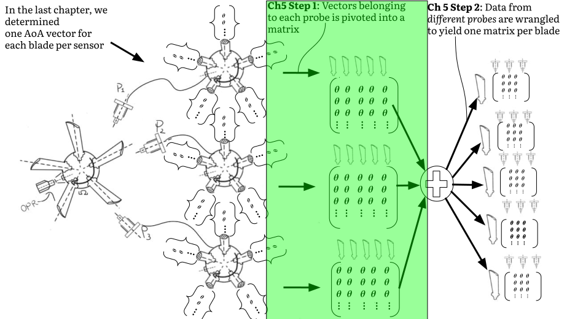

??? abstract "You are here"
	<figure markdown>
	{ width="500" }
	</figure>

<style>
:root {
  --md-tooltip-width: 600px;
}
</style>

# Combining multiple probes
We are almost halfway through the tutorial! If you can stick with it for this chapter, it should be downhill from here. If you're doing the tutorial for the first time and feel confused by some of the previous chapters, that's OK. I'm often confused myself. Just remember that the chapters will always be free and online. You can, and should, return to them at any time. The more time you spend on the fundamentals, the faster your research will progress later on.

I've promised that, by the end of this tutorial, you'll be able to infer vibration frequency, amplitude, and phase for each individual blade. To achieve this, we need to combine all AoAs belonging to the same blade together. This means combining the AoAs of the same blade at different proximity probes. Much of this chapter's content can be referred to as data wrangling. Data wrangling is the term often used in Machine Learning (ML). We are not *changing* any AoAs. We are simply grabbing, slicing, and consolidating the data in order to simplify subsequent analyses.

Why do we need new algorithms to combine data from different probes together? 

Because we don't know which blade arrived at each probe first. 

To illustrate this point, [Figure 1](#figure_01) shows an animation of a 5 blade rotor. The rotor completes one revolution. Three proximity probes are located at different circumferential positions. Each time a blade passes a probe, we allocate the blade on the right hand side. This allows us to visualize the order in which the blades arrive at each probe. The blades have been marked with numbers 1 to 5.

<figure markdown>
  
  <figcaption><a id='figure_01'><strong>Figure 1:</strong></a>
    The first blade to arrive at each probe differ. The first blade to arrive at probe 1 is Blade 1. The first blade to arrive at probe 2 is Blade 5. The first blade to arrive at probe 3 is Blade 4. If we want to combine the AoAs from all the probes together, we must determine this order first.
  </figcaption>
</figure>

[Figure 1](#figure_01) above demonstrates the first blade to arrive at each probe is different. The first blade to arrive at probe 1 is Blade 1. The first blade to arrive at probe 2 is Blade 5. The first blade to arrive at probe 3 is Blade 4.

It may seem simple to determine this order, but if your rotor has many blades, it is nontrivial. 

!!! tip "A colorful example"

    Let's use a colorful example to illustrate the problem.

    Suppose you're measuring the lap times of 5 marathon runners. Normally, you simply stand at the finish line and record the time each runner finishes. 
    
    But our race is different. 
    
    The runners *do not start* at the same location around the track. We can therefore not infer that the first runner to arrive at the finish line is the fastest. Each runner's starting position needs to be taken into account as well. 
    
    Furthermore, we grab two friends and disperse ourselves to arbitrary positions around the track. No one is taking measurements at the finishing line, but rather at random locations. To infer how fast the runners are going, we need to communicate with one another, and take the relative distance between all timers into account. This chapter solves a similar problem for BTT.

To collect all AoAs for the first blade, we have to "grab" the first AoA vector from probe 1, the second AoA vector from probe 2, and the third AoA vector from probe 3. To isolate the AoAs that belong to the second blade, we take the second AoA vector from probe 1, the third AoA vector from probe 2, and the fourth AoA vector from probe 3. This task is simple because the order in which the blades arrive is known for this example.

Normally, the blade order is unknown. This chapter discusses how to determine this order. By the end of this chapter, we will have one DataFrame per blade. Each DataFrame consolidates the AoAs for a single blade across all the probes. 

We break this process into two steps. The two steps are explained with the help of [Figure 2](#figure_02) below.

<figure markdown>
  { width="700" }
  <figcaption><a id='figure_02'><strong>Figure 2:</strong></a>
    An illustration of the two-step process followed in this chapter. In the first step, we pivot the AoA vectors from each probe into a matrix where each row of the matrix represents a shaft revolution, and each column represents a blade's arrival AoA at the probe. 
    
    In the second step, we combine the pivoted DataFrames together, and extract the columns that correspond to each blade. After step two, we have a DataFrame for each blade. Each DataFrame contains the AoAs for the blade in question across all the probes.
  </figcaption>
</figure>

In the first step, we pivot the AoA vectors from each probe into a matrix where each row of the matrix represents a shaft revolution, and each column represents a blade's arrival AoA at the probe. The illustrative example includes three sensors and five blades. After step 1, there are three matrices. Each matrix corresponds to a sensor. The matrix contains 5 columns, each one holding the AoAs for a different blade. 

Note that, at the end of step 1, we have not combined or considered the relationship between sensors yet. Step 2 deals with how to combine information from different sensors together. In step 2, we flex our data wrangling muscles to identify which columns in the pivoted matrices represent the same blade for each sensor. Those columns are combined together into a single DataFrame. We therefore have one DataFrame per blade, with as many columns as there are sensors.


!!! question "Outcomes"

	:material-checkbox-blank-outline: Understand that we can pivot the AoAs arriving at one proximity probe in a column-wise manner. Each row of the resulting DataFrame contains the AoAs for each blade in a different column.

    :material-checkbox-blank-outline: Understand what the stack plot is, and how it can be used to confirm our blades are properly aligned.
	
	:material-checkbox-blank-outline: Write functions to convert the AoAs associated with individual proximity probes into consolidated rotor blade DataFrames containing all the ToAs and AoAs belonging to a blade.

## Follow along
The worksheet for this chapter can be downloaded here <a href="https://github.com/Bladesight/bladesight-worksheets/blob/master/intro_to_btt/ch_05_worksheet.ipynb" target="_blank"></a>.

You can open a Google Colab session of the worksheet here: <a href="https://colab.research.google.com/github/Bladesight/bladesight-worksheets/blob/master/intro_to_btt/ch_05_worksheet.ipynb" target="_blank"></a>.

You need to use one of these Python versions to run the worksheet:


## Step 1: Pivot the AoA vectors for each probe
<figure markdown>
  { width="700" }
  <figcaption><a id='figure_03'><strong>Figure 3:</strong></a>
    We now discuss step 1 of the two-step process. We pivot the AoA vectors from each probe into a matrix where each row of the matrix represents a shaft revolution, and each column represents a blade's AoAs at the probe.
  </figcaption>
</figure>

[Figure 3](#figure_03) above shows the first step of the two-step process. We pivot the AoA vectors from each probe into a matrix where each row of the matrix represents a shaft revolution, and each column represents a blade's AoAs at the probe.

!!! tip "We still only consider data from a single probe at a time"
    
    We cannot stress enough that, in step 1, we still only consider data from one probe at a time. Information from different probes will be combined in step 2.

We repeat what was achieved in the previous chapter in [Figure 4](#figure_04) below. This clarifies the transformation required in Step 1.

<figure markdown>
  { width="600" }
  <figcaption><a id='figure_04'><strong>Figure 4:</strong></a> Illustration of the algorithm developed in Chapter 3. We took the AoAs from one proximity probe, and cut it into 5 DataFrames. Each DataFrame corresponds to the AoAs for one blade.</figcaption>
</figure>

In [Figure 4](#figure_04) above, the AoAs from one proximity probe have been sliced into 5 DataFrames. Each DataFrame represents the vector of AoAs for one blade.

Now, in step 1 of our process, we pivot those vector DataFrames into a matrix. The AoAs from different blades are located in different columns of the matrix. In other words, each row of our resulting DataFrame concatenates all the AoAs for each sensor. We want to perform the transformation illustrated in [Figure 5](#figure_05) below.

<figure markdown>
  
  <figcaption><a id='figure_05'><strong>Figure 5:</strong></a> An illustration of the column-wise pivot we perform. Each row of the ultimate DataFrame contains the AoAs for each blade in a different column. </figcaption>
  </figcaption>
</figure>
In [Figure 5](#figure_05) above 👆, a function called `pivot_blade_AoAs_along_revolutions` transforms the list of DataFrames into one DataFrame. Each row contains the AoAs for each blade. We have not changed the information inside the DataFrame, merely rearranged it. 

Why do we do this? Simply because its easier to work with one DataFrame than with a list of DataFrames. There are other ways to perform the work discussed in this chapter. I believe this is the most intuitive way.

The function to perform this transformation is given below. I have added code annotations to explain the steps in the function. You open them with the :material-plus-circle: symbols. If the comments  don't appear, refresh the page and try again.

``` py linenums="1"
def pivot_blade_AoAs_along_revolutions(
    prox_AoA_dfs : List[pd.DataFrame] #(1)!
) -> pd.DataFrame:
    df_blades_aligned = prox_AoA_dfs[0]#(2)!
    df_blades_aligned = df_blades_aligned.rename(#(3)!
        columns={
            "ToA":"ToA_1", 
            "AoA":"AoA_1"
        }
    )
    for i, df_blade in enumerate(prox_AoA_dfs[1:]):#(4)!
        df_blades_aligned = df_blades_aligned.merge(#(5)!
            df_blade[["n", "ToA", "AoA"]].rename(
                columns={
                    "ToA":"ToA_"+str(i+2), 
                    "AoA":"AoA_"+str(i+2)}
            ),
            how="outer",#(6)!
            on="n"#(7)!
        )
    return df_blades_aligned
```

1.  The `prox_AoA_dfs` is a list of DataFrames from one proximity probe where each element in the list represents the AoA values from one blade. This list is the output of the `transform_prox_AoAs_to_blade_AoAs` from the previous chapter.
    
    The `List` type hint is used to indicate `prox_AoA_dfs` is a list of DataFrames. You can import the `List` type hint from the `typing` module as such: 
    
    `from typing import List`

2.  We take the first blade as our reference. We will align the other blades to the first blade's DataFrame.

3.  We rename the `ToA` and `AoA` columns to `ToA_1` and `AoA_1` respectively. The `1` indicates these values belong to the first blade.

4.  We loop over the rest of the blades. We merge each successive blade's DataFrame into the reference DataFrame.

5.  The Pandas `.merge` method joins two DataFrames on a common key. Here, we merge the reference DataFrame with the current blade's DataFrame. 
    We rename the `ToA` and `AoA` columns to `ToA_{i+2}` and `AoA_{i+2}` respectively. The `i+2` is used because the `i` counter starts at zero. The first DataFrame we merge into the reference must, however, be 2. Therefore, we add 2 to the `i` counter.

6.  We perform an `outer` join. This means we retain all rows from both DataFrames, even if no matching value for the `n` key is present in one of them. If, for instance, the `n` for revolution 50 is missing from the current blade's DataFrame, the `ToA_2` and `AoA_2` columns will be filled with `NaN` values.

7.  We join the DataFrames on the `n` key, `n` is the revolution number.


In the above code block, the first blade's DataFrame is used as the reference DataFrame. Why do we handle the first blade's vector outside of the loop, and the other blades' vectors inside the loop? Because we need a first DataFrame to merge the other DataFrames into. If we tried to process the first blade's AoAs inside the loop, our merge operation would fail, because there is no initial DataFrame to merge it into! The first blade's AoAs are therefore treated as a special case. The first blade's AoAs become the reference into which the other blades' AoAs are merged. 

??? note "Is it not arbitrary to use blade 1 as the reference?"

    Yes it is. We could have selected any blade as our reference. They are all equally arbitrary. Given this fact, we may as well standardize on the first blade as the reference.

Each subsequent blade's DataFrame is merged into this reference. This is a common operation in most tabular-data based applications. We expand the reference DataFrame by two columns with each merge.

The top of the merged DataFrame is presented in [Table 1](#table_01) below.

<figure markdown>
  <figcaption><a id='table_01'><strong>Table 1:</strong></a> Each proximity probe's AoAs after pivoting in a column-wise manner. </figcaption>
  </figcaption>
</figure>
{{ read_csv('docs/tutorials/intro_to_btt/ch5/blade_dfs_recombined_head.csv') }}

??? note "Column explanation 👇"

    | Column name | Explanation |
    | --- | --- |
    |n  | The revolution number in which the blade arrived at the probe. Revolution number 0 is the first revolution. |	
    |n_start_time	| The zero-crossing time at which the revolution started. |
    |n_end_time	 | The zero-crossing time at which the revolution ended. |
    |Omega    | The shaft speed within the revolution. In units of radians/second. |
    |ToA_1 | The ToA of the first blade to arrive at the probe in revolution $n$. |	
    |AoA_1 | The AoA corresponding to the first ToA in revolution $n$ as determined in Ch3. |
    |ToA_2 | The ToA of the second blade to arrive at the probe in revolution $n$. |
    |AoA_2	 | The AoA corresponding to the second ToA in revolution $n$ as determined in Ch3. |
    |ToA_3 | The ToA of the third blade to arrive at the probe in revolution $n$. |
    |AoA_3 | The AoA corresponding to the third ToA in revolution $n$ as determined in Ch3. |
    |ToA_4 | The ToA of the fourth blade to arrive at the probe in revolution $n$. |
    |AoA_4 | The AoA corresponding to the fourth ToA in revolution $n$ as determined in Ch3. |
    |ToA_5 | The ToA of the fifth blade to arrive at the probe in revolution $n$. |
    |AoA_5 | The AoA corresponding to the fifth ToA in revolution $n$ as determined in Ch3. |

The table presents the ToA and AoA columns for each blade. Each row of the table contains the data for a revolution. This DataFrame is now ready for further analysis.

### The stack plot
We now introduce the stack plot, a widely recognized tool in BTT. The stack plot visually represents the relative distance between adjacent  blades as they pass a proximity probe. A visual representation of what the stack plot represents is provided in [Figure 6](#figure06) below.

<figure markdown>
  { width="700"}
  <figcaption><a id='figure06'><strong>Figure 6:</strong></a> The stack plot for the illustrative rotor. The stack plot shows the circumferential distance between adjacent blades. </figcaption>
</figure>

Ideally, the circumferential distance between each set of adjacent blades would be the same. In reality, each rotor exhibits a unique pattern of blade spacing. We can use this unique pattern to assess whether our alignment has been done properly.

In the example above, the consecutive distances between adjacent blades for the first shaft revolution is:

``` py linenums="1"
>>> blade_dfs_recombined = []
>>> for prox_list_AoAs in blade_probes_dfs:
    ... blade_dfs_recombined.append(
    ...     pivot_blade_AoAs_along_revolutions(prox_list_AoAs)
    ...)
>>> df = blade_dfs_recombined[0]
>>> blade_2_minus_1 = df.iloc[0]["AoA_2"] - df.iloc[0]["AoA_1"] #(1)!
>>> blade_3_minus_2 = df.iloc[0]["AoA_3"] - df.iloc[0]["AoA_2"]
>>> blade_4_minus_3 = df.iloc[0]["AoA_4"] - df.iloc[0]["AoA_3"]
>>> blade_5_minus_4 = df.iloc[0]["AoA_5"] - df.iloc[0]["AoA_4"]
>>> blade_1_minus_5 = 2*np.pi + df.iloc[1]["AoA_1"] - df.iloc[0]["AoA_5"]
>>> print("blade_2_minus_1:", blade_2_minus_1, "rad")
>>> print("blade_3_minus_2:", blade_3_minus_2, "rad")
>>> print("blade_4_minus_3:", blade_4_minus_3, "rad")
>>> print("blade_5_minus_4:", blade_5_minus_4, "rad")
>>> print("blade_1_minus_5:", blade_1_minus_5, "rad")
```

1.  The `iloc[0]` method is used to access the first row of the DataFrame. It returns a Pandas Series, and we can access the `AoA` columns with the `[]` operator.

``` console
blade_2_minus_1: 1.2629980304819501 rad
blade_3_minus_2: 1.2574606040202596 rad
blade_4_minus_3: 1.2488114790250116 rad
blade_5_minus_4: 1.2490816162460137 rad
blade_1_minus_5: 1.2585900251951907 rad
```

Stack plot calculations are intuitive: Blade 1's AoA in revolution `n` is subtracted from Blade 2's AoA in revolution `n`, Blade 2's AoA in revolution `n` is subtracted from Blade 3's AoA in revolution `n`, and so on. The only tricky calculation is the `blade_1_minus_5` calculation. Here, we subtract the AoA of the first blade from the `second` revolution (`n=1`) from the AoA of the last blade from the `first` revolution (`n=0`). Put another way: the blade to arrive after the last blade of the first revolution is the first blade in the second revolution.

Here's a function called `create_stack_plot_df` to calculate the stack plot:

``` py linenums="1"
def create_stack_plot_df(df_blades_aligned : pd.DataFrame) -> pd.DataFrame:
    all_aoa_columns = sorted([#(1)!
        i for i in df_blades_aligned.columns 
        if i.startswith("AoA_")
    ])
    B = len(all_aoa_columns)#(2)!
    stack_plot_diffs = {}#(3)!
    stack_plot_diffs["n"] = df_blades_aligned["n"].to_numpy()#(4)!
    for blade_no in range(B - 1):#(5)!
        farther_blade_name = all_aoa_columns[blade_no + 1]#(6)!
        closer_blade_name = all_aoa_columns[blade_no]#(7)!
        arr_blade_diffs = (#(8)!
            df_blades_aligned[farther_blade_name] 
            - df_blades_aligned[closer_blade_name]
        ).to_numpy()
        
        stack_plot_diffs[closer_blade_name] = arr_blade_diffs#(9)!
    farther_blade_name = all_aoa_columns[0]#(10)!
    closer_blade_name = all_aoa_columns[B - 1]
    arr_blade_diffs = (
        df_blades_aligned[farther_blade_name].to_numpy()[1:] + 2*np.pi#(11)! 
        - df_blades_aligned[closer_blade_name].to_numpy()[:-1]
    )
    arr_blade_diffs = np.append(arr_blade_diffs, [None])#(12)!
    stack_plot_diffs[closer_blade_name] = arr_blade_diffs
    return pd.DataFrame(stack_plot_diffs)#(13)!
```

1.  To start, we collect all the columns with the prefix `AoA_`. This will return as many columns as there are blades.
2.  The number of blades, `B`, is calculated from the AoA column headings.
3.  We initialize a dictionary that will contain the stack plot values. We use a dictionary because it is easy to convert it to a Pandas DataFrame later on with the `pd.DataFrame` constructor.
4.  We add the revolution number to the DataFrame. This is the only column that is not a stack plot value. We don't use `n` in the stack plot, but it feels wrong to throw away the revolution number column :smile:.
5.  We iterate over all the blades except the last blade. We therefore use `range(B - 1)` instead of `range(B)`. Within this loop, we calculate the difference between adjacent blade pairs. We'll calculate the difference between the last and the first blade after the loop has executed.
6.  We get the column name of the blade to arrive second - i.e. after the first one.
7.  The name of the column that corresponds to the first blade.
8.  We calculate the difference between the two blades. We use the `.to_numpy()` method to convert the Pandas Series to a NumPy array. We do this to get rid of our `Pandas` index.
9.  We add the blade difference array to the dictionary.
10. We now calculate the stack plot values between the last blade and the first blade. The *farthest* blade is the first blade and the closer blade is the last blade.
11. Here we subtract the two from one another. Note there's a difference between the revolution numbers of the two arguments. The farthest blade starts at the second revolution, and the closer blade starts at the first revolution. Also note the `+ 2 * np.pi` addition. It wraps the AoAs from the first blade back to the previous revolution.
12. We need to add one `None` value to the last blade's stack plot values because its dimension must match the other stack plot columns.
13. We convert the dictionary that holds our values in a Pandas DataFrame and return it.

We now can calculate the median of each column. We use the `.median` method:

``` py linenums="1"
stack_plot_dfs = []
for df in blade_dfs_recombined:
    stack_plot_dfs.append(create_stack_plot_df(df))
print(stack_plot_dfs[0].median())
```
``` console
n          1435.0
AoA_1    1.257285
AoA_2    1.257135
AoA_3    1.254071
AoA_4    1.257441
AoA_5    1.257264
dtype: object
```
In the code above, we show the median stack plot values for each column in the stack plot DataFrame. The median value for `n` is meaningless here, and will not be plotted.

[Figure 7](#figure_07) below shows the median stack plot values for each blade. To help interpret the y-axis, recall the ideal distance between each blade is $\frac{2 \pi}{5} \approx 1.256637$.

<script src="stack_plot_probe_1.js" > </script>
<div>
	<div>
		<canvas id="ch05_stack_plot_probe_1"'></canvas>
	</div>
	<script>
		async function render_chart_stack_plot_probe_1() {
			const ctx = document.getElementById('ch05_stack_plot_probe_1');
			// If this is a mobile device, set the canvas height to 400
			if (window.innerWidth < 500) {
				ctx.height = 400;
			}
			while (typeof Chart == "undefined") {
				await new Promise(r => setTimeout(r, 1000));
			}
			Chart.defaults.font.family = "Literata, -apple-system, BlinkMacSystemFont, Helvetica, Arial, sans-serif";
			window.fig_stack_plot_probe_1 = new Chart(ctx, window.stack_plot_probe_1);
			window.fig_stack_plot_probe_1_reset = function resetZoomFig1() {
					window.fig_stack_plot_probe_1.resetZoom();
				}
			}
		render_chart_stack_plot_probe_1();
	</script>
	<a onclick="window.fig_stack_plot_probe_1_reset()" class='md-button'>Reset Zoom</a>
</div>
<figure markdown>
  <figcaption><strong><a name='figure_07'>Figure 7</a></strong>: 
    The stack plot of the rotor for the first proximity probe. The stack plot shows the circumferential distance between adjacent blades. The stack plot value for each blade is close to, but not exactly, the ideal distance between the blades: 2 np.pi/5 = 1.256637. 
  </figcaption>
</figure>

In [Figure 7](#figure_07) above, the median difference between consecutive blades are all approximately equal to the *ideal* distance of $\frac{2 \pi}{5}=1.256637$. The differences that *do* exist, however, are valuable, and can be considered a "fingerprint" for this rotor.

We've now figured out how to determine the stack plot for one probe. The stack plot values for all the probes are displayed on top of one another in [Figure 8](#figure_08) below. This is simply a formality. We expect the stack plot for each probe to be identical because the same blades arrive at each probe. We expect all the lines to lie neatly on top of one another.

<script src="stack_plot_probe_whole_rotor.js" > </script>
<div>
	<div>
		<canvas id="ch05_stack_plot_probe_whole_rotor"'></canvas>
	</div>
	<script>
		async function render_chart_stack_plot_probe_whole_rotor() {
			const ctx = document.getElementById('ch05_stack_plot_probe_whole_rotor');
			// If this is a mobile device, set the canvas height to 400
			if (window.innerWidth < 500) {
				ctx.height = 400;
			}
			while (typeof Chart == "undefined") {
				await new Promise(r => setTimeout(r, 1000));
			}
			Chart.defaults.font.family = "Literata, -apple-system, BlinkMacSystemFont, Helvetica, Arial, sans-serif";
			window.fig_stack_plot_probe_whole_rotor = new Chart(ctx, window.stack_plot_probe_whole_rotor);
			window.fig_stack_plot_probe_whole_rotor_reset = function resetZoomFig2() {
					window.fig_stack_plot_probe_whole_rotor.resetZoom();
				}
			}
		render_chart_stack_plot_probe_whole_rotor();
	</script>
	<a onclick="window.fig_stack_plot_probe_whole_rotor_reset()" class='md-button'>Reset Zoom</a>
</div>
<figure markdown>
  <figcaption><strong><a name='figure_08'>Figure 8</a></strong>: 
  The stack plot for the rotor at all the proximity probes. The stack plots for probes 2, 3 and 4 are different from the stack plot for probe number 1. This is because the first blade to arrive at probes 2, 3 and 4 is not the same blade as the first blade to arrive at probe 1. 
  </figcaption>
</figure>

Oh no! :scream:

The stack plots are clearly different. How can this be? How can the rotor suddenly change shape based on the probe? 

The rotor has not changed shape. 

The stack plot, as we've shown at the start of the chapter in [Figure 1](#figure_01), is a function of which blade arrives first at each probe. The stack plot for probe 1 is different from the stack plot for probes 2, 3 and 4 because the first blade to arrive at probe 1 is not the same blade as the first blade to arrive at probes 2, 3 and 4.

??? note "Difference between arrival order of Figure 1 vs arrival order of Figure 8"

    Please note the arrival order of the blades in Figure 1 is *not* the same as the arrival order in Figure 8. Figure 1's arrival order was chosen to vividly illustrate the fact that different blades arrive at different probes first. The arrival order in Figure 8 is the actual arrival order of the blades for our dataset.


## Step 2: Combine the pivoted DataFrames from different probes

<figure markdown>
  { width="700" }
  <figcaption><a id='figure_09'><strong>Figure 9:</strong></a>
    We now discuss step 2 of the two-step process. We combine the pivoted DataFrames from each probe. We then extract the columns corresponding to each blade. After step 2, we have one DataFrame for each blade. Each DataFrame contains the AoAs for said blade across all the probes.
  </figcaption>
</figure>

The first blade to arrive at probe number 1 and the first blade to arrive at probes 2, 3 and 4 is *not* the same blade. This causes the stack plot for probes 2, 3 and 4 to seem *shifted*. We can visually inspect the stack plot to determine how much the stack plot for probes 2, 3 and 4 is shifted.

A nice way to visualize this is to plot the stack plot on a polar plot.

<figure markdown>
  
  <figcaption><a id='figure_10'><strong>Figure 10:</strong></a>
    In this animation, we shift the stack plot values for probes 2, 3 and 4 by 1 blade in the counterclockwise direction. After this shift, our stack plot lines match almost perfectly. We therefore conclude that the first blade to arrive at probe 1 arrives second at probes 2, 3 and 4.
  </figcaption>
</figure>


The first probe's stack plot is kept constant. Probe 2, 3, and 4's stack plots are shifted by $\frac{360}{5} = 72$ degrees counterclockwise. This is the same as shifting the stack plot by 1 blade. The stack plot for probes 2, 3 and 4 now matches the stack plot for probe 1. 


### Rename the columns for global alignment
The simplest way to solve our apparent conundrum is to rename the columns from the probe 2, 3 and 4 stack plot DataFrames such that it results in a stack plot similar to the first probe.

In our case, the below transformation must be performed.

``` console
                 Default order
_____________________________________________    
["AoA_1", "AoA_2", "AoA_3", "AoA_4", "AoA_5"   ] # Start with each default order
["AoA_1"] + ["AoA_2", "AoA_3", "AoA_4", "AoA_5"] # Break the list into 2 lists
["AoA_2", "AoA_3", "AoA_4", "AoA_5"] + ["AoA_1"] # Switch the the lists around
["AoA_2", "AoA_3", "AoA_4", "AoA_5", "AoA_1"   ] # Add them again  
_____________________________________________
            Probe 2, 3 and 4 order               # 👈 This is the global blade order
                                                 # for probes 2, 3, and 4
```
A function that performs this is presented below.

``` py linenums="1"
def shift_AoA_column_headings(
    aoa_column_headings : List[str], 
    shift_by : int
) -> List[str]:
    if shift_by >= len(aoa_column_headings):#(1)!
        raise ValueError("shift_by must be less than the number blades in aoa_column_headings")
    return (#(2)!
        list(aoa_column_headings)[shift_by:] 
        + list(aoa_column_headings)[:shift_by]
    )
```

1.  Before we perform the shift, we confirm the user is not trying to shift the column headings by more than the number of blades. This would not make sense!
2.  We separate our columns at the `shift_by` index and concatenate the two parts in reverse order. We wrap the `aoa_column_headings` with the `list` function. This is not strictly necessary if the user uses a Python list as the type for `aoa_column_headings`, but some people may want to pass `aoa_column_headings` as a Pandas series or a NumPy array. These constructs only implement the '+' to mean mathematical addition, not list concatenation.

We demonstrate the shift function below:

``` py linenums="1"
>>> probe_1_col_headings = ["AoA_1", "AoA_2", "AoA_3", "AoA_4", "AoA_5"]
>>> print("Shift by 0:", shift_AoA_column_headings(probe_1_col_headings, 0))
>>> print("Shift by 1:", shift_AoA_column_headings(probe_1_col_headings, 1))
>>> print("Shift by 2:", shift_AoA_column_headings(probe_1_col_headings, 2))
>>> print("Shift by 3:", shift_AoA_column_headings(probe_1_col_headings, 3))
>>> print("Shift by 4:", shift_AoA_column_headings(probe_1_col_headings, 4))
```

``` console
Shift by 0: ['AoA_1', 'AoA_2', 'AoA_3', 'AoA_4', 'AoA_5']
Shift by 1: ['AoA_2', 'AoA_3', 'AoA_4', 'AoA_5', 'AoA_1']
Shift by 2: ['AoA_3', 'AoA_4', 'AoA_5', 'AoA_1', 'AoA_2']
Shift by 3: ['AoA_4', 'AoA_5', 'AoA_1', 'AoA_2', 'AoA_3']
Shift by 4: ['AoA_5', 'AoA_1', 'AoA_2', 'AoA_3', 'AoA_4']
```
Wonderful. We can now determine the column name mapping that would align the blades from probes 2, 3, and 4 to the first probe.

??? note "How much should we shift the column headings?"

    Excellent, you've spotted a gap in my approach. Until now, we've been able to estimate the shift directly from the stack plot. This is not ideal. We're almost at the point where we write a function to estimate the shift. We'll do this in the next section.

This function can be used to rename the columns:

``` py linenums="1"
def rename_df_columns_for_alignment(
    df_to_align : pd.DataFrame,#(1)!
    global_column_headings : List[str],#(2)!
    shift_by : int#(3)!
) -> pd.DataFrame#(4)!
    shifted_dataframe_columns = shift_AoA_column_headings(#(5)!
        global_column_headings, 
        shift_by
    )
    column_headings_to_rename = {#(6)!
        local_col : global_col
        for local_col, global_col 
        in zip(
            shifted_dataframe_columns,
            global_column_headings
        )
    }
    original_column_order = list(df_to_align.columns)#(7)!
    df_to_align = df_to_align.rename(#(8)!
        columns=column_headings_to_rename
    )
    return df_to_align[original_column_order]#(9)!
```

1.  The DataFrame that we want to change.
2.  The column headings to which the columns in `df_to_align` should be mapped. This will normally be AoA or ToA column headings.
3.  The number of positions to shift the column headings by.
4.  We return a DataFrame with the exact same shape and column headings as `df_to_align`, but with the column headings renamed and re-ordered. Some columns in `df_to_align` should not be sorted or renamed, such as the revolution number `n`. We need to return these columns as is.
5.  We shift the column headings of the `global_column_headings` by `shift_by` positions.
6.  We create a dictionary that maps the column headings in `df_to_align` to the `global_column_headings`. The `zip` function allows us to iterate over the `shifted_dataframe_columns` and the `global_column_headings` together.
7.  We store the original column order of `df_to_align` in a variable. We will use this to re-order the columns in `df_to_align` in the return statement.
8.  We rename the columns in `df_to_align` with the `column_headings_to_rename` dictionary.
9.  We return the columns in `df_to_align` in the original order.

The stack plots are now redrawn in [Figure 11](#figure_11) below.

<script src="stack_plot_probe_whole_rotor_aligned.js" > </script>
<div>
    <div>
        <canvas id="ch05_stack_plot_probe_whole_rotor_aligned"'></canvas>
    </div>
    <script>
        async function render_chart_stack_plot_probe_whole_rotor_aligned() {
            const ctx = document.getElementById('ch05_stack_plot_probe_whole_rotor_aligned');
            // If this is a mobile device, set the canvas height to 400
            if (window.innerWidth < 500) {
                ctx.height = 400;
            }
            while (typeof Chart == "undefined") {
                await new Promise(r => setTimeout(r, 1000));
            }
            Chart.defaults.font.family = "Literata, -apple-system, BlinkMacSystemFont, Helvetica, Arial, sans-serif";
            window.fig_stack_plot_probe_whole_rotor_aligned = new Chart(ctx, window.stack_plot_probe_whole_rotor_aligned);
            window.fig_stack_plot_probe_whole_rotor_aligned_reset = function resetZoomFig3() {
                    window.fig_stack_plot_probe_whole_rotor_aligned.resetZoom();
                }
            }
        render_chart_stack_plot_probe_whole_rotor_aligned();
    </script>
    <a onclick="window.fig_stack_plot_probe_whole_rotor_aligned_reset()" class='md-button'>Reset Zoom</a>
</div>

<figure markdown>
  <figcaption><strong><a name='figure_11'>Figure 11</a></strong>: 
  The stack plot for the rotor at all the proximity probes after the columns have been renamed. The stack plots align with one another.
  </figcaption>
</figure>

Perfect :clap: !

Our stack plots for all probes lie on top of one another. We can therefore conclude our alignment is correct. Small differences between the median stack plot values for the different probes are observed. We attribute the differences to random noise and manufacturing tolerances in the axial and radial positions of the probes. Each probe therefore reacts slightly differently to the presence of the blades.

### Calculate the shift based on probe spacing 
We've successfully shifted the stack plot DataFrames to align them all with the first probe. We estimated the amount to shift through visual inspection of the stack plot. This estimation is simple if the rotor only has 5 blades. 

Normally, however, you cannot eyeball this shift for a rotor with more blades. We therefore need to estimate the shift based on the installed spacing between the probes. 

The engineering drawing for the probe holder used in the current dataset reveals the spacing between the probes in [Figure 12](#figure_12) below.

<figure markdown>
  
  <figcaption><strong><a name='figure_12'>Figure 12</a></strong>: 
  The figure shows the engineering drawing for the component holding the probes for this chapter's dataset. The circumferential distance between adjacent probes is 9.67 * 2 = 19.34 degrees.
</figure>

??? note "Equidistant vs non-equidistant spacing"

    How would our method differ between equidistant and non-equidistant probe sets? Nothing. The present method works for any probe-spacing.

From [Figure 12](#figure_12) above, the holes for the probes were manufactured to be 19.34 degrees from one another. 

In reality, because of manufacturing tolerances, the manufactured spacing will be slightly different. Even if you could manufacture it perfectly, the probes themselves may still not "respond" perfectly similar. This would lead to AoAs that do not correspond to the centerline of the intended probe locations.

We therefore need to assume the probes are not perfectly spaced. We therefore need an algorithm to determine when each blade arrives at each probe.

We follow a two step process to achieve this:

1.  Predict the likely AoA of a blade at a subsequent probe based on: 
    
    1.  the AoA of the blade at the current probe and;
    
    2.  the spacing between the two probes.


2.  Determine which AoA value in the subsequent probe's DataFrame is closest to the predicted AoA value.

Here's a function that performs the first step:

``` py linenums="1"
def predict_probe_offset(
        df_probe_AoAs : pd.DataFrame,#(1)!
        starting_aoa : float,#(2)!
        prox_probe_relative_distance : float,#(3)!
    ) -> int:#(4)!
    predicted_blade_position = (
        starting_aoa 
        + prox_probe_relative_distance#(5)!
    ) % (2*np.pi)#(6)!
    all_aoa_columns = sorted([
        i for i in df_probe_AoAs.columns 
        if i.startswith("AoA_")
    ])#(7)!
    current_probe_median_AoAs = df_probe_AoAs[all_aoa_columns].median()#(8)!
    err_aoa = np.abs(current_probe_median_AoAs - predicted_blade_position)#(9)!
    offset = np.argmin(err_aoa)#(10)!
    return offset
```

1.  The DataFrame that contains the AoAs for the probe for which you want to determine the offset. This DataFrame is the result of the `pivot_blade_AoAs_along_revolutions` function.
2.  Our initial AoA. This will always be the median AoA of the first blade to arrive at probe 1.
3.  The relative distance between the probe responsible for measuring the values in `df_probe_AoAs` and the probe from which `starting_aoa` was obtained. The distance must be provided in radians.
4.  The function returns the offset required for the AoA columns in `df_probe_AoAs` to align it to the blade from `starting_aoa`.
5.  We add the relative distance between the probes to the initial AoA. This gives us the predicted AoA of the blade at the later probe.
6.  We wrap the predicted AoA value to the range $[0, 2 \pi)$. This is to cater for cases where a blade arrives at `starting_aoa` in the next revolution.
7.  We get all the AoA column headings from `df_probe_AoAs`.
8.  We calculate the median AoA for each blade at the current probe.
9.  We calculate the absolute error between the predicted AoA and the median AoA for each blade.
10. The `np.argmin` returns the index of the smallest entry in an array. In this case, the smallest value in `err_aoa` will correspond to the blade that arrives closest to `predicted_blade_position`.

We can use the function above to check our previous assumption: the offset for probes 2, 3, and 4 must be 1.


``` py linenums="1"
>>> probe_1_blade_1_AoA = blade_dfs_recombined[0]["AoA_1"].median()#(1)!
>>> probe_spacings = np.deg2rad(np.array([0, 19.34, 19.34*2, 19.34*3]))#(2)!
>>> for i, (df_probe_AoAs, probe_spacing) in enumerate(#(3)!
            zip(blade_dfs_recombined, probe_spacings)#(4)!
        ):
        probe_offset = predict_probe_offset(#(5)!
            df_probe_AoAs,
            probe_1_blade_1_AoA,
            probe_spacing
        )
        print(f"Probe {i + 1 }:", probe_offset)#(6)!
```

1.  We calculate the median AoA of the first blade to arrive at probe 1. We consider it our first probe's AoA.
2.  We calculate the relative distance between the probes. We use the `np.deg2rad` function to convert the degrees to radians.
3.  We iterate over the DataFrames for each probe. The `enumerate` function returns the index of the current iteration, `i`, and the current probe AoA DataFrame and probe spacing.
4.  We use the `zip` function to iterate over the DataFrames and the probe spacings together. This is a common pattern in Python.
5.  We use the `predict_probe_offset` function to determine the offset for the current probe. We use the median AoA of the first blade arriving at probe 1 as the initial AoA.
6.  We print the offset for the current probe.

``` console
Probe 1: 0
Probe 2: 1
Probe 3: 1
Probe 4: 1
```

The optimal offset for probes 2, 3 and 4 is indeed 1. We have also calculated the optimal offset for probe 1. This is simply a sanity check, and should always return 0.

### Assemble global blade DataFrames
We now finally assemble one dataframe for each blade. The dataframes will contain the AoAs for each blade across all the probes.

A function that constructs `B` DataFrames from each of the pivoted proximity probe DataFrames is presented below. 

``` py linenums="1"
def assemble_rotor_AoA_dfs(
    prox_aligned_dfs : List[pd.DataFrame], 
    probe_spacing : List[float]
) -> List[pd.DataFrame]:
    all_aoa_columns = sorted([#(1)!
        i for i in prox_aligned_dfs[0].columns 
        if i.startswith("AoA_")
    ])
    all_toa_columns = sorted([#(2)!
        i for i in prox_aligned_dfs[0].columns 
        if i.startswith("ToA_")
    ])
    remaining_columns = [#(3)!
        i for i in prox_aligned_dfs[0].columns 
        if not i.startswith("ToA_") and not i.startswith("AoA_")
    ]
    B = len(all_aoa_columns)#(4)!
    P = len(prox_aligned_dfs)#(5)!
    if P  - 1 != len(probe_spacing):#(6)!
        raise ValueError(
            "The number of proximity probes must be "
            "one less than the number of probe spacings"
        )
    rotor_blade_dfs = []#(7)!
    for b in range(1, B+1):#(8)!
        columns_to_copy = (
            remaining_columns 
            + [f"ToA_{b}", f"AoA_{b}"]
        )#(9)!
        rename_dict = {
            f"ToA_{b}" : "ToA_p1",
            f"AoA_{b}" : "AoA_p1"
        }#(10)!
        rotor_blade_dfs.append(#(11)!
            prox_aligned_dfs[0][columns_to_copy]
            .copy(deep=True)
            .rename(
                columns=rename_dict
            )
        )
    blade_1_probe_1_median = rotor_blade_dfs[0]["AoA_p1"].median()#(12)!
    for iter_count, (df_probe_AoA, probe_offset) in enumerate(
            zip(prox_aligned_dfs[1:], probe_spacing)#(13)!
        ):
        probe_no = iter_count + 2#(14)!
        probe_offset = predict_probe_offset(#(15)!
            df_probe_AoA,
            blade_1_probe_1_median,
            probe_offset
        )
        df_probe_AoAs_aligned = rename_df_columns_for_alignment(#(16)!
            df_probe_AoA,
            all_aoa_columns,
            probe_offset
        )
        df_probe_AoAs_aligned = rename_df_columns_for_alignment(#(17)!
            df_probe_AoAs_aligned,
            all_toa_columns,
            probe_offset
        )
        for b in range(1, B+1):
            columns_to_merge = ["n", f"ToA_{b}", f"AoA_{b}"]
            rename_dict = {
                f"ToA_{b}" : f"ToA_p{probe_no}",
                f"AoA_{b}" : f"AoA_p{probe_no}"
            }
            rotor_blade_dfs[b - 1] = rotor_blade_dfs[b - 1].merge(#(18)!
                df_probe_AoAs_aligned[columns_to_merge].rename(
                    columns=rename_dict
                ),
                how="outer",
                on="n"
            )
    return rotor_blade_dfs
```

1.  We get all the AoA column headings from the first DataFrame in `prox_aligned_dfs`. We use the first DataFrame because all the DataFrames in `prox_aligned_dfs` have the same column headings.
2.  Similar to the above line, we get the ToA column names.
3.  We get all the column headings that are not AoA or ToA headings, such as `n`, `n_start_time`, `n_end_time`, and `Omega`.
4.  We determine the number of blades in the rotor.
5.  We determine the number of proximity probes.
6.  This is a sanity check to ensure we've provided the correct number of probe spacings.
7.  We initialize an empty list that will contain the rotor blade DataFrames.
8.  The purpose of this loop is to get the AoA and ToA values from the first probe. This is the start of each rotor blade's AoA DataFrame and will be grown to include the other proximity probe values in the next loop.
9.  We determine the column headings needed to copy from the first probe's DataFrame. We need to copy a) all the columns that are not AoA or ToA columns, and b) the AoA and ToA columns for only the current blade.
10. We construct the dictionary to be used with Pandas' `.rename` function to rename the AoA and ToA column headings.
11. We copy the columns from the first probe's DataFrame and rename the AoA and ToA columns for the current blade to `AoA_p1` and `ToA_p1` respectively. We append the DataFrame to the `rotor_blade_dfs` list.
12. We determine the median AoA of the first blade at the first probe. We will use this value to predict the AoA of the first blade at the other probes.
13. We loop over the rest of the probes and their probe spacings. Note the probe spacings are all relative to the first probe.
14. We determine the probe number. This is simply the iterator value plus 2, since the first probe is probe 1. We create this variable for renaming purposes.
15. We calculate the offset for the current probe. We use the `predict_probe_offset` function we wrote earlier.
16. We rename the AoA columns in `df_probe_AoAs` to align them with the first probe. We use the `rename_df_columns_for_alignment` function we wrote earlier.
17. Now we rename ToA columns in `df_probe_AoAs`.
18. We merge our aligned probe's AoA DataFrame, `df_probe_AoAs_aligned`, with the current blade's DataFrame. We use the `merge` function to do this. We use the `outer` merge type to ensure we do not lose any data. We merge on the revolution number `n`.

We can use this function to get a list of rotor blade DataFrames:

``` py linenums="1"
>>> prox_relative_distances = np.cumsum(#(1)!
    np.deg2rad(#(2)!
            np.array([9.67*2, 9.67*2, 9.67*2])#(3)!
        )
    )
>>> rotor_AoA_dfs = assemble_rotor_AoA_dfs(
    prox_aligned_dfs=blade_dfs_recombined,
    probe_spacing=prox_relative_distances
)
```

1.  We use the `np.cumsum` function to calculate the cumulative spacing between each probe and the first probe. This is because we specify our probe spacings in its increments between subsequent probes, not in absolute terms. 
2.  We convert the probe spacings to radians. We use this function instead of multiplication with `np.pi`/180 . This makes it exceedingly unlikely we'll make a mistake with this conversion.
3.  We specify the probe spacings between adjacent probes from [Figure 6](#figure_06).

The first three rows in the rotor blade AoA DataFrame is shown in [Table 2](#table_02) below.

<figure markdown>
  <figcaption><a id='table_02'>Table 2:</a> The rotor blade AoA DataFrame's head.  </figcaption>
  </figcaption>
</figure>
{{ read_csv('docs/tutorials/intro_to_btt/ch5/rotor_blade_1_df_head.csv') }}

From [Table 2](#table_02) above, four AoA columns and four ToA columns are displayed, one for each probe. We can also identify the probe by its subscript `p`. This DataFrame shares similarities with the DataFrame shown in [Table 1](#table_01). 

To get a better perspective on what we've done, we present, in [Table 3](#table_03) below, the last rotor blade's AoA DataFrame.
<figure markdown>
  <figcaption><a id='table_03'>Table 3:</a> The last rotor blade's AoA DataFrame </figcaption>
  </figcaption>
</figure>
{{ read_csv('docs/tutorials/intro_to_btt/ch5/rotor_blade_5_df_head.csv') }}

Note that `ToA_p1` in the first row occurs *after* the other ToAs in the same row. The first probe, therefore, that observes blade 5 in every revolution is probe number 2, and the last probe to observe it is probe number 1.

## Conclusion

We've done a lot of work in this chapter that yielded one DataFrame per blade. The steps involved are numerous and may be confusing. Rest assured, it gets easier with practice. The first coding exercise 👇 below will challenge you to combine everything we've done until now in a single function to get the rotor blade DataFrames.

We've now reached the peak of the difficulty mountain of BTT. From here, we can start doing the "cool" stuff. The stuff most published work is about. 

We can start doing vibration analysis.

!!! question "Outcomes"

	:material-checkbox-marked:{ .checkbox-success .heart } Understand that we can pivot the AoAs arriving at one proximity probe in a column-wise manner. Each row of the resulting DataFrame contains the AoAs for each blade in a different column.

    :material-checkbox-marked:{ .checkbox-success .heart } Understand what the stack plot is, and how it can be used to confirm our blades are properly aligned.
	
	:material-checkbox-marked:{ .checkbox-success .heart } Write functions to convert the AoAs associated with individual proximity probes into consolidated rotor blade DataFrames containing all the ToAs and AoAs belonging to a blade.

## Acknowledgements
Thanks to <a href="https://www.linkedin.com/in/justin-s-507338116/" target="_blank">Justin Smith</a> and <a href="https://www.linkedin.com/in/alex-brocco-70218b25b/" target="_blank">Alex Brocco</a> for reviewing this chapter and providing feedback.

\bibliography

<div style='display:flex'>
    <div>
        <a target="_blank" href="https://www.bladesight.com" class="" title="Dawie Diamond" style="border-radius:100%;"> 
            
        </a>
    </div>
    <div style='margin-left:2rem'>
        <p>
            <strong>Dawie Diamond</strong>
        </p>
        <p>
            2024-02-28
        </p>
    </div>
</div>

## Coding exercises

### 1. One function to rule them all

We've done a lot of work in chapters 3, 4 and 5. Its now time to combine them into one function that receives raw time stamps, and returns rotor blade AoA DataFrames.

{==

:material-pencil-plus-outline: Write a function called `get_rotor_blade_AoAs` that receives the these three inputs:

1.  A DataFrame that contains the opr zero-crossing times.
2.  A list of ToAs from each proximity probe.
3.  A list of probe spacings between each proximity probe and the first proximity probe.

and returns a list of rotor blade DataFrames. I recommend you leverage the functions we've written in this chapter.

==}

??? example "Reveal answer (Please try it yourself before revealing the solution)"
    ``` py linenums="1"
    def get_rotor_blade_AoAs(
        df_opr_zero_crossings : pd.DataFrame,
        prox_probe_toas : List[pd.DataFrame],
        probe_spacings : List[float],
        B : int
    ) -> List[pd.DataFrame]:
        """This function converts the raw time stamps, both the OPR zero-crossing
        times and he proximity probe ToAs, and returns a DataFrame for each 
        blade containing the ToA and AoA values for each blade over all the
        proximity probes.

        Args:
            df_opr_zero_crossings (pd.DataFrame): A DataFrame containing the
                OPR zero-crossing times in its first column.
            prox_probe_toas (List[pd.DataFrame]): A list of DataFrames
                where each DataFrame contains the ToAs of a single
                blade from a proximity probe.
            probe_spacings (List[float]): The relative spacing between
                the first probe and every other probe. There  one
                less value in this list than in prox_probe_toas.
            B (int): The number of blades.

        Returns:
            List[pd.DataFrame]: A list of DataFrames where each DataFrame
                contains the ToAs and AoAs of a single blade over all
                the proximity probes.
        """
        blade_dfs_recombined = []

        for df_prox_toas in prox_probe_toas:
            df_prox = transform_ToAs_to_AoAs(
                df_opr_zero_crossings, 
                df_prox_toas, 
            )
            
            blade_dfs_recombined.append(
                pivot_blade_AoAs_along_revolutions(
                    transform_prox_AoAs_to_blade_AoAs(
                        df_prox, 
                        B
                    )
                )
            )
        
        rotor_AoA_dfs = assemble_rotor_AoA_dfs(
            prox_aligned_dfs=blade_dfs_recombined,
            probe_spacing=probe_spacings
        )
        return rotor_AoA_dfs
    ```

    Usage example:

    ``` py linenums="1"
    >>> ds = Datasets["data/intro_to_btt/intro_to_btt_ch05"]
    >>> df_opr_zero_crossings = ds['table/opr_zero_crossings']
    >>> df_prox_1 = ds['table/prox_1_toas']
    >>> df_prox_2 = ds['table/prox_2_toas']
    >>> df_prox_3 = ds['table/prox_3_toas']
    >>> df_prox_4 = ds['table/prox_4_toas']

    >>> rotor_blade_AoA_dfs = get_rotor_blade_AoAs(
            df_opr_zero_crossings,
            [df_prox_1, df_prox_2, df_prox_3, df_prox_4],
            np.cumsum(np.deg2rad(np.array([19.34, 19.34, 19.34]))),
            5
        )
    ```

### 2. Predict the probe spacings

It can happen that you receive a set of BTT timestamps, but the exact probe spacing is unknown. This can happen when you are handed an old dataset. It can also happen because you're not 100% sure that the manufactured probe spacing is correct.

{==

:material-pencil-plus-outline: Write a function that calculates the probe spacing by comparing the stack plot between two probes. 

==}

??? example "Reveal answer (Please try it yourself before revealing the solution)"
    :ghost: BOO. 
    
    I'll leave you to it. I actually think this could make a journal publication. If you're stuck, you can reach me at <a mailto="dawie.diamond@bladesight.com">dawie.diamond@bladesight.com</a>.