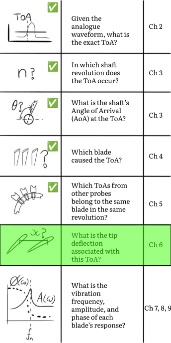
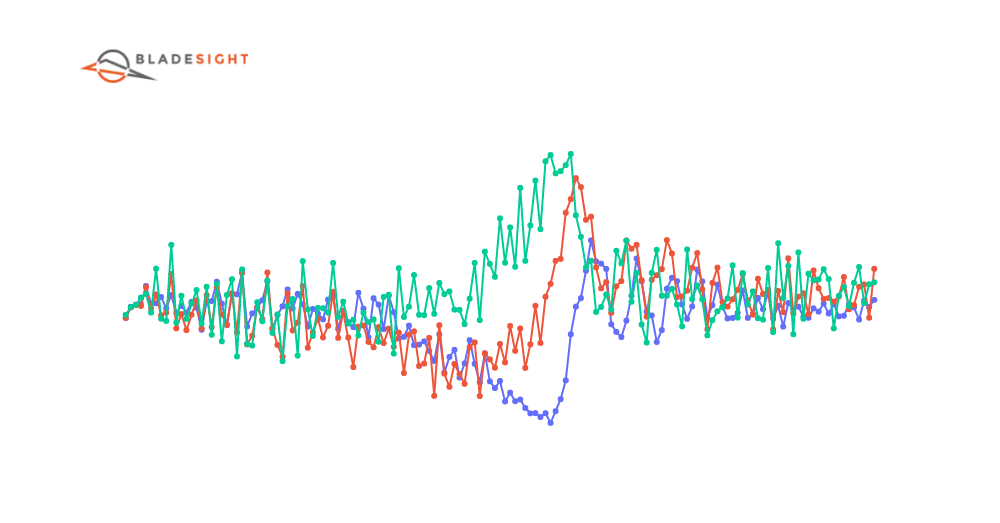
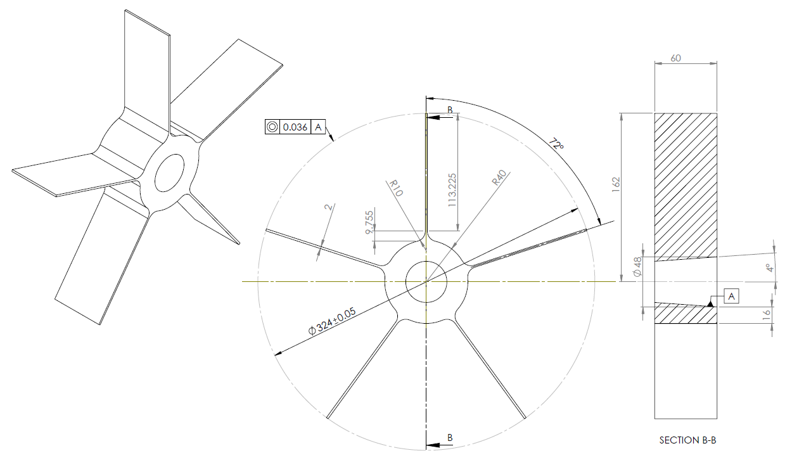

??? abstract "You are here"
	<figure markdown>
	{ width="500" }
	</figure>

<style>
:root {
  --md-tooltip-width: 600px;
}
</style>

# Tip Deflections Zeroing and Filtering 
At the end of the last chapter, we managed to combine data from multiple proximity sensors. We arrived at a place where we had one DataFrame containing the AoAs for a single blade. We are now more than halfway through our journey. In order to reach our promised goal of inferring blade vibration characteristics, we now convert these AoAs into tip deflections. The process entails: 

1. Zeroing the AoAs to remove the static part of the signal.
2. Scaling the AoAs by the rotor's radius, thereby yielding the tip deflection in units of microns.
3. Filtering the tip deflections to remove high frequency noise.

In this chapter, we explore multiple techniques to perform this transformation. You may ultimately use only one approach. Rest assured you'll find some application for the other ones in future, even if its unrelated to BTT.

<figure markdown>
  
  <figcaption><a id='figure_01'><strong>Figure 1:</strong></a>
    An animation showing the effect of applying a Butterworth filter to normalized tip deflections. 
  </figcaption>
</figure>


!!! question "Outcomes"

	:material-checkbox-blank-outline: Understand that AoAs are offset by a constant value. This offset is unrelated to the blade's vibration. 

	:material-checkbox-blank-outline: Understand that the normalized AoAs can be multiplied by the rotor radius to obtain tip deflections.

    :material-checkbox-blank-outline: Understand that the tip deflection signal may contain non-vibration related components that are proportional to the shaft speed.

	:material-checkbox-blank-outline: Understand that a low pass filter can be used to smooth the tip deflections. 
	
	:material-checkbox-blank-outline: Understand that the peak-to-peak vibration can be used to identify resonance events.

	:material-checkbox-blank-outline: Write a single function that zeroes, scales and filters the rotor blade AoAs.

## Following along
The worksheet for this chapter can be downloaded here <a href="https://github.com/Bladesight/bladesight-worksheets/blob/master/intro_to_btt/ch_06_worksheet.ipynb" target="_blank"></a>.


You can open a Google Colab session of the worksheet here: <a href="https://colab.research.google.com/github/Bladesight/bladesight-worksheets/blob/master/intro_to_btt/ch_06_worksheet.ipynb" target="_blank"></a>.

You need to use one of these Python versions:


## Zeroing the AoAs
Let's load a new dataset into memory. The dataset was acquired from the same rotor as used in the previous chapters. The dataset has measurements from three eddy current probes for a run-up and run-down of the rotor:

``` py linenums="1"
from bladesight import Datasets

ds = Datasets["data/intro_to_btt/intro_to_btt_ch06"]
df_opr_zero_crossings = ds['table/opr_zero_crossings']
df_prox_1 = ds['table/prox_1_toas']
df_prox_2 = ds['table/prox_2_toas']
df_prox_3 = ds['table/prox_3_toas']
```

I've included the functions we've created in the previous chapter into the `bladesight` module. Specifically, the `get_rotor_blade_AoAs` function from the previous chapter's coding exercises have been added to the `btt` module. It can now be used as a single entrypoint to convert the OPR zero-crossing times and the proximity probe ToAs into rotor blade AoA DataFrames.

``` py linenums="1"
from bladesight.btt import get_rotor_blade_AoAs
from typing import List#(1)!
blade_AoAs : List[pd.DataFrame] = get_rotor_blade_AoAs(
    df_opr_zero_crossings, 
    [
        df_prox_1, 
        df_prox_2, 
        df_prox_3
    ],
    probe_spacings=np.deg2rad([10,20]),
    B=5
)
```

1.  We import the list annotation. The `get_rotor_blade_AoAs` function returns a list of DataFrames. Each DataFrame contains the AoAs for a single blade. 
    
    Why did I not return one big DataFrame instead? Because we want to analyze each blade individually. We may want to compare the vibration of different blades. It's easier to achieve if the DataFrames are separate.

In the code above we've stipulated that probe 2 is 10 degrees from probe 1. Probe 3 is 20 degrees from probe 1. We also stipulate there are 5 blades. The function returns a list of DataFrames, one for each blade. The top of the first DataFrame is shown in [Table 1](#table_01) below:

<figure markdown>
  <figcaption><a id='table_01'><strong>Table 1:</strong></a> The first 5 rows of rotor blade 1's AoA DataFrame. </figcaption>
  </figcaption>
</figure>
{{ read_csv('docs/tutorials/intro_to_btt/ch6/df_blade_1_head.csv') }}

The AoAs for each probe are plotted against the revolution number in [Figure 2](#figure_02) below.

<script src="blade_1_aoas_raw.js" > </script>
<div>
	<div>
		<canvas id="ch06_blade_1_aoas_raw"'></canvas>
	</div>
	<script>
		async function render_chart_blade_1_aoas_raw() {
			const ctx = document.getElementById('ch06_blade_1_aoas_raw');
			// If this is a mobile device, set the canvas height to 400
			if (window.innerWidth < 500) {
				ctx.height = 400;
			}
			while (typeof Chart == "undefined") {
				await new Promise(r => setTimeout(r, 1000));
			}
			Chart.defaults.font.family = "Literata, -apple-system, BlinkMacSystemFont, Helvetica, Arial, sans-serif";
			window.fig_blade_1_aoas_raw = new Chart(ctx, window.blade_1_aoas_raw);
			window.fig_blade_1_aoas_raw_reset = function resetZoomFig1() {
					window.fig_blade_1_aoas_raw.resetZoom();
				}
			}
		render_chart_blade_1_aoas_raw();
	</script>
	<a onclick="window.fig_blade_1_aoas_raw_reset()" class='md-button'>Reset Zoom</a>
</div>
<figure markdown>
  <figcaption><strong><a name='figure_02'>Figure 2</a></strong>: The AoAs for the first blade. Each probe's AoAs are offset by a constant value. We say the AoAs are <strong>not zeroed</strong>. The shaft speed is also indicated on a second y-axis.</figcaption>
  </figcaption>
</figure>

In [Figure 2](#figure_02) above, there are three seemingly horizontal lines that represent the AoAs for the blade at probes one, two and three respectively. Each line has a constant AoA offset. This constant is the average distance traveled by the shaft from the start of each revolution until the blade reaches the probe. 

This constant offset is unrelated to the deflection of the blade. We therefore say the values in [Figure 2](#figure_02) are *not zeroed*. We need to remove the static part of the signal before we can proceed with the analysis.

### Normalization and scaling
One of the simplest ways to remove the static part of the signal is to subtract the mean of the AoA column from each AoA value. We can use the code below to achieve this.

``` py linenums="1" 
df["AoA_norm_p1"] = df[f"AoA_p1"].mean() - df[f"AoA_p1"] 
df["AoA_norm_p2"] = df[f"AoA_p2"].mean() - df[f"AoA_p2"]
df["AoA_norm_p3"] = df[f"AoA_p3"].mean() - df[f"AoA_p3"]
```

The normalized AoA column can now be *scaled* with the rotor radius to calculate the tip deflection. 

Recall that the distance traveled along an arc is given by the formula:

\begin{equation}
x = R \cdot \theta
\end{equation}

The code below shows how to do this:

``` py linenums="1"
R = 162000
df["x_p1"] = R * df["AoA_norm_p1"]
df["x_p2"] = R * df["AoA_norm_p2"]
df["x_p3"] = R * df["AoA_norm_p3"]
```

The engineering drawing for the blisk used in these measurements is presented in [Figure 3](#figure_03) below.

<figure markdown>
  
  <figcaption><a id='figure_03'><strong>Figure 3:</strong></a>
    An engineering drawing of the blisk used in these measurements. The blisk's diameter is 324 mm. The radius is therefore 162 mm.
  </figcaption>
</figure>

The rotor's radius is 162mm, or 162000 $\mu$m. I like to express tip deflection in microns. This is a personal preference. 

The resulting tip deflections are presented in [Figure 4](#figure_04) below.

<script src="blade_1_x_normalized.js" > </script>
<div>
    <div>
        <canvas id="ch06_blade_1_x_normalized"'></canvas>
    </div>
    <script>
        async function render_chart_blade_1_x_normalized() {
            const ctx = document.getElementById('ch06_blade_1_x_normalized');
            // If this is a mobile device, set the canvas height to 400
            if (window.innerWidth < 500) {
                ctx.height = 400;
            }
            while (typeof Chart == "undefined") {
                await new Promise(r => setTimeout(r, 1000));
            }
            Chart.defaults.font.family = "Literata, -apple-system, BlinkMacSystemFont, Helvetica, Arial, sans-serif";
            window.fig_blade_1_x_normalized = new Chart(ctx, window.blade_1_x_normalized);
            window.fig_blade_1_x_normalized_reset = function resetZoomFig2() {
                    window.fig_blade_1_x_normalized.resetZoom();
                }
            }
        render_chart_blade_1_x_normalized();
    </script>
    <a onclick="window.fig_blade_1_x_normalized_reset()" class='md-button'>Reset Zoom</a>
</div>
<figure markdown>
  <figcaption><strong><a name='figure_04'>Figure 4</a></strong>: The normalized tip deflections for the first blade. There are distinct areas where the blade vibration suddenly change, as indicated by callout <strong>A</strong>. This is a typical example of a resonance event. We've also added, as indicated by callout <strong>B</strong>, dotted lines that serve as "breakpoints" for our detrending algorithm (we're going to discuss detrending next). The shaft speed is indicated on a second y-axis. 
  </figcaption>
</figure>

In [Figure 4](#figure_04) above, the tip deflections no longer have a constant offset. All the tip deflection values are between +-1000 µm. The tip deflections change suddenly at multiple locations. Whether the change in tip deflection is positive or negative depends on the probe's location and the vibration frequency and phase.

One such location is indicated by callout *A*. We refer to these events as *resonance events*. Drag across the plot to zoom into the resonance event. Each probe's tip deflections have different shapes at the resonance. This is counter-intuitive, because the blade's vibrational state can surely not change much within a single shaft revolution. This behavior is because of *aliasing*. But we're getting ahead of ourselves. We'll discuss aliasing in the next chapter. For now, you just need to understand that the tip deflections measured at different probes have different shapes, and that there exists a perfectly sensible explanation for this.

!!! note "Are the tip deflections safe?"

    The tip deflections in [Figure 4](#figure_04) above are within the safe limits for this particular blade. You need to perform a FEA to determine the safe limits for your blade.

### Piecewise linear detrending
We have done well to remove the static offset from each probe's signal. Unfortunately, some static effects that have nothing to do with tip deflection are still present in the signal. 

From [Figure 4](#figure_04) it seems as though the tip deflections change proportionally to the shaft speed. It is unlikely this change is related to tip deflection. Shaft speed related shifts can occur for many reasons. In this case, the proportional change in tip deflection is due to the fact that the eddy current probes used here have a limited bandwidth. The amplitude of the pulses (as discussed in Chapter 2) therefore become smaller as the shaft speed increases. This causes the ToAs to be triggered later. This later triggering manifests itself as apparent tip deflection changes.

Let's remove this proportional change with a *detrending* algorithm.

A detrending algorithm is a simple algorithm that removes a static trend from a signal. The Python library `scipy` has a built-in detrending algorithm.

``` py linenums="1"
from scipy.signal import detrend
```

This function fits and subtracts a linear curve from the signal. A linear curve, though, is not what we need. In [Figure 4](#figure_04) above, there are multiple regions with different linear trends. This is especially true the moment the shaft speed reverses around revolution 1436. Linear trend changes are observed in other regions as well.

Fortunately, the detrending algorithm allows us to specify *breakpoints* where the linear trend changes. From [Figure 4](#figure_04) above, I've eyeballed the breakpoints between linear sections at shaft revolutions 217, 1128, 1436, 1784, and 2670. The breakpoints are indicated by the dotted lines in [Figure 4](#figure_04) above (one breakpoint is indicated by callout B). 

The detrending algorithm can be applied for all three probes with the code below:

``` py linenums="1"
bps = np.array([217, 1128, 1436, 1784, 2670])
df[f"x_p1"] = detrend(
    df["x_p1"],
    bp=bps
)
df[f"x_p2"] = detrend(
    df["x_p2"],
    bp=bps
)
df[f"x_p3"] = detrend(
    df["x_p3"],
    bp=bps
)
```

The detrended tip deflections are shown in [Figure 5](#figure_05) below.
<script src="blade_1_x_detrended.js" > </script>
<div>
    <div>
        <canvas id="ch06_blade_1_x_detrended"'></canvas>
    </div>
    <script>
        async function render_chart_blade_1_x_detrended() {
            const ctx = document.getElementById('ch06_blade_1_x_detrended');
            // If this is a mobile device, set the canvas height to 400
            if (window.innerWidth < 500) {
                ctx.height = 400;
            }
            while (typeof Chart == "undefined") {
                await new Promise(r => setTimeout(r, 1000));
            }
            Chart.defaults.font.family = "Literata, -apple-system, BlinkMacSystemFont, Helvetica, Arial, sans-serif";
            window.fig_blade_1_x_detrended = new Chart(ctx, window.blade_1_x_detrended);
            window.fig_blade_1_x_detrended_reset = function resetZoomFig3() {
                    window.fig_blade_1_x_detrended.resetZoom();
                }
            }
        render_chart_blade_1_x_detrended();
    </script>
    <a onclick="window.fig_blade_1_x_detrended_reset()" class='md-button'>Reset Zoom</a>
</div>
<figure markdown>
  <figcaption><strong><a name='figure_05'>Figure 5</a></strong>: The detrended tip deflections for the first blade. The tip deflections are now centered around zero for the duration of the measurement.
  </figcaption>
</figure>

Thats much better :clap:! The tip deflections from each probe are now centered around zero. We can now trust that the tip deflection variations are caused by blade vibration.

This approach gives us great control over the zeroing process. It would, however, be better to automatically remove these trends.

### Order domain polynomial detrending
We can gain some intuition about removing shaft speed related effects with a scatterplot of tip deflection vs shaft speed. The scatterplot is presented in [Figure 6](#figure_06) below.


<script src="blade_1_x_vs_RPM.js" > </script>
<div>
    <div>
        <canvas id="ch06_blade_1_x_vs_RPM"'></canvas>
    </div>
    <script>
        async function render_chart_blade_1_x_vs_RPM() {
            const ctx = document.getElementById('ch06_blade_1_x_vs_RPM');
            // If this is a mobile device, set the canvas height to 400
            if (window.innerWidth < 500) {
                ctx.height = 400;
            }
            while (typeof Chart == "undefined") {
                await new Promise(r => setTimeout(r, 1000));
            }
            Chart.defaults.font.family = "Literata, -apple-system, BlinkMacSystemFont, Helvetica, Arial, sans-serif";
            window.fig_blade_1_x_vs_RPM = new Chart(ctx, window.blade_1_x_vs_RPM);
            window.fig_blade_1_x_vs_RPM_reset = function resetZoomFig4() {
                    window.fig_blade_1_x_vs_RPM.resetZoom();
                }
            }
        render_chart_blade_1_x_vs_RPM();
    </script>
    <a onclick="window.fig_blade_1_x_vs_RPM_reset()" class='md-button'>Reset Zoom</a>
</div>
<figure markdown>
  <figcaption><strong><a name='figure_06'>Figure 6</a></strong>: The tip deflections have been plotted vs shaft speed for each probe. The tip deflections seem to decrease proportionally as shaft speed increases. We can fit a high order polynomial to each signal. This polynomial can be subtracted from the tip deflections to remove shaft speed related effects.
  </figcaption>
</figure>

From [Figure 6](#figure_06) above, the tip deflections for probes 2 and 3 seem to decrease, on average, as the shaft speed increases. Probe 1's tip deflections exhibit a smaller correlation. The resonance events within these signals seem to be short lived as a function of shaft speed. 

This allows us to fit a high-order polynomial to the tip deflections vs shaft speed. The polynomial represents the shaft speed related effects in the tip deflections. By subtracting the evaluated polynomial from each signal, we end up with a signal that only contains the tip's dynamic vibration.

The polynomial can be fit with the code below:

``` py linenums="1"
df["x_p1"] = R * df["AoA_norm_p1"]
df["x_p2"] = R * df["AoA_norm_p2"]
df["x_p3"] = R * df["AoA_norm_p3"]

poly_order = 11 #(1)!
p1 = np.polyfit(df['Omega'], df['x_p1'], poly_order)
p2 = np.polyfit(df['Omega'], df['x_p2'], poly_order)
p3 = np.polyfit(df['Omega'], df['x_p3'], poly_order)

df["x_p1"] = df["x_p1"] - np.polyval(p1, df['Omega'])
df["x_p2"] = df["x_p2"] - np.polyval(p2, df['Omega'])
df["x_p3"] = df["x_p3"] - np.polyval(p3, df['Omega'])
```

1.  Here, I've selected a polynomial order of 11. This was the first value I tried. You may need to experiment with different polynomial orders to find the best one for your case. Maybe you could write an algorithm that automatically determines this polynomial order. If you do, please let me know :smile:.

The detrended tip deflections are presented in [Figure 7](#figure_07) below.

<script src="blade_1_x_poly_normalised.js" ></script>
<div>
    <div>
        <canvas id="ch06_blade_1_x_poly_normalised"'></canvas>
    </div>
    <script>
        async function render_chart_blade_1_x_poly_normalised() {
            const ctx = document.getElementById('ch06_blade_1_x_poly_normalised');
            // If this is a mobile device, set the canvas height to 400
            if (window.innerWidth < 500) {
                ctx.height = 400;
            }
            while (typeof Chart == "undefined") {
                await new Promise(r => setTimeout(r, 1000));
            }
            Chart.defaults.font.family = "Literata, -apple-system, BlinkMacSystemFont, Helvetica, Arial, sans-serif";
            window.fig_blade_1_x_poly_normalised = new Chart(ctx, window.blade_1_x_poly_normalised);
            window.fig_blade_1_x_poly_normalised_reset = function resetZoomFig5() {
                    window.fig_blade_1_x_poly_normalised.resetZoom();
                }
            }
        render_chart_blade_1_x_poly_normalised();
    </script>
    <a onclick="window.fig_blade_1_x_poly_normalised_reset()" class='md-button'>Reset Zoom</a>
</div>
<figure markdown>
  <figcaption><strong><a name='figure_07'>Figure 7</a></strong>: The detrended tip deflections for the first blade after zeroing with an order domain polynomial. The tip deflections are now centered around zero for the duration of the measurement.
  </figcaption>
</figure>

Great :smile:! We've managed to remove the static, non-vibration related part of the signal. We can now move on to the next step of the analysis, filtering.

!!! note "Poorly conditioned polynomial fit"

    When you use polynomial detrending, you may receive a `Polyfit may be poorly conditioned` warning. This happens for one of three reasons:

    1.  The polynomial order is too high. You can reduce the polynomial order to remove the warning.
    2.  The shaft speed is constant. This means there is no shaft speed variety to fit against. You should choose an order of 0 or 1 for constant speed cases.
    3.  Your data is wrong. If the data passed to the algorithm is spurious or incorrect, the algorithm will still attempt to fit a polynomial to it. This will result in a poorly conditioned fit. You should check your data for errors.

!!! tip
    Zeroing can be achieved in many different ways. I've presented you with one simple method to get you going. It is, however, a discipline on its own. Maybe you can come up with different ways of zeroing the signal. If you do, please let me know :smile:.

## Filtering
We've now removed the static part of the signal. We have, essentially, implemented a high-pass filter on our signals. We still have high frequency noise in our signals. We can remove this noise with a low-pass filter. 

Once again, the `scipy` package in Python comes to the rescue. There are multiple filters in the `scipy.signal` module. We demonstrate two methods here:

1.  A Butterworth filter.
2.  A Gaussian filter.

### Butterworth filter
A Butterworth filter is a low-pass filter. It is often implemented in analogue systems, but we can implement it digitally with the `scipy.signal.butter` function. The code below shows how to implement a Butterworth filter.

``` py linenums="1"
from scipy.signal import butter, filtfilt

butterworth_filter = butter(N=2, Wn=0.3) #(1)!

df["x_p1_filt_butter"] = filtfilt(*butterworth_filter, df["x_p1"]) #(2)!
df["x_p2_filt_butter"] = filtfilt(*butterworth_filter, df["x_p2"])
df["x_p3_filt_butter"] = filtfilt(*butterworth_filter, df["x_p3"])
```

1.  The `butter` function is responsible for *designing* the filter. The order parameter, `N`, and the cutoff frequency `Wn`, can be adjusted. Each different combination of the two results in a different frequency response. I will not discuss filter design in this tutorial. Primarily because I am not an expert in filter design. The important parameter here is the cutoff frequency `Wn`. The larger this value, the more high frequency components will be permitted to stay. In our case, the faster our resonances occur, the higher we want this cutoff. I think 0.3 is a good initial value to use.
2.  The `filtfilt` function *applies* the filter. The first argument is the filter coefficients, and the second argument is the signal to filter. The `filtfilt` function is a forward-backward filter. This means it applies the filter twice, once forward, and once backward. This is done to remove phase shifts caused by the filter. The result is a filtered signal, but it has the same phase as the original signal.

The butterworth filter is simple to implement. It works well for most cases.

### Gaussian filter

A Gaussian filter is a low-pass filter often used in image processing. It is implemented below:

``` py linenums="1"
from scipy.ndimage import gaussian_filter1d

df["x_p1_filt_gaussian"] = gaussian_filter1d(df["x_p1"], 1) #(1)!
df["x_p2_filt_gaussian"] = gaussian_filter1d(df["x_p2"], 1)
df["x_p3_filt_gaussian"] = gaussian_filter1d(df["x_p3"], 1)
```

1.  The `gaussian_filter1d` takes as its first argument the signal to filter, and as its second argument the standard deviation of the Gaussian filter. The larger the standard deviation, the smoother the signal will be. A standard deviation of 1 means the Gaussian kernel has a standard deviation of *1 shaft revolution*. You need to experiment with different values to determine what works best for your case.

### Filter comparison
We show the effects of both filters in [Figure 8](#figure_08) below.

<script src="blade_1_x_filtered.js" ></script>
<div>
    <div>
        <canvas id="ch06_blade_1_x_filtered"'></canvas>
    </div>
    <script>
        async function render_chart_blade_1_x_filtered() {
            const ctx = document.getElementById('ch06_blade_1_x_filtered');
            // If this is a mobile device, set the canvas height to 400
            if (window.innerWidth < 500) {
                ctx.height = 400;
            }
            while (typeof Chart == "undefined") {
                await new Promise(r => setTimeout(r, 1000));
            }
            Chart.defaults.font.family = "Literata, -apple-system, BlinkMacSystemFont, Helvetica, Arial, sans-serif";
            window.fig_blade_1_x_filtered = new Chart(ctx, window.blade_1_x_filtered);
            window.fig_blade_1_x_filtered_reset = function resetZoomFig6() {
                    window.fig_blade_1_x_filtered.resetZoom();
                }
            }
        render_chart_blade_1_x_filtered();
    </script>
    <a onclick="window.fig_blade_1_x_filtered_reset()" class='md-button'>Reset Zoom</a>
</div>
<figure markdown>
  <figcaption><strong><a name='figure_08'>Figure 8</a></strong>: The filtered tip deflections for the first blade arriving at the first probe. By zooming into the signal, it becomes clear that both the Butterworth and Gaussian filters have a similar effect. The Gaussian filter leaves slightly more noise in the signal, but it is not significant. Both leave the signal significantly smoother than the raw signal.
  </figcaption>
</figure>

From [Figure 8](#figure_08) above, the Gaussian filter and the Butterworth filter performs well. The Gaussian filter leaves a bit more high frequency noise. That should not bother us.

??? note "When would which method perform better?"

    To be honest, I have no idea. I've used both filters in the past, and I've never noticed a significant difference between the two. I've used the Butterworth filter more often, because in my experience, the people who use Butterworth filters have moustaches. Engineers with moustaches built the modern world.

!!! tip
    It is not mandatory to remove the noise in the signal for frequency analysis. Some algorithms, such as the ones we'll cover in subsequent chapters, work better with the noise removed. There are, however, algorithms that are robust against noise. It is therefore a good idea to keep the raw signal around for later analysis if need be.

## Peak-to-Peak vibration

A well established concept in vibration analysis is the peak-to-peak vibration. It is simply the difference between the maximum and minimum values of a signal within a certain timeframe. The peak-to-peak vibration gives us a nice tool to combine the tip deflections from each probe into a single value. 

The peak-to-peak vibration for each blade is the difference between the minimum value and the maximum value inside each revolution. 

We can achieve this with the code below:

``` py linenums="1"
x_matrix = (
    df[["x_p1_filt_butter", "x_p2_filt_butter", "x_p3_filt_butter"]]
    .to_numpy()
)
df["pk-pk"] = x_matrix.max(axis=1) - x_matrix.min(axis=1)
```

The peak-to-peak vibration for the first blade is presented in [Figure 9](#figure_09) below.

<script src="blade_1_x_pk_pk.js" ></script>
<div>
    <div>
        <canvas id="ch06_blade_1_x_pk_pk"'></canvas>
    </div>
    <script>
        async function render_chart_blade_1_x_pk_pk() {
            const ctx = document.getElementById('ch06_blade_1_x_pk_pk');
            // If this is a mobile device, set the canvas height to 400
            if (window.innerWidth < 500) {
                ctx.height = 400;
            }
            while (typeof Chart == "undefined") {
                await new Promise(r => setTimeout(r, 1000));
            }
            Chart.defaults.font.family = "Literata, -apple-system, BlinkMacSystemFont, Helvetica, Arial, sans-serif";
            window.fig_blade_1_x_pk_pk = new Chart(ctx, window.blade_1_x_pk_pk);
            window.fig_blade_1_x_pk_pk_reset = function resetZoomFig7() {
                    window.fig_blade_1_x_pk_pk.resetZoom();
                }
            }
        render_chart_blade_1_x_pk_pk();
    </script>
    <a onclick="window.fig_blade_1_x_pk_pk_reset()" class='md-button'>Reset Zoom</a>
</div>
<figure markdown>
  <figcaption><strong><a name='figure_09'>Figure 9</a></strong>: The peak-to-peak vibration for the first blade. We now have a single indicator that represents the vibration from all the proximity probes for a blade. It is much easier to identify resonance zones with this indicator than with multiple probe signals.
  </figcaption>
</figure>

In [Figure 9](#figure_09) above, the peak-to-peak vibration is an indicator that represents the maximum range between the tip deflections within every revolution. It is simpler to identify resonance events with this signal than with multiple probe signals.

In most of our plots, we've also included the shaft speed on a secondary y-axis. You may have noticed there is a symmetry to the resonances in [Figure 9](#figure_09) above. This symmetry occurs because we measured on a run-up and run-down, and the vibration is synchronous. We'll delve into synchronous vibration in the next chapter. For now, you only have to understand a blade will experience resonance at a particular shaft speed. Whether we traverse this shaft speed on the run-up or run-down is irrelevant. 

We can use this concept with a scatterplot of the peak-to-peak values vs the shaft speed in [Figure 10](#figure_10) below.

<script src="blade_1_x_pk_pk_vs_shaft_speed.js" ></script>
<div>
    <div>
        <canvas id="ch06_blade_1_x_pk_pk_vs_shaft_speed"'></canvas>
    </div>
    <script>
        async function render_chart_blade_1_x_pk_pk_vs_shaft_speed() {
            const ctx = document.getElementById('ch06_blade_1_x_pk_pk_vs_shaft_speed');
            // If this is a mobile device, set the canvas height to 400
            if (window.innerWidth < 500) {
                ctx.height = 400;
            }
            while (typeof Chart == "undefined") {
                await new Promise(r => setTimeout(r, 1000));
            }
            Chart.defaults.font.family = "Literata, -apple-system, BlinkMacSystemFont, Helvetica, Arial, sans-serif";
            window.fig_blade_1_x_pk_pk_vs_shaft_speed = new Chart(ctx, window.blade_1_x_pk_pk_vs_shaft_speed);
            window.fig_blade_1_x_pk_pk_vs_shaft_speed_reset = function resetZoomFig8() {
                    window.fig_blade_1_x_pk_pk_vs_shaft_speed.resetZoom();
                }
            }
        render_chart_blade_1_x_pk_pk_vs_shaft_speed();
    </script>
    <a onclick="window.fig_blade_1_x_pk_pk_vs_shaft_speed_reset()" class='md-button'>Reset Zoom</a>
</div>
<figure markdown>
  <figcaption><strong><a name='figure_10'>Figure 10</a></strong>: The peak-to-peak vibration for the first blade vs shaft speed. This makes it easier to identify resonances. We've marked resonances with arrows (as indicated in callout A) at 572, 622, 672, 934, 1078, and 1248 RPM.
  </figcaption>
</figure>

The order domain scatterplot, shown in [Figure 10](#figure_10) above, beautifully reveal resonance events. These events occur on both the run-up and the run-down. We've indicated the resonance events with arrows in [Figure 10](#figure_10) above. 

!!! tip
    Please note the peak-to-peak vibration is *not the same* as the vibration amplitude. It is a quick and dirty way to visually spot resonances with the aliased tip deflections. It is not a replacement for a proper frequency inference.

## Conclusion

In this chapter, we converted raw AoAs to tip deflections. The tip deflection values represent the dynamic vibration of the blade. All the static components have been removed. We've also used the peak-to-peak vibration to identify resonance events.

In the next chapter, we will delve into the concept of synchronous vibration and sampling.

!!! question "Outcomes"

	:material-checkbox-marked:{ .checkbox-success .heart } Understand that AoAs are offset by a constant value. This offset is unrelated to the blade's vibration. 

	:material-checkbox-marked:{ .checkbox-success .heart } Understand that the normalized AoAs can be multiplied by the rotor radius to obtain tip deflections.

	:material-checkbox-marked:{ .checkbox-success .heart } Understand that the tip deflection signal may contain non-vibration related components that are proportional to the shaft speed.

	:material-checkbox-marked:{ .checkbox-success .heart } Understand that a low pass filter can be used to smooth the tip deflections. 
	
	:material-checkbox-marked:{ .checkbox-success .heart } Understand that the peak-to-peak vibration can be used to identify resonance events.

	:material-checkbox-blank-outline: Write a single function that zeroes, scales and filters the rotor blade AoAs.


## Acknowledgements
Thanks to <a href="https://www.linkedin.com/in/justin-s-507338116/" target="_blank">Justin Smith</a> and <a href="https://www.linkedin.com/in/alex-brocco-70218b25b/" target="_blank">Alex Brocco</a> for reviewing this chapter and providing feedback.

\bibliography

<div style='display:flex'>
    <div>
        <a target="_blank" href="https://www.bladesight.com" class="" title="Dawie Diamond" style="border-radius:100%;"> 
            
        </a>
    </div>
    <div style='margin-left:2rem'>
        <p>
            <strong>Dawie Diamond</strong>
        </p>
        <p>
            2024-03-05
        </p>
    </div>
</div>

## Coding exercises

### 1. AoA to Tip Deflection algorithm

We've performed several steps in this chapter to zero and filter a signal. We want to combine these steps into a single function that scales, zeroes and filters a signal. 


{==

:material-pencil-plus-outline: Write a function called `get_blade_tip_deflections_from_AoAs`, accepting these arguments:

1.  A DataFrame that contains the raw AoA values of a rotor blade. This is a DataFrame from the output of the `get_rotor_blade_AoAs` function.
2.  A polynomial order to use for detrending.
3.  A cutoff frequency to use for the butterworth filter.

and returns a new DataFrame with the zeroed and filtered tip deflections. Also include the peak-to-peak vibration levels.

==}

??? example "Reveal answer (Please try it yourself before revealing the solution)"
    ``` py linenums="1"
    def get_blade_tip_deflections_from_AoAs(
        df_rotor_blade_AoAs : pd.DataFrame,
        blade_radius : float,
        poly_order : int = 11,
        filter_order : int = 2,
        filter_cutoff : float = 0.3
    ) -> pd.DataFrame:
        """This function performs the following operations:
            1. Normalizes the AoAs of each probe.
            2. Scales the AoAs to tip deflections.
            3. Detrends the tip deflections with a polynomial fit.
            4. Filters the tip deflections with a Butterworth filter.
            5. Calculates the peak-to-peak tip deflection.

        Args:
            df_rotor_blade_AoAs (pd.DataFrame): The DataFrame containing the 
                AoAs of each probe. This is an item from the list 
                returned by the function `get_rotor_blade_AoAs`.
            blade_radius (float): The radius of the blade in microns.
            poly_order (int, optional): The polynomial order to use for the detrending
                algorithm . Defaults to 11.
            filter_order (int, optional): The order of the butterworth filter. Defaults to 2.
            filter_cutoff (float, optional): The butterworth filter cutoff 
                frequency. Defaults to 0.3.

        Returns:
            pd.DataFrame: The DataFrame containing the detrended and filtered tip deflections.
                This dataframe also contains the peak-to-peak tip deflection.
        """
        df = df_rotor_blade_AoAs.copy(deep=True)
        all_aoa_columns = [
            col_name 
            for col_name 
            in df.columns 
            if col_name.startswith("AoA_p")
        ]
        butterworth_filter = butter(N=filter_order, Wn=filter_cutoff)
        for col in all_aoa_columns:
            df[col + "_norm"] = df[col].mean() - df[col]
            deflection_col_name = col.replace("AoA", "x")
            df[deflection_col_name] = blade_radius * df[col + "_norm"]
            poly = np.polyfit(df['Omega'], df[deflection_col_name], poly_order)
            df[deflection_col_name] = (
                df[deflection_col_name] 
                - np.polyval(poly, df['Omega'])
            )
            df[deflection_col_name + '_filt'] = filtfilt(
                *butterworth_filter,
                df[deflection_col_name]
            )
        x_matrix = df[[col for col in df.columns if col.endswith("_filt")]].to_numpy()
        df["pk-pk"] = x_matrix.max(axis=1) - x_matrix.min(axis=1)
        return df
    ```

    Usage example:

    ``` py linenums="1"
    >>> df_filtered = get_blade_tip_deflections_from_AoAs(
        df,
        R=162000,
        poly_order=10
    )
    ```

